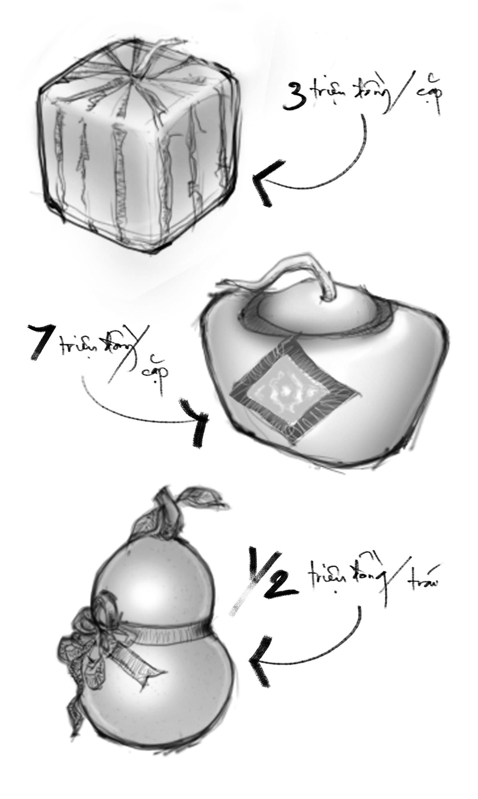
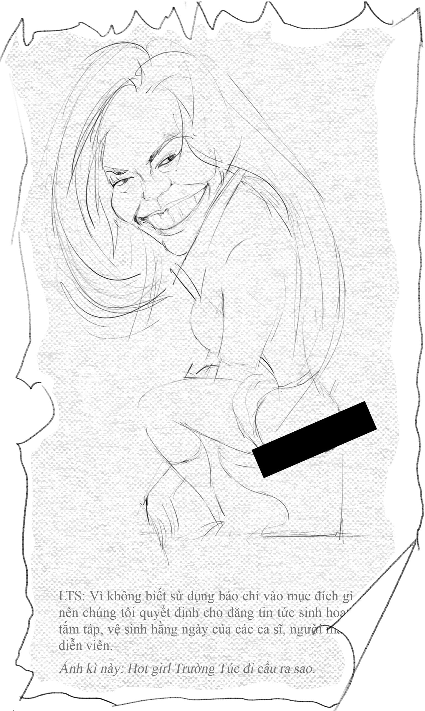

# 10

_Em bảo cuộc đời này thảm hại lắm xấu xa lắm  
Tất cả đều buồn cười vô nghĩa lý  
Mà khổ sở mà chết người  
Nhưng em ơi đâu đã là tuyệt vọng  
Nếu mọi người tốt đều lặng im  
Giữ riêng bàn tay sạch  
Ai là người dọn đi bùn rác  
Ai là người gieo hạt  
Cho ban mai tươi lành?_

— Lưu Quang Vũ

   

Thời gian thấm thoắt thoi đưa, hết thỏ lặn lại ác tà, gà gáy ngày xong lại gáy đêm, chó hú dưới trăng, gái đứng đường vẫy gọi “ai kêu tôi đó có tôi đây cày tôi đi,” tóm lại một năm trôi qua nhanh như đu dây cáp treo trên sông Pôkô. 

Thế là mùa xuân mong ước đã đến.[^1]

Cũng như mọi nhân viên văn phòng mẫn cán khác, thoạt đầu anh không để ý gì đến sự đổi thay của vạn vật chung quanh mình. Anh vẫn đến công ty lúc mười giờ sáng và cuốn gói lúc bảy giờ tối. Màn hình của anh vẫn chi chít những code là code trên nền xanh của Nốt Pát Cộng Cộng theme Ruby Blue, nền trắng của Ơ Cơ Líp và nền đen của Pút Ti. Cái laptop của anh vẫn nóng rực và ngủm cù đeo một ngày bốn bận. 

Nhưng mùa xuân đã đến! Thật chẳng phải chuyện chơi! Anh không còn bàng quan được nữa. Khắp nơi người ta đang hối hả chuẩn bị cho xuân. Không khí sặc sụa hương vị xuân mới. Đầu làng cuối phố đâu đâu cũng thấy người ta nô nức đón xuân. Năm nay đất nước làm ăn khá, đời sống nhân dân no đủ hơn năm trước, và tất nhiên rồi, năm trước thì đời sống nhân dân no đủ hơn năm trước nữa, cứ thế lùi mãi đến đời Lạc Long Quân và Âu Cơ. Cái lạnh âm mấy độ Xê làm toi cả chục mạng người ở Hà Nội[^2] và khiến cho cả mớ chó kiểng phải mặc quần áo chui vào khách sạn ở không làm nhụt chí dân thành phố này. Các bà vẫn hăm hở đi đặt bánh chưng, trong khi các ông lùng sục trên mạng tìm mua cho bằng được dưa hấu vuông, bưởi hồ lô, dưa hấu thỏi vàng... vừa chưng tổ tiên lấy hên ngày Tết vừa để chứng tỏ rằng mình là trọc phú. Phố phường rực rỡ sắc màu mùa xuân. Các khu chợ treo bảng “Bán Xả Hàng Giảm Giá Xuân, đặc biệt ưu đãi cho các quý khách hàng có họ là Xuân[^3].” Thậm chí anh còn nghe tin đồn rằng để đón chào xuân mới, thành phố sắp tổ chức lễ động thổ đặt nhát cuốc đầu tiên đào ống cống ở ngã tư Tôn Thất Tùng – Bùi Thị Xuân. 

Thế là mùa xuân mong ước đã đến. Mọi ngày hai bên đường anh đi làm về chỉ rặt những người bán áo gió đổ đống, túi xách hàng lởm, dây nịt, dép lào... nhưng hôm nay đã tăng cường thêm lực lượng bán lồng đèn mừng Tết. Tại sao ngày Tết lại có lồng đèn thì anh không được rõ. Anh chỉ thấy  người ta bày bán những chiếc lồng đèn bằng giấy kiếng màu đỏ chót, to bằng đầu người, trong lủng lẳng cái bóng đèn quả nhót chạy pin sáng lập lòe lập lòe như đít đom đóm. Mỗi khi có xe máy chạy ngang qua, thằng nhóc gầy tong teo lại nhảy ra chặn đầu xe mời mua lồng đèn tốt nhập khẩu từ Nhật Bản về, trong khi bố nó râu ria xồm xoàm cầm cái loa tay bằng nhôm ông ổng thuyết minh cho bà con cô bác về cấu tạo và công dụng không ngờ của lồng đèn[^4], còn mẹ nó thì mập như nái xề, ngồi nấp thu lu sau chồng bao bố ăn vội ăn vàng nắm xôi mừng xuân. Từ cái lề đường lởm chởm này, lồng đèn tràn đi khắp thành phố. Người ta treo lồng đèn khắp nơi. Mang các dạng khối kỷ hà như hình tròn, hình vuông, hình tam giác, hình lon sữa bò, hình cái quần tà lỏn, lồng đèn lủng lẳng dưới hiên nhà, trước cổng khách sạn, trên tầng thượng cao ốc, trên tay các fan đang múa may chào đón ban nhạc ngoại quốc là Backstreet Boys trước cửa rạp chiếu phim ba chiều. 

Thế là mùa xuân mong ước đã đến. Các sân khấu nhạc trong thành phố đồng loạt mở những chương trình hòa nhạc đặc biệt, với sự hội tụ của những ngôi sao ca nhạc được ăn khách nhất hiện nay. Các ca sĩ gân cổ nở phổi bò liền tham gia mặc áo lưới đen coóc-xê trắng, bước ra gửi đến khán thính giả lời chào Trân Trọng Nhất, rồi hát các bản nhạc xuân bất hủ, tỉ dụ Xuân này con không về, Lắng nghe mùa xuân về, Xuân đã về, Rước xuân về, Mùa xuân sao chưa về, Hát nhanh lên còn đi về vân vân. Trên nền sân khấu lóng lánh kim tuyến có hàng chữ “Băng Vệ Sinh Thấm Hút Nhanh” rất to, các vũ công đua nhau chổng đầu xuống đất xoay mông lên trời, làm các loại hoa giấy đủ màu bay lả tả. Giữa các bài hát, thỉnh thoảng lại có một nhóm hài ra biểu diễn vở hài kịch vui nhộn “mùa xuân anh Hai gặp chị Ba,” đại để như sau: anh Hai đi bên trái đường, chị Ba (là do một diễn viên đực rựa độn ngực bôi phấn giả gái đóng) đi bên phải đường, theo định đề hai đường thẳng song song của Euclide vô tình thế nào xe hai người lại đụng nhau. Hai người phanh xe rằng “Két két két” rồi la lên ông ổng “a, anh Hai!” “a, chị Ba!” Chào hỏi nhau xong, hai người liền nhảy tưng tưng lên như hai con quỷ một giò lạc đâu ra từ bụi tre đầu ngõ, la lên rằng “Ái cha, ái cha.” Rồi trống khởi sự đánh tùng xèng, nhạc công quắn quýt gãi đàn muốn rạc cả tay, rồi hai người thách nhau hát lô tô sao cho trong mỗi câu đều có chữ “xuân.” Khi anh Hai lắc mông hát thì chị Ba hấm hứ theo điệu, khi chị Ba ễnh ngực ca thì anh Hai thọc gậy bánh xe. Một hồi hai người chuyển qua hát tiếng Tàu, tiếng Thái, tiếng Lào, tiếng Cam bốt. Cuộc thi bất phân thắng bại, hai người bèn giận nhau, chửi nhau chí chóe rằng “má mày là đồ súc vật,” “đánh chết cha mày bây giờ.” Thế rồi đang cao trào của cuộc chửi, khi ông cố và ông nội đang lồm cồm lật mồ bò dậy chuẩn bị nhảy búng chim như Michael Jackson thì hai người bỗng nhiên trở nên bao dung, xí xóa cho nhau, quàng vai nhau cùng cất giọng mái hát chúc khán giả một bài hát về mùa xuân tươi vui hạnh phúc, rồi cả khán phòng cùng chọc léc nhau cười, đèn lade xanh đỏ chiếu loạn xì ngầu cả lên, rất chi là hỉ hả. 

Thế là mùa xuân mong ước đã đến. Những phiên chợ hoa cũng đã bắt đầu mở. Vô vàn các chủng loại hoa thi nhau nhảy lên xe tải, từ các ngả đường xa lộ, theo các biển hướng dẫn “hướng đi xe chở gia cầm” ào ạt tràn vào thành phố. Chỉ đợi có thế, những đại gia đang nằm phục kích trên mái nhà lập tức đu máng xối dây điện xuống đi mua hoa về chưng lấy lộc ngày Tết. Sau cuộc mặc cả chóng vánh, những gốc mai trị giá cả trăm triệu đồng được nhẹ nhàng cẩn thận khuân vào sân, xếp quanh hồ cá chép hòn non bộ, chĩa hết những chùm hoa sắp nở về hướng Đông Nam vì chủ nhà mạng Tuyền cung Khảm. Những đóa thược dược, những bông vạn thọ cũng bung xòe hết ra. Nhân lúc khí trời mát mẻ, vạn vật hữu tình, các ngôi sao người mẫu tuổi teen bèn noi gương các công tử công nương con nhà có điều kiện ngày xưa là Thúy Kiều, Thúy Vân, Đạm Tiên, Kim Trọng và Hồ Tôn Hiến mà rủ nhau đi dạo phố ngắm hoa. Các cô mặc áo dài màu đỏ thêu công thêu phượng, khoét lỗ trên ngực để lộ hai bầu vú nõn nà ít mụt ruồi rất động lòng tầm xuân, khiến cho các cậu những muốn trèo lên cây hoa hái bưởi. Các cô lại kết hợp quần đùi màu mỡ gà, nháy mắt, cười chúm chím và ưỡn mông đọ nhau bên cạnh cây đào có ông đồ đang cắm đầu ngồi viết đôi câu thư pháp kiếm tiền tiêu Tết. Các cậu đội khăn đóng kết hợp vận giày Nike[^5] rất hài hòa, mặt đánh phấn trắng như lợn cạo, tung nhảy tạo dáng khoe hàm răng sáng bóng đều như bắp rang. Các bác phó nhòm cầm máy ảnh ống kính tê-lê chụp xành xạch, đèn flash văng ra khắp đường. Tiếp theo quy trình là các phóng viên báo Tết làm việc hăng say không kể ngày đêm, cho ra lò những tin tức nóng hổi để bà con không bị lạc hậu suốt ba ngày Tết. Cuối mỗi tít biên tập viên lại không quên giật kèm một vài dấu chấm cảm rất thán, tỉ dụ: Siêu mẫu Hồng Diện vui vẻ sờ mông trên ụ rơm! Ngắm nàng xuân Đa Thủy khoái lạc bước giữa vườn đào! Á hậu Trường Mi vẽ mèo quào thành chó đốm đầu xuân! Ca sĩ Tố Mao hạnh phúc nhặt rau bên người tình Phi Luật Tân ngày Tết! Cô nàng ngổ ngáo Chiết Yêu khoe vòng eo rốn lồi gợi cảm cạnh nồi bánh chưng! Diễn viên Âm Cự nhấp nha nhấp nhổm trên mâm ngũ quả! Hot girl Trường Túc: “IQ của tôi khá thấp nhưng không thật cao!” Nàng Bất Tri Lao cho biết “Tết này sẽ phục vụ chồng trong bếp!” vân vân và vân vân… 

Thế là mùa xuân mong ước đã đến. Các chùa chiền bất kể tôn giáo đều nhất loạt mở cửa, đón khách thập phương vãng lai lai vãng từ sáng đến đêm. Tiếng chuông boong cứ thi thoảng lại ngân lên trong không trung tĩnh mịch, xa vọng tiếng gầm rú êm ả của những con xe máy phân khối lớn hòa vào tiếng xình xịch du dương của chiếc Lamborghini nhà đại phú hào nào đó. Bên trong khuôn viên chùa, cạnh đức Phật Bà Quan Âm cầm bình Cam Lồ là tượng đức Như Lai ngồi xếp bằng trên đài sen mỉm cười hiền hòa, thương hại nhìn xuống chúng sinh với những cái lưng chen chúc nhau nhễ nhại mồ hôi mồ kê, những cái tay cầm bó  nhang nghi ngút khói chắp vái liên hồi, những cái cùi chỏ huých nhau, những cặp mắt kẻ xanh lè nhắm nghiền, ti hí, khép hờ, trô trố, láo liên, những cái miệng loe loét son môi Lip Ice đang cầu trời khấn Phật cho năm sau triền miên phát đạt, mua được cái máy ảnh có ống kính dài một thước và xăm được một hình con mèo vào mông để đi xia nhìn cho nó ngầu. Bên ngoài khuôn viên chùa, các bà bán sách bói toán vả vào mặt nhau giành chỗ tốt, rôm rả mời cô gái cậu trai bói duyên: cậu tên là Mỗ cô tên Nở theo bản An-pha-bê La Tinh của nhà Đại Giáo Sĩ là A-Lịch-Sơn Đề-Rốt thì chữ cái đầu tên hai cô cậu được xếp gần nhau sát rạt như thế vậy rõ ràng hai người có duyên tiền định sẽ được đức bề trên công chứng cho ở với nhau đến già ơ thế hai người là chị em ruột à chẳng sao cứ đưa hai trăm nghìn đây định quỵt phỏng bà lại chém chúng mày hở be bây giờ. 

Thế là mùa xuân mong ước đã đến. Cũng hiển nhiên rõ ràng như khi cho tiền ăn mày thì anh bới rách cả ví tìm tờ mệnh giá thấp nhất, sau một năm đi lạc ở tận đẩu tận đâu, mùa xuân đã lò dò tìm về trước cửa nhà anh, tươi tỉnh như Việt kiều uống cà phê dưới chân tòa tháp cao tầng Bitexco. Trước cửa nhà anh có một cô bé bán chả que mà những hôm đi làm về muộn anh vẫn gặp ngồi đợi khách thu lu bên góc cổng, mấy hôm nay có lẽ vì quá ế đã đi bán nơi khác biệt tăm biệt tích. Bà bới rác xuất hiện thường xuyên hơn, làm việc cần mẫn hơn, thanh cời rác trong tay bà vung lên cắm xuống mạnh mẽ hơn, theo bán kính rộng hơn. Càng gần đến tết tiết trời càng lạnh, gà cũng không buồn gáy nữa. Anh ngồi viết lúc quá nửa đêm, bật rộn ràng những bản nhạc xuân lấy cảm hứng, thỉnh thoảng lại nghe tiếng rao “Bánh giòòòò” run run vọng vào, xói vào tai anh như kim châm xuyên từ nọ qua kia, nghe vui như tiếng nổ giao thừa những năm pháo còn chưa bị cấm và đốt pháo thăng thiên phóng vào mông khách bộ hành còn là niềm vui đơn sơ của trẻ em. 

Nhưng thôi kệ. Em ơi, thế là cuối cùng mùa xuân cũng đến rồi đó. Em hãy cùng anh bỏ những kệch cỡm lố lăng ra sau lưng đi. Con người càng ngày càng tiến hóa em ạ, suốt ngày cứ khư khư ôm lấy cái truyền thống cũ là thiển cận, là sai, là không thức thời. Vài trăm năm sau, khi con cái chúng ta nhìn lại thời đại này, anh chẳng biết chúng nó sẽ cười hay khóc, hay cả hai, nửa thế này nửa thế kia, miệng chúng nó tạo thành đường cos, răng chúng nó vẽ thành đường sin. Anh cũng không quan tâm chúng nó sẽ nghĩ về tổ tiên, về anh và về em ra sao, đầy những thành kính phân ưu kính viếng, hay như những thằng hề thất học. Không sao cả, em ạ, vì lúc ấy anh và em đã thành tro bón đất rồi. Anh và em, chúng ta sẽ yên nghỉ, nhẹ nhõm, hài lòng vì những gì ta đã có được hôm nay, về ngôi nhà dát vàng lóng lánh dưới ánh dương, về gốc sanh[^6] giá hai mươi tỷ đồng mua chưng Tết, về tô phở bò Kô-be[^7] một triệu đồng chẳng bõ dính răng trong khi đồng loại còng lưng chân cầu bới rác. Tất nhiên, trừ phi mộ của chúng ta bị người ta đào lên, hoặc bị xe tải xúc đất đè xuống, sau một đêm mất tích chẳng còn dấu vết. 

Cầu trời như thế thôi. 

  

[^1]: Câu này anh thuổng từ sách giáo khoa hồi tiểu học. Câu tiếp theo là “Đầu tiên, từ trong vườn, mùi hoa hồng, hoa huệ sực nức.”
[^2]: Đây là tình tiết hư cấu giật gân do anh thêm vào để lôi kéo độc giả. Sự thật chỉ cần lạnh chừng mười độ là ở Hà Nội đã chết cóng mấy người rồi.
[^3]: Ví dụ nhé, Xuân Diệu, Xuân Thủy, Xuân Hồng, Xuân Sách…
[^4]: Có tay cầm, có nút bấm lò xo kêu tạch tạch, đặc biệt có thể chiếu sáng.
[^5]: Tức giày Thần Chiến Thắng, một hiệu giày thể thao nổi tiếng khắp thế giới. Ai đeo đôi giày này vào người thì giá trị bản thân lập tức được nâng từ vài triệu lên vài chục triệu đồng.
[^6]: Một loại cây có thân, gốc, rễ, lá.
[^7]: Một loại bò có chân, đuôi, móng, sừng.
