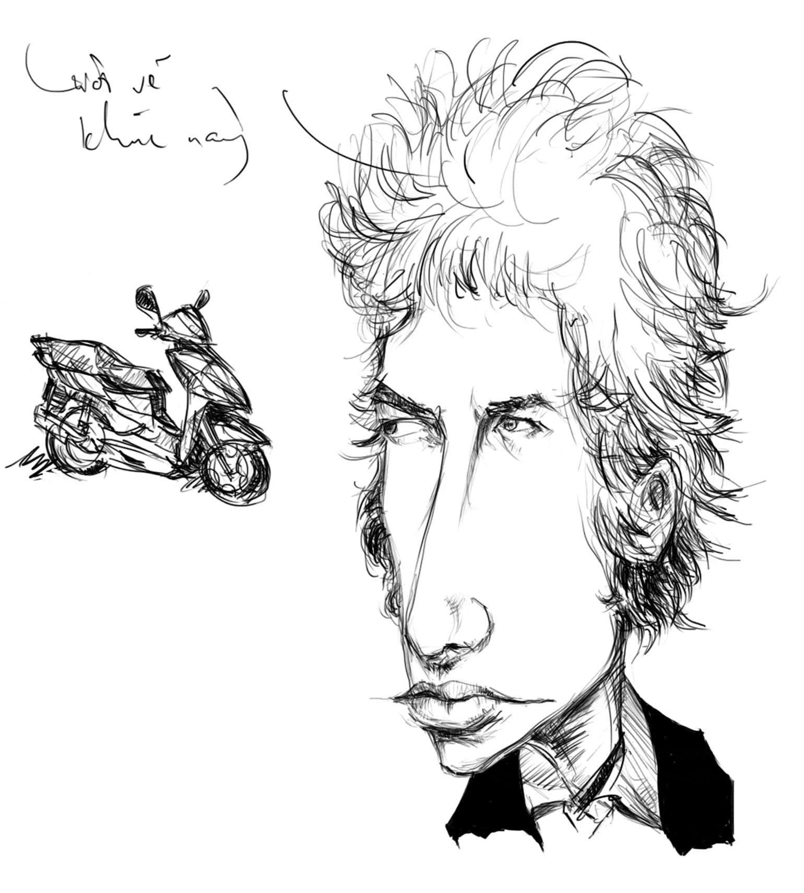

# 11

_tôi yêu đất nước này lầm than  
mẹ đốt củi trên rừng và cha làm cá ngoài biển_

— Trần Vàng Sao

   

Hôm nay ngày đẹp trời, mây bay chim hót, anh đọc báo hay được một tin: 

Việt Nam được đánh giá là một trong những nơi hạnh phúc nhất trên thế giới, do có tuổi thọ cao, con người hài lòng với cuộc sống và gây ít tác động tới môi trường.[^1]

Cụ thể hơn, chúng ta đứng thứ 5 thế giới về độ hạnh phúc. Cùng hạnh phúc với ta có Costa Rica, Dominica, Jamaica, Guetamala, Colombia, Cuba, El Salvador, Brazil và Honduras. Sáu mươi nhăm phần trăm dân số chúng ta hài lòng với cuộc sống thực tại. 

Em, ngày đẹp trời, chim bay mây hót, anh không biết nên buồn hay nên vui với cái tin rất vui này. 

Chân anh ngắn, xe anh cà khổ, túi anh ít tiền, anh chưa đi hết một nghìn bảy trăm ba mươi lăm cây số dọc chiều dài đất nước. Suốt ngày anh chỉ quẩn quanh trong cái tổ của anh. Ở nhà anh ngồi ôm cái desktop[^2], lên công ty anh lại ôm laptop[^3], chiều về anh chen chúc trong đám kẹt xe[^4] dài từ ngã tư Cách Mạng Tháng Tám đến cây xăng Nguyễn Văn Trỗi, cuối tuần đi học đàn thầy Châu Sinco, đi đánh với băng Melodic Death Mê Tồ nửa mùa ở nhà lão Lộc mập UnlimiteD, xong lại chạy ra Hàn Thuyên ngồi bù khú với tụi thằng Hưng Sẹo,  Cường Lít, Đồng Bát, Vũ Phú Yên. Cái tổ của anh nó như thế thôi, chật hẹp, buồn tẻ như một cái mạng nhện bỏ hoang bám đầy những bụi bặm trong gầm tủ, mà anh lại là con ruồi mắc bẫy cứ quẫy đạp đến xịt khí lòi dom, lâu lâu cũng tự kéo mình ra được đến nhà xí và chân bàn nhưng rồi bụp một cái – đời _đếu_ đệp, đâu lại hoàn vào đấy. 

Chắc là anh chưa đủ già. Anh cũng chẳng dám đại diện cho ai. Lấy tư cách đâu? Nhưng ai đã đủ già mà đại diện cho anh để hài lòng với cuộc sống và đứng _top_ 5 về hạnh phúc?

Anh thích _Bài thơ của một người yêu nước mình_, nhưng phía Bắc anh chưa thấy một phần hai thác Bản Giốc, phía Nam anh chưa đi đến phần bị xâm thực của mũi Cà Mau. 

Ngày hôm qua, ngày hôm nay, có thể ngày mai nữa, mây chim hót bay, có lẽ anh sẽ chỉ đi qua những con đường trong cái thành phố này, chật chội, đông đúc, và mịt mù bụi khói. 

Anh đi qua những vỉa hè rộng một mét rưỡi nham nhở những gạch vỡ, bùn đất lầy lội, thỉnh thoảng lại có một đống rác rất to, ruồi nhặng bâu đầy, bốc mùi khai nồng nặc dưới chân một bức tường có hai dòng chữ viết hoa “CHỖ CHÓ ĐÁI” và “CẤM ĐỔ RÁC, ĐỔ CẮT CU” quét loang lổ bằng than đen và vôi trắng. 

Anh đi qua những tủ điện cao thế mốc meo bung cả cửa, đề “Cấm vào, nguy hiểm chết người” cùng với hình đầu lâu bắt chéo, những cây cột đèn dán chi chít quảng cáo hút hầm cầu, trị trĩ nội trĩ ngoại, dạy đàn ghi-ta “Ô kìa cô ấy biết ngồi tréo cẳng ngỗng để đờn guitar mình là con trai có ngồi tréo cẳng ngỗng được như cô ấy không được chứ chỉ cần âm thầm bí mật đi học hai tháng sau mình sẽ tự tin ngồi tréo cẳng ngỗng mà đờn cho cô ấy xem” trên giấy photocopy loại mỏng rẻ tiền. 

Anh đi qua những búi dây nhợ nặng có lẽ không dưới một tạ tây vắt qua những nhánh cây, thòng xuống tận mặt đường hãy còn lênh láng nước do trận mưa rào mười phút ngày hôm qua để lại. 

Anh đi qua ngã tư Nguyễn Văn Trỗi – Hoàng Văn Thụ, nơi không biết tự lúc nào đã mọc lên từ lòng đất mẹ bao la một cái lô cốt rất to bao bọc vững chãi bằng bốn miếng tôn nằm chắn ngang đường, chỉ thông được xe từ nửa đêm về sáng. Ngày hôm qua, ngày hôm nay, có thể ngày mai nữa, bay hót chim mây, xe máy và xe tải sẽ còn phải chen chúc nhau ở đó, người ta sẽ còn văng tục, chửi thề, nhổ nước bọt, anh con trai đang ngồi trong chiếc xe cấp cứu rất to kêu ú o ú o đầy quay quắt kia sẽ còn phải vừa chùi nước mắt vừa cầu trời khấn Phật vừa bóp chặt bàn tay lạnh ngắt của mẹ mình, cô gái bịt khẩu trang khắp mặt ngồi trên chiếc xe tay ga rất to kêu bí bo bí bo kia sẽ còn phải tự dằn vặt có phải mình đang vô tình góp phần giết chết một mạng người hay không. 

Anh đi qua bồn binh Hàng Xanh trong trời mưa tầm tã, gió thổi phần phật lạnh buốt tới xương, ngày hôm qua, ngày hôm nay, rồi ngày mai nữa, chim mây bay hót, vẫn sẽ có mấy đứa nhóc đen đúa nhếch nhác nằm co ro trên thảm cỏ dưới chân tháp Đồng Hồ mới xây xong, trong tấm áo mưa rách tơi tả, mỗi lần có tiếng xe dừng đèn đỏ lại choàng dậy, hai tay đầy cáu ghét cầm cái ca nhựa nứt bể, giương đôi mắt rất to đầy ghèn rỉ, đầu gục gặc xin tiền. 

Anh đi qua những hàng quán buổi đêm trên đường Trường Chinh, đường Bà Hạt, đường Nguyễn Tri Phương, đường Bình Giã, bán phở, hủ tiếu, bánh mì bò kho, sâm lạnh, nước mía, hột vịt, cá viên, sau lớp khói mịt mù lờ mờ những dáng người cong xiêu cong vẹo đang lặng lẽ cúi đầu băm thịt vụn. Đằng xa xa chân trời, sau ngôi nhà cao tầng Bitexco trên có sân bay trực thăng, một mặt trăng đỏ rực trồi xuống trồi lên, người ta chỉ trỏ cho nhau, thầm thì với nhau rằng “đấy siêu trăng kìa, kìa siêu trăng đấy.” 

Anh đi qua khuôn viên to rộng của một trường đại học lớn, nơi có bãi cỏ xanh mướt nằm dưới những tán cây cao, sau thấp thoáng mấy tòa nhà quét vôi trắng toát. Trên bãi cỏ ấy, người ta ngồi như cá xếp lớp, mồm há ra như muốn đớp từng chữ từng lời của bài hát kinh điển mà ông nhạc sĩ tài danh giọng khàn đến từ nửa vòng trái đất đang biểu diễn. Rồi ngày mai trên mặt báo sẽ xuất hiện hằng hà sa số những bài viết ngợi ca, những từ ngữ sáo rỗng tuyệt vời, những câu trích dẫn sâu xa, những phép so sánh thông thái, tất cả trộn lại với nhau thành một món hổ lốn buồn cười, đủ khiến cho một con người còn chút lương tri phải nhắm mắt quay đi mà thượng đế thì nhỏ lệ. 

Anh đi qua những thằng sinh viên kiến trúc của tuổi anh ngày xưa – cách đây chừng vài ba năm – gầy tong teo, mắt lồi ra như cá thia lia đằng sau gọng kính, mím môi mím lợi cố sức dựng chống đứng chiếc A Còng giá trăm rưỡi triệu của đám gái nhảy mới túa ra từ các quán bar và vũ trường, bưng tô nước lèo sánh ra bị chửi xơi xơi vào mặt, thức đến bốn giờ sáng kiếm được hai mươi lăm ngàn đồng, vội vội vàng vàng chong đèn chong  mắt vẽ cho xong cái đồ án nhà liên kế để khỏi phải đóng tiền học lại mấy trăm ngàn một tín chỉ. 

Anh đi qua những bà cụ run lẩy bẩy trên xe lăn, chân tay lở lói, nước dãi nhễu rớt đầy hai bên khóe mép, thều thào “Con giúp giùm ngoại tờ vé số, ngoại khổ lắm con ơi.” Anh đi qua ông diễn viên hài to béo rất nổi tiếng đang ngồi rung đùi ngả nghiêng trên chiếc ghế xúp, kể chuyện lên ti vi chọc cười khán giả xem đài, chửi sau lưng một gã đồng nghiệp ngu như bò, tay phẩy lia phẩy lịa, cuối cùng cạn hết kiên nhẫn mà quay sang lễ phép quát rằng “Phiền quá bà già, cút!”

Em, ngày hôm qua, ngày hôm nay, rồi lại ngày mai nữa, bay mây hót chim, anh sẽ còn đi qua những chuyến xe buýt có lộ trình nên thơ giống như hai câu Kiều của Nguyễn Du[^5] nhưng lại gỉ sét, tróc sơn lỗ chỗ, móp méo cả đầu đuôi, đèn hư kính vỡ, có mụ soát vé mập như heo nái và chửi như hát hay, chạy dọc chạy ngang không kiềng một ai trên đường quốc lộ. Anh sẽ còn đọc trên báo những mẩu tin khủng khiếp như cô gái công nhân bị điện giật cháy lòi xương đầu gối khi đang đi xe máy trên đường phố, ba người bị cuốn vào gầm xe bồn ở ngã tư Bình Thái lúc đang đứng đợi đèn xanh nay chỉ còn óc não vương vãi, chiếc cầu rất to bị sập mất vài nhịp toi vài chục mạng vì mưa oanh liệt quá hóa ra đất mềm, đứa bé bảy tuổi làm nghề mãi võ Sơn Đông rơi xuống hố công trình bơi một hồi xong tự nhiên vô tình uống vài ngụm nước mà thành chết đắm. Anh sẽ còn mắc kẹt ở đây, trong cái tổ của anh, thêm vài năm nữa và nhiều năm nữa, bay mây chim hót, với những con đường ngập nước, với dòng kênh đen ngòm hôi hám, với cây đàn Gibson hàng nhái, với ông già rỗi việc vẫn thường ngồi trên băng ghế đá Hàn Thuyên cầm cây sáo thổi mấy bài ca buồn bã, trong khi tụi bạn anh túm tụm nhau bàn chuyện khủng bố phía bên kia bán cầu và ê a bản nhạc cảm động ca ngợi tình yêu xa cách “ở bên kia bầu trời.” 

Em, anh không muốn bàn về những con người sung sướng và thỏa mãn với cuộc sống ở Cuba và Honduras – chắc chắn anh không phải Sở Cung Vương, càng không phải Khổng Phu Tử, anh không thể thở ra được những câu mĩ miều đầy tinh thần bác ái kiểu “người đánh mất cung lại người bắt được cung.” Tối và sáng, nay và mai, anh chỉ quẩn quanh trong cái tổ của anh mà nhìn lên trời cao như con cóc dòm con thiên nga bay trong truyện của Victor Hugo, lâu lâu lại tặc lưỡi thèm thuồng. Có lẽ anh không nằm trong danh sách những người vẫn hay ngồi dưới tán cây xanh hát rằng “Ồ mề lý, mê ly,” hài lòng với thực tại và tự coi mình hạnh phúc bởi vì sáng nay thức dậy khỏe mạnh răng còn đủ ba hai chiếc, vì chưa trải qua chiến tranh, chưa chịu tù đày, vì được đi chùa gõ mõ tụng kinh, vì biết đọc biết viết... như những lời triết lí sáo mòn trong một cuốn Hạt Giống Tâm Hồn bìa mềm ba xu nào đó. Có lẽ anh có quan niệm khác với em, với cô ca sĩ đẹp trai anh diễn viên xinh gái, với nhà thơ thành danh nhà văn nức tiếng, với cô dì chú cậu ông bà bác dượng về hạnh phúc. Có lẽ đối với anh hạnh phúc chẳng phải nụ hôn cũng chẳng phải cơm ngon áo đẹp. Có lẽ anh chỉ đang tự rước buồn khổ vào người. Có lẽ thế. Thì sao. 

Thì đã sao.

Anh vẫn thích _Bài thơ của một người yêu nước mình_. 

Nhưng em đừng hài lòng giùm cho anh, đừng hạnh phúc giùm cho anh. 

Bay chim hót mây. 

  

[^1]: Theo báo VnExpress ngày 6/7/2009. 
[^2]: Máy nằm trên bàn
[^3]: Máy nằm trên đùi
[^4]: Máy nằm trên đường
[^5]: Hàng Xanh – Thủ Đức – Suối Tiên / Ngã Tư Bảy Hiền – Tam Hiệp – Hố Nai
