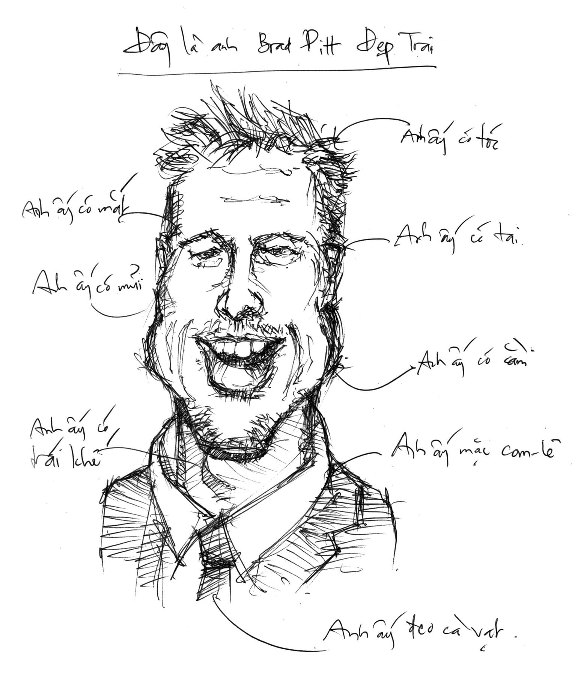
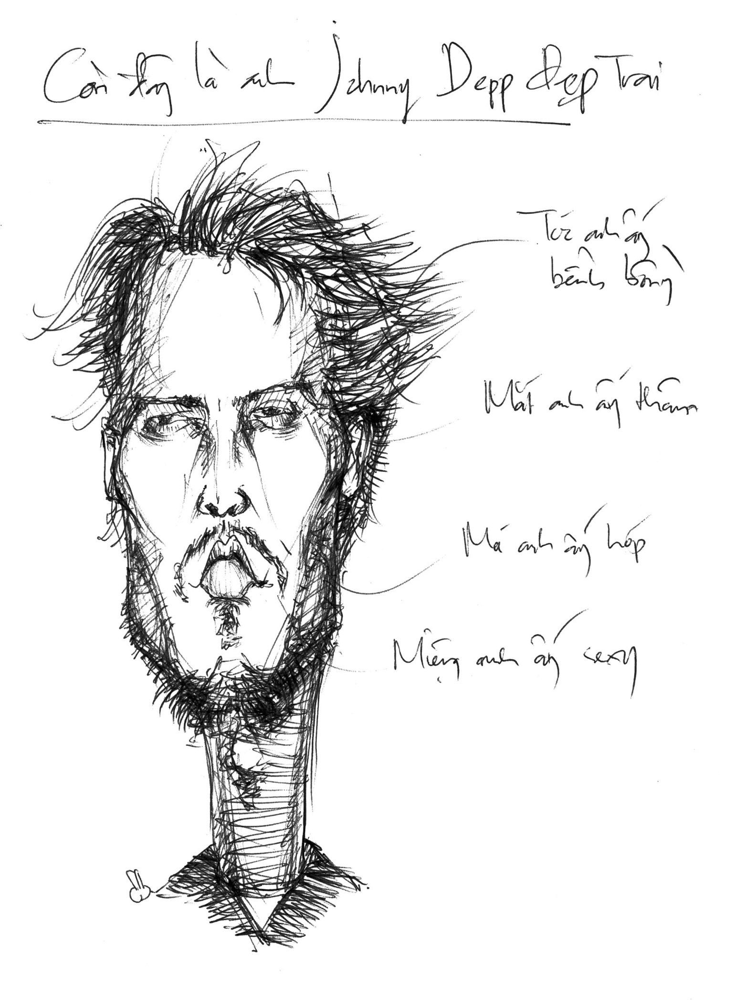

# 2

_Tôi bật đèn lên. Đúng là trong mơ tôi đã khóc thật. Tôi lau những giọt nước mắt, rồi ghi ngay lại cơn ác mộng này._

— Aziz Nesin

  

Từ bé đến lớn anh rất thích đi du lịch.

Khi tán dóc với bạn bè anh vẫn thường bắt chước cách tân thời mà nói chệch sang thành _du hí_. 

Không phải chỉ riêng anh, khối người cũng thích xài từ _du hí_ hơn là _du lịch_. Sự này không có gì cao xa, vì bản chất con người ta ai ai cũng thích cười – chỉ trừ mấy người hồi nhỏ xước mía với gặm bắp nhiều, giờ đang niềng răng – mà so với “lịch” thì nghe “hí,” ví dụ ngựa hí trâu hí, nó giống như đang cười hơn, có vẻ hạnh phúc hơn. 

Lấy ví dụ như cách đây chừng ba bốn năm khi ông bộ trưởng bộ Giáo Dục của ta đang yên vị trong nước bỗng dưng lại xuất hiện ở xứ Ăng Lê mà đánh một cuốc bổ túc tiếng Anh khi đã gần sáu chục tuổi – sau này đồng bào mới phát hiện thành ra có một vài lục đục rất đáng tiếc trong ngành. Tay cọ mẫn cán LAP của báo Tuổi Trẻ Cười khi ấy chớp thời cơ vẽ ngay ngài bộ trưởng chân phóng như chim bay, tay cầm cái vali dán hai chữ _du hí-ọc_. 

Tất nhiên chuyện ngài du ọc không liên quan gì đến anh, chẳng qua tại thói quen nói chuyện lan man con cà con kê của anh đã nhiễm vào trong máu không thể nào sửa chữa được trong một sớm một chiều. 

Bảo đảm trình tiếng Anh của ngài bộ trưởng thua xa anh. 

Nay anh quay lại chuyện du hí. 

Vì lí do kinh doanh và kĩ thuật, công ty đưa anh đi Malaysia, ta hay gọi là Mã Lai. Nước này về mặt địa lí thì nằm ở hướng Đông Nam của ta, cách ta chừng hai ngàn cây số vị chi ngàn hai dặm, về mặt du hí thì có cái tháp đôi kia tên là Pentronas cao rất là cao, thắp đèn chói lòa chói lọi, nhưng về mặt thể dục thể thao lại rất chi là bèo, trong lịch sử cứ đá banh với ta mười trận thì thua đâu chừng hết chín. Nhớ ngày xưa, mỗi lần hai bên đụng trận SEA Games với Tiger Cup, bên trên có Huỳnh Đức, chính giữa có Hồng Sơn, hậu vệ có Công Minh, tiền đạo có Sĩ Hùng, đội Việt Nam ta quần Mã Lai tơi tả. Các chú cầu thủ Mã Lai cứ bốc thăm đụng Việt Nam là phát sốt rét ban đỏ, ra sân thì đội hình chuệch choạc, rờ banh như xẩm rờ chiếu rách, mặc tình cho chúng ta thả sức ghi bàn. Đứng trên trái banh mà nói thì trong khu vực vùng trũng thế giới này, bóng đá Việt Nam ta trừ Thái Lan ra chẳng sợ mẻ nào, những Sin-ga-po, Lào, Cam-pu-chia, In-đô, Bru-nây, Mi-an-ma, Phi-líp-pin... đều lần lượt bị chúng ta luộc tuốt luốt. Thật hoành tráng. Thời ấy anh mới học lớp 6 lớp 7 đã học đòi theo người lớn, mỗi khi Việt Nam thắng trận lại buộc lá cờ đỏ sao vàng bằng giấy tự chế đằng sau xe đạp, cong đầu cắm đít đạp vòng vòng quanh các phố, chen chúc với những chân cẳng và xe máy, mồm rúc còi toe toe. Thật hoành tráng. Thần tượng thời thơ ấu của anh là số 8 Nguyễn Hồng Sơn, anh ấy hay đi đôi giày đỏ, chân quá dẻo, lừa bóng quá xiềng, vuốt bóng hơn cả Đê-vít Bết-khâm, quả có xấu trai nhưng được tài rê dắt. Thật hoành tráng. 

Nay anh quay lại chuyện du hí. 

Vì lí do kinh doanh và kĩ thuật, công ty đưa anh đi Mã Lai. Phải nói ngay để tránh hiểu lầm, rằng đây là lần đầu tiên anh xuất ngoại – tất nhiên nếu không kể đến lần đi đường đồng qua cửa khẩu Mộc Bài-Bavet, cái lần chỉ vì không có hộ chiếu mà anh và thằng Sơn Bobby, hai đứa phải ngồi đằng sau cái xe gắn máy cà khổ mua cách đây chắc cũng bốn mươi năm, mồ hôi túa ra đầy trán, bám chặt lấy eo của chú cửu vạn gầy còm đen đủi chừng bốn mươi tuổi đang hăng say chạy tạch tạch tạch với tốc độ bốn mươi cây số một giờ trên một bờ ruộng gồ ghề rộng chừng bốn mươi phân, mà cứ chừng bốn mươi mét lại có một khúc cua theo một góc bốn mươi độ, mỗi phút mỗi giây đều có nguy cơ nhào đầu xuống ruộng tắm với cá rô. Lần này thứ nhất là Sơn Bóp bi không được đi theo, thứ hai là anh đã có hộ chiếu (nhân tiện nói thêm, anh đã tốn một trăm năm ngàn Việt Nam Đồng cho một lão cò có hàm răng rất vàng và rất vẩu tên là anh Hiệp vì cái hộ chiếu này), thứ ba là cửa khẩu Mộc Bài không dẫn qua Mã Lai, nên anh được đi máy bay Air Asia tức Á Khí. Tiền vé máy bay đâu như là một trăm năm chục US đô, đối với anh nói riêng và dân lao động Việt Nam nói chung thì quả là một số tiền to, nhưng anh không bận tâm cho mấy, vì là sếp anh giàu sếp anh trả. Anh chỉ biết là anh sắp được xuất ngoại lần đầu tiên, được nhìn những cái lạ cái hay cái mĩ miều, có cơ hội nhớn để mở mang tầm mắt. Thật là hoành tráng. Công ty lại phát cho anh ba ngàn Malaysian Ringgit tức là khoảng mười lăm triệu đồng Việt Nam, cho dù thật ra bà kế toán đã vô tình hay hữu ý đưa nhầm cho anh ba ngàn đô la Hồng Kông tức là chỉ còn chưa tới bảy triệu[^1]. Mặc kệ tất thảy, vấn đề chính ở đây là gì? Là anh được đi du hí ở Mã Lai, đất nước láng giềng chung khối ASEAN có một đội banh mặc áo vàng khè quần đen bóng như mười một bông hoa hướng dương cắm trên bãi hắc ín, trình độ chuyên môn rất tồi lúc nào cũng từ huề tới thua khi đụng đầu Hồng Sơn Việt Nam ta. Thật hoành tráng. 

Đêm trước khi đi anh không ngủ được. Gà gáy làng trên xóm dưới, chó sủa nhặng xị, thỉnh thoảng lại có tiếng cú kêu cu cu giữa khuya u tịnh, hết sao mọc rồi lại sao mờ, anh vẫn còn nằm thao thức trằn trọc. Cứ được vài phút anh lại ngồi dậy bật đèn đi xem thử đồng hồ đã chuyển biến thế nào. Không cần phải bàn cãi nhiều, đối với chuyến đi Mã Lai của anh kì này thì chuyến _du hí-ọc_ qua Ăng Lê của ông bộ trưởng ngày ấy chỉ là cái đinh gỉ. Vì đã có thơ rằng:

_Ta là Một, là Riêng, là Thứ Nhất  
Không có chi bầu bạn nổi cùng ta_[^2] 

Thật hoành tráng. 

Nay anh quay lại chuyện du hí. 

Theo lịch trình, máy bay cất cánh lúc bảy giờ kém mười lăm phút buổi tối. Anh ra sân bay làm xong các loại thủ tục lúc sáu giờ ba mươi, hơn kém một chút không xi nhê. Xong anh đeo khẩu trang vào – dạo này đang có dịch H1N1 tức cúm heo, một loại cúm lây từ heo sang người rồi từ người lại lây sang heo, rất nguy hiểm cho người nào đứng gần heo và heo nào đứng gần người và heo người đứng gần nhau và tất cả các trường hợp chỉnh hợp khác, tóm lại rất nguy hiểm cho cả hiệp chủng thế giới. Xong anh bật máy nghe nhạc và bắt đầu nhịp đùi thưởng thức bài _Đau xót lý con cua_ trong khi chờ đợi được người ta trải thảm đỏ mời lên máy bay. Ca sĩ hải ngoại nức danh là Quang Lê ca _Đau xót lý con cua_ rất hay, anh giậm giựt tua đi tua lại cả chục lần, rồi giật mình nghe thông báo rằng vì lí do kĩ thuật và hiển nhiên là ngoài ý muốn, máy bay sẽ đến lúc chín giờ hai mươi phút, tức là trễ hơn so với dự kiến hai tiếng ba mươi nhăm phút, đồng nghĩa với việc chuyến du hí của anh sẽ mặc nhiên bị cắt mất gần cả ba giờ đồng hồ. Quả là đau xót lý con cua, nhưng không sao, anh vẫn còn cả khối thời gian để mở mang tầm mắt, nhìn những cái lạ, cái hay, cái mĩ miều. Thật lòng mà nói là anh rất đói nhưng không dám đi ăn, vì biết đâu máy bay lại bất thình lình lăn đến đúng lúc anh đang rung đùi nhe răng gặm cẳng gà thì cũng phiền chăng. Tất nhiên có một số người bảo rằng máy bay cũng như nhiều thứ khác của chúng ta chỉ có muộn chứ không có sớm, có tăng chứ không có giảm, có tiến chứ không có thoái, nhưng – nhất là sau khi nghe câu chuyện cô gái miền Tây phụ tình chàng trai miền Tây trong _Đau xót lý con cua_ – lòng tin của anh triệt tiêu, anh không dám tin nữa. Cho nên trong suốt mấy tiếng đồng hồ liền, anh đeo khẩu trang bịt mặt, tai nghe iPod, lưng vác ba lô, chân mang giày dã chiến đi qua đi lại trước cửa số mười chín, chốc chốc lại liếc nhìn đồng hồ rồi tặc lưỡi ra vẻ bồn chồn để bất cứ ai có chút kinh nghiệm tối thiểu đều biết rằng sau khoảng thời gian đi ngoài ra nước, nay anh sắp đi ra nước ngoài. Đường hàng không, bằng máy bay Á Khí tức Air Asia.

Thật hoành tráng.

Quả anh có tài tiên liệu, máy bay đến sớm hơn dự kiến, vào lúc chín giờ mười phút. Khi nghe tiếng loa phóng thanh cất lên “Mời quý khách lên chuyến bay AK Tám Tám Bốn của hãng hàng không Air Asia” bằng đủ các thứ tiếng trên đời, anh vội vội vàng vàng đạp tung cửa toilet, vỗ cánh bay ra và xông thẳng aboard. Máy bay hơi nhỏ hơi bẩn, kiểu mỗi hàng sáu ghế, nhìn có vẻ cũ kĩ giống như chiếc ngày xưa hay chở vua Bảo Đại lên Đà Lạt săn voi, tiếp viên đen thui, béo tròn quay, răng vàng khè, nói tiếng Anh lơ lớ như ngậm sing-gum trong mồm, nhưng anh chẳng cần. Vì anh chỉ còn cách Mã Lai hơn một giờ bay. Trừ phi cha ông kiếp trước có tu, còn ra thì không phải ai cũng được con cháu võng dù nghêng ngang mà đi du hí ở nước ngoài, cái sự thể là như thế. 

Tiếp viên răng vàng bảo anh thảy ba lô lên khoang chứa hành lí, nhưng anh nói không, anh thả ba lô đánh bẹt xuống sàn, anh lại lấy hai chân giẫm lên cho thật vững chãi, vừa đề phòng được không tặc lại vừa có điệu đường bệ. Xong xuôi đâu đấy anh mới rút tờ báo tiếng Anh tên đâu như là “Du Hí Vòng Quanh” từ lưng ghế trước, gật gù xem hình các loại xe hơi, sân golf, bể bơi, hoa hậu, đùi gà, đùi hoa hậu, đồng hồ đẹp hai kim chữ V, khách sạn năm sao. Thật hoành tráng. 

Máy bay bắt đầu lăn bánh. Sau khi lăn lăn được một lát, máy bay bắt đầu cất cánh. Véo! Tung phọt lên trời cao! Anh nhìn xuống phía dưới: đèn đuốc sáng rực mặt đất hoa lệ, chiếu chớp chớp lòa lòa những nhà hàng khách sạn sân vận động cầu cống công viên bể bơi, lại có điểm xuyến thêm cả tiệm Vina Giầy, gà rán KFC và Phở 24. Khoảng bốn năm năm về trước, khi còn học lập trình ở Aptech, buổi tối anh thường phải phụ thằng Thái Minh Nguyên chạy bàn hủ tiếu ở vỉa hè đường Lê Thánh Tôn gần chợ Bến Thành để kiếm chỗ ngủ qua đêm. Lúc đó giá một tô phở bò cỡ bự đầy phở và bò – có thể làm vỡ bụng một thằng sinh viên cao một mét sáu mươi hai cân nặng ba tám ki lô, ốm đói gầy còm như anh – giá đâu chừng mười ngàn đồng. Cho nên khi Phở 24 mở cửa hàng theo mô hình chuỗi cao cấp ở mặt tiền đối diện, giăng những cờ xanh cờ đỏ mà bán một tô phở giá hai mươi bốn ngàn đồng, bọn anh vừa kinh ngạc vừa thèm thuồng lại vừa tò mò không biết ngoài vàng với kim cương ra người ta còn bỏ cái hợp chất vô cơ gì vào phở mà bán đắt đến như thế vậy[^3]. Dạo ấy anh với thằng Nguyên, hai thằng chạy bàn cứ mỗi lúc rảnh tay lại ngoác mồm nghêu ngao “Hai tư phím cầm chiều, hai tư nhành sương mím... riêng đêm em đổ hai tư tô phở xuống đời, anh giữ lại anh ăn.” Thằng Nguyên bây giờ, sau cú đụng xe đêm khuya móp đầu suýt vong mạng, đã một hôm nốc nguyên một vại bia hơi hai lít cạn đến tận đáy và quẹt mồm kết luận “Cuộc đời này nó mong manh lắm, ai biết được sống nay chết mai” xong đi thuê nhà, bán cháo gà lề đường, lấy vợ, mua chõng tre kê tường, mua than đốt sưởi, đẻ ngay đứa con trai _backup_ đặt tên Thái Thiên Vương. Còn anh thì ngồi trên chiếc máy bay số hiệu AK Tám Tám Bốn bay đi du hí bên Mã Lai. Thật hoành tráng. 

Nay anh quay lại chuyện du hí.

Sau một tiếng đồng hồ lả lướt, máy bay đáp xuống sân bay Kualar Lumpur. Việc đầu tiên anh làm sau khi hoàn tất thủ tục checkout là chạy đi đổi tiền. Việc thứ hai anh làm là xộc vào cửa hàng Mc Donald's kêu ngay cái bánh mì bơ cứu đói. Việc thứ ba anh làm là ngồi nhồm nhoàm nhai, tai vểnh lên nghe các loại tiếng Malay, tiếng Indo và tiếng Trung Quốc xen kẽ nhau thành một mớ âm thanh hỗn tạp, rất hay ho tuy rằng hơi khó hiểu. Sau đó anh hoàn tất luôn việc thứ tư là mua vé tắc xi đến Sungai Besi Kem, khu nhà mà lão William giám đốc kĩ thuật của công ty đang ở. Qua bao gian nan trầy trật nơi đất khách quê người, phải hỏi đường ba bốn bận, tốn biết bao nhiêu là tiền xu cho điện thoại công cộng, cuối cùng anh cũng mò được đến nơi. Đó là một cái nhà to kềnh cao bốn tầng nằm trong khu biệt thự, cổng có gắn bộ điều khiển từ xa bấm kêu bíp bíp, phía trước đậu hai chiếc Bi Êm Đúp Liu một đen một trắng cả hai cùng chói sáng láng bóng, trong nhà lại nuôi một con chó giống gì đó lông lưng nhẵn nhụi lông bụng lại bung xòe rất đẹp tên là Rocky. Năm bảy tuổi anh bị chó cắn một lần vào ống chân đến giờ còn để sẹo, từ đó anh rất sợ chó, nhưng con Rocky này thì anh không sợ, vì ngoài cái mẽ ngoài giống chó ra, tất cả các thành phần còn lại nó có vẻ giống lợn hơn: mập thù lù, kêu ụt ịt, lười như hủi, chuyên gia nằm ép bụng xuống sàn, đuổi không buồn đi đá không buồn dậy vân vân và vân vân... Thật hoành tráng. 

Lúc anh đến là gần ba giờ sáng, William từ trên lầu phễnh phệ lăn xuống theo đường tay vịn cầu thang, giơ bàn tay chuối mắn ra chào rằng “Hi.” Anh cũng giơ bàn tay búp măng giống tay Đặng Thái Sơn của mình ra chào trả rằng “Hi,” tự nhủ câu chuyện kể từ lúc này đã bắt đầu có hơi hướm tiểu thuyết của nhà văn trẻ Việt Nam: xuất ngoại, công ty, giám đốc, thành đạt, giàu sang, tập đoàn, lại có cả piano, Nhật Bản, thần đồng, cầy hương, đồng xanh, nải chuối. Thật hoành tráng. 

Anh được sắp xếp cho một cái phòng khá là rộng rãi, có đầy đủ giường nệm, máy lạnh, tủ áo, bàn viết, ti vi, cả một cái WC xài chung với phòng bên cạnh. Lão kiến trúc sư nào thiết kế cái mô hình xài chung nhà xí này mà gặp thầy Cổ Thiên Hậu của anh thì bảo đảm rớt tốt nghiệp, chỉ còn nước bơm xe lề đường hoặc về núi Tản chăn bò về núi Gò chăn dê về Ban Mê trồng pạc-xỉu cho qua ngày đoạn tháng. Nhân đây anh cũng nói luôn cho đỡ hiểu lầm về sau, kiến trúc sư giảng viên Cổ Thiên Hậu không có bà con dây mơ rễ má gì với nam tài tử Hồng Kông dách lầu cực KuL là Cổ Thiên Lạc. Có lẽ chỉ vì thấy thầy ấy khó tính và có khuynh hướng hoài cổ chỉ thích nhà vuông nên mấy chú sinh viên vẽ nhà tròn bị đánh rớt bài mới bất mãn mà đem cái tên Lạc Hậu ra trộ thầy chăng, về vấn đề này thì anh không được rõ. 

Nay anh quay lại chuyện du hí.

William lại giơ tay chuối mắn chỉ cho anh xem cái phòng nồng nặc mùi long não rồi nói: Ở nhà tao cũng có hai người Việt Nam nữa mà giờ họ ngủ rồi, có gì không biết thì mai mày xuống dưới gặp họ mà nhờ vả các sự. Mép anh nhếch lên, mặt anh tỏ vẻ lãnh đạm theo kiểu “thường thôi biết rồi,” nhưng trong bụng anh thì ngạc nhiên sung sướng lắm – ai mà ngờ được, mấy ngàn cây số mà vẫn gặp hội đồng hương. Anh lại đồ rằng chắc bạn đánh bài Phú Quốc gì đó của William, lão mời đến ở cho vui cửa vui nhà, vì xét cho tiệt mọi nhẽ thì cái biệt thự ba bốn tầng lầu này mà chỉ có hai vợ chồng son với con Rocky ở kể cũng hơi thừa diện tích. Thật chẳng bù cho ở quê anh ngày xưa, vợ chồng con cái ông nội bà ngoại cô chú dì dượng thím này cậu kia cùng sum vầy trong một cái nhà hai gian mái tranh vách đất, khi ăn chen chúc nhau quanh cái bàn gỗ mít đã đành, đến lúc tiêu tiểu cũng phải ngồi chung cái hố xí lộ thiên sau vườn, dưới lũy tre ngà nhìn nhau đắm say gió tóc lay lay trong mùi xú khí nồng nàn bay bay. Lâu lâu vì những phen giành nhau chỗ ị đẹp, giữa cô kia cùng cậu nọ lại nổ ra một trận cãi nhau hoặc đánh nhau rất ác chiến mà kẻ thủ bại không biết chạy đi đâu nấp cho nó kín người. Quê anh ngày ấy rất là vui vẻ, mỗi khi nhà nào xảy uýnh lộn lại có con nít chạy đến đứng lóc nhóc đầy sân, đứa quần cụt thủng đáy, đứa ở truồng lòi chim, đứa áo ba lỗ dính đầy nhựa chuối, đứa đầu trọc ghẻ chốc, đứa lại tóc khét nắng dài phủ mang tai, tất thảy đều vừa quẹt mũi lòng thòng vừa múa chân huơ tay cổ vũ rất nhiệt tình cho cả hai đội. Anh cũng ở trong đám ấy, anh cầm cái nồi nhôm đít lọ, anh lại thủ thêm cái vá gỗ, anh gõ hai thứ ấy vào nhau kêu beng beng, anh hò hét rất hùng hồn khí thế, lâu lâu anh cũng bị chủ nhà nhảy ra bợp tai vài phát, ù té chạy văng cả vá thất lạc cả nồi bị mẹ đánh. Thoắt đó mà đã mấy chục năm, thời gian bóng trâu phi cửa sổ như đưa nôi. Bữa nay ở nhà William có bồn cầu TOTO đam mê sự hoàn hảo, tuy không diễn ra những chiến sự giành hố xí nhưng lại có hai ông khách quý cũng người Việt Nam trên xứ lạ, kể cũng khơi gợi những kỉ niệm êm đềm của tuổi thơ anh. Anh thay quần áo, miệng này đánh răng miệng kia huýt sáo bài hát Trên Mảnh Đất Tình Người “Vượt ngàn dặm xa, người đến đây với mảnh đất nầy” của nhà nhạc sĩ Trần Long Ẩn, rồi tắt đèn lăn quay ra ngủ.

Thật hoành tráng. 

Anh thức dậy vào lúc mười một giờ rưỡi giờ Mã Lai (tức GMT+8), lúc vợ chồng William còn ngủ khò. Mắt nhắm mắt mở, anh lò dò đi xuống tầng trệt. Cái nhà vô cùng sạch đẹp. Nền nhà lát gạch bông bóng loáng. Tường nhà treo nhiều tranh vẽ quả táo, con cáo và chùm nho. Trần nhà có cái đèn chùm to như cái nong. Phòng khách sạch sẽ. Bếp thơm tho. Lại có cả một bà xem hình thù mặt mũi có vẻ là người Á Châu đang nấu nướng. Anh giơ tay chào “Hê lô.” Bà bếp đang lúi húi xào xào xáo xáo liền ngẩng đầu lên, trợn mắt nhìn anh, không nói tiếng nào, sau đó làm rớt, nguyên một đôi đũa. 

Anh nhìn kĩ lại một chút, rồi đến lượt anh trợn mắt nhìn bà bếp, sau đó làm rớt đôi đũa. Tức là, anh chạy đến chỗ bà bếp nọ, sau đó lượm đôi đũa lên cầm, sau đó làm rớt. Kinh hoàng cực độ nó phải là như thế. 

Thì ra hai quý khách người Việt đang ở trong nhà William Rocky không phải khách chơi bài Phú Quốc[^4], lại càng không phải là chó Phú Quốc[^5]. Đó là hai bà _maid_[^6], được nhập khẩu từ bên Việt Nam qua để giúp các thể loại việc nhà ví như giặt đồ, nấu cơm, tắm chó, tắm bà già, xách bô đến bưng bô đi, lau nhà, tưới bông, cho cá ăn, bị chửi vân vân. 

Trưa và tối hôm đó anh ăn cơm với vợ chồng William. 

Trưa hôm sau anh ngồi ăn cơm với _maid_[^7].

Thật hoành…

tráng…

Nay anh quay lại chuyện du…

hí…

Nhưng sự thật là, khốn nạn, anh hết thấy gì hoành tráng, mà, cơ khổ, cũng toi luôn ý muốn du hí. Mặc dù, tất nhiên, nghe chữ “hí” nó vẫn vui vẻ hơn là chữ “lịch.”[^8]

Em, em gọi cuộc đời này là “true mosaic,” là bức tranh to béo khảm nhiều màu cứ như con đường gốm sứ vừa rực rỡ vừa mau bị mẻ ở Hà Nội. Mỗi sáng sớm em cầm trên tay cái máy ảnh Nikon Đê Năm Mươi, em len lỏi trong những chợ, những xóm nhà, những khu dinh thự Phú Mỹ Hưng Nam Sài Gòn, những gầm cầu, những bến sông; mỗi tối em lang thang trên đường Lê Duẩn, em ngồi cà phê vỉa hè, em vào quán Vắng, em về Thủ Đức, em lên quận Năm, em xuống Bình Thạnh, em rong ruổi Tân Bình Tân Phú. Em đã đi nhiều nước, có những nước giàu như Anh, như Úc, như Hà Lan, như Thụy Sĩ, Nhật, như Pháp, như Singapore, cũng có những nước nghèo xác xơ như Campuchia, như Lào. Em đã thấy chuột túi nhảy trong vườn thú, đã ngồi vẽ chân dung dưới tháp Eiffel, đã đi qua điện Buckingham ngắm đàn quạ bay, đã uống rượu sakê trong vườn anh đào, đã chui vào trong cối xay gió và chụp hình bên cạnh hoa tulip. Em cũng đã gặp nhiều người, nhiều hạng người, có người thông minh vỗ cánh như rồng, lông nách thơm tho bay như thiên thần trong Final Fantasy phiên bản Tám, có người ngu xuẩn bò lệt bệt như ốc sên giun đất sau mưa, có người nồng nhiệt, có người lạnh lẽo, có người chất phác bảo gì nghe nấy, có người dối trá bảo dí nghe nầy, có người lùn thích chơi bóng rổ, có người gầy gò thích món Xumô, lại có người suốt ngày ngắm mình trong gương cầu lõm gương cầu lồi rồi tự sánh mình ngang tầm đẹp trai lạnh lùng với Brad Pitt và Johny Depp. Em hiểu về cuộc sống hơn anh, em sâu sắc hơn anh, em lạc quan hơn anh. Em  trả lời giúp anh, tại sao lại có hai bà _maid_[^9] quốc tịch Việt Nam trong nhà một người Mã Lai? Tại sao hai người đó phải ăn riêng, sau khi chủ nhà đã đã no phễnh bụng? Tại sao cơm của chủ thì thơm dẻo còn cơm của họ thì khô như đặc sản cơm rang miền Bắc, lại có mùi hôi thối của gạo mốc để lâu ngày? Tại sao bữa ăn của họ chỉ có hai con cá kho mặn chát với một nhúm rau luộc – tô thịt đầy tú hụ William với vợ cùng ăn tối hôm trước đã vội mọc cánh mà vỗ đi đâu? Tại sao trong nhà phòng nào cũng có máy lạnh, giường nệm, tivi, mà phòng của họ lại là một cái kho có cái giường lò xo phủ một lớp vải mỏng dính, một cái quạt tai voi kêu rồn rột, một đống quần áo chưa ủi và một cái máy giặt chạy suốt ngày đêm? Tại sao họ chỉ được xài điện thoại mỗi sáu tháng? Tại sao ba năm họ mới được chủ nhà ban ơn mưa móc cho về thăm nhà một lần? Tại sao họ ngạc nhiên đến đánh rơi đũa khi có người giơ tay chào họ theo tư thế “hê lô Việt Nam?” Tại sao họ ngồi ăn cơm với anh, nói vớ vẩn một đôi hồi đột nhiên anh thấy nước mắt của họ chảy thành dòng xuống bàn, trộn chèm nhẹp với chén cơm đang ăn, một chuyện mà trước giờ anh vẫn nghĩ là chỉ có trong sách vở hoặc kịch nói hoặc cải lương nơi Võ Đông Sơ với Bạch Thu Hà cùng rống lên những khúc oán thán thê lương rồi rút gươm khắc vào cây ba chữ Hận Thằng Xăm Tại Sao Không Dạy Chúng Tao Học Đếm chỉ bởi sa cơ giữa chiến trường thọ tiễn? 

Và từ lúc nào Việt Nam yêu quý của anh, của em, của chúng ta đã trở thành một cái kho nhân công rẻ mạt cho thế giới dùng ra người ta xài vào?

Em, sau chuyến đi Malaysia của anh trở về[^10], khi đầu óc anh vẫn còn quay cuồng lảo đảo vì di chứng suốt ngày ngồi trong xe hơi Bê Êm Đúp Liu phóng với tốc độ quỷ khốc thần sầu trăm hai cây số một giờ trên đường cao tốc xuyên qua đảo Penang[^11], em bảo anh nên tiếp tục viết sách như thế nào? Về cái gì? Chuyện tình giữa nàng tiểu thư du học và chàng lãng tử du cơ ở một xứ du côn đầy du thử du thực? Cuộc phiêu lưu đi tìm kho báu giữa làng phù thủy của một nhóm những nam thanh nữ tú có huyền đai Thiếu Lâm và hồng đai Tiệt Quyền Đạo? Con chó Nhật lông xù giành miếng tôm hùm sốt cà với con mèo trên chiếc ghế xô-pha màu men cánh gián? Biển Côn Đảo những ngày này xanh thẫm thấm đẫm những sự yên bình ôi của mẹ lời ru? Con rùa cổ dài đuôi cụt mệt mỏi lờ đờ bơi qua bơi lại trong bể kiếng lâu lâu lại cụng đầu vào thành bể kêu cồm cộp? Đội bóng đá Việt Nam liên tục giành thắng lợi vẻ vang trước những là hùng binh Lào và Cam Bốt và Miến Điện? Ô Kê, cũng Ô Kê thôi, nhưng rồi ai sẽ viết về hai bà _maid_[^12] người Việt đến tận bây giờ vẫn còn đang ngồi khóc tu tu trong một cái phòng ăn buồn tủi ở Mã Lai? Anh, hay em, hay bạn Gào, hay bạn Keng, hay một nhà văn trẻ mới nổi nào khác có ngòi bút mềm mượt như lông chuột cống vẫn thường ngồi viết về chuyện đêm qua mất trinh đêm nay đi vá đêm mai lại mất trinh đêm mốt lười đêm bữa kia lại vá, trong một tiệm cà phê Highland không gian yên ắng nhạc Pháp du dương bốn chục ngàn một li đen ít đường nào đó? 

Em, em có biệt tài về ngôn ngữ, em giỏi cả tiếng mẹ đẻ lẫn tiếng Anh, cứ như rằng em đẻ ở Anh mẹ em đẻ ở Giỏi, hay là em của em tên Anh anh của em tên Giỏi. Em đã học tiếng Pháp suốt tám tháng trời, từ cấp sơ tấn bộ tới cấp trung – _à tort ou à raison_? Em từng học qua tiếng Đức, em phát âm mạnh mẽ như khạc đờm – _haben du nicht_? Em là mặt tái có cái lưỡi dài hay uống thứ nước có lửa, giỏi bắt chước giọng miền Tây, giọng Nghệ An, giọng Quảng Ngãi, giọng Quảng Trị, giọng Hà Nội, giọng Huế – _dạ em là người con gại Huệ, một chiệc lạ rơi cụng làm em hoạng shợ_. Phải không? Em dịch giùm anh nguyên văn câu này – cái câu mà một trong hai bà _maid_[^13] viết vô tờ giấy để ở đầu giường khi anh đi gặp khách hàng để quên ví tiền ở nhà, chữ nguệch ngoạc và rất to, giống như chữ học sinh lớp một:

_Em, chị dử bôp tiền của em. Dì nhiều nguời._

Thật hoành tráng. 

Ha ha ha.

  

[^1]: Theo Google ngày 5/7/2009, 1 Malaysian ringgit = 5 063.69643 Vietnamese dong 
[^2]: Thơ Xuân Diệu vào cái thời còn tưởng ta là Một, là Riêng, là Thứ Nhất thật.
[^3]: Tất nhiên bây giờ vật giá leo thang, tô phở hai bốn ngàn không còn hợp thời nữa, mà nghe đâu đã chuyển vị thành bốn hai ngàn. 
[^4]: Thật ra lúc ấy sòng bài Phú Quốc xây chưa xong. Anh không cập nhật tiến độ thi công nên không biết hiện nay thì thế nào. 
[^5]: Là một trong ba dòng chó có xoáy lưng trên thế giới, biết đào hang, biết bơi, lông rất mau khô nước. Tất nhiên chúng ta rất ưa chuộng, yêu chiều và hết lòng bảo vệ loài chó quý hiếm này. 
[^6]: _Maid_ là danh từ tiếng Anh để gọi cho nó lịch sự đúng đẳng cấp quý tộc, chứ bình dân chúng ta vẫn hay gọi là "giúp việc" hoặc "người ở,” hoặc tệ hơn nữa là "đầy tớ.” 
[^7]: _Maid_ là danh từ tiếng Anh để gọi cho nó lịch sự đúng đẳng cấp quý tộc, chứ bình dân chúng ta vẫn hay gọi là "giúp việc" hoặc "người ở,” hoặc tệ hơn nữa là "đầy tớ.” 
[^8]: Và, tất nhiên, không ai nói "con ngựa lịch" hoặc "lịch như con ngựa.”
[^9]: Như anh đã chú thích, _maid_ là danh từ tiếng Anh để gọi cho nó lịch sự đúng đẳng cấp quý tộc, chứ bình dân chúng ta vẫn hay gọi là "giúp việc" hoặc "người ở,” hoặc tệ hơn nữa là "đầy tớ.” 
[^10]: Tức là cái chuyến đi của anh, còn Malaysia thì của Liên Hiệp Quốc hay ASEAN hay cái mẹ gì đấy, tuyệt nhiên không phải của anh.
[^11]: Cái đảo này thì lại của Malaysia, không phải của anh nốt. Anh nhà nghèo chẳng có cái đảo nào cho nó ra hồn ra vía cả. 
[^12]: Anh lại chú thích, _maid_ là danh từ tiếng Anh để gọi cho nó lịch sự đúng đẳng cấp quý tộc, chứ bình dân chúng ta vẫn hay gọi là "giúp việc" hoặc "người ở,” hoặc tệ hơn nữa là "đầy tớ.”
[^13]: Sau bốn trang sách, _maid_ vẫn là danh từ tiếng Anh để gọi cho nó lịch sự đúng đẳng cấp quý tộc, chứ bình dân chúng ta vẫn hay gọi là "giúp việc" hoặc "người ở,” hoặc tệ hơn nữa là "đầy tớ.”
