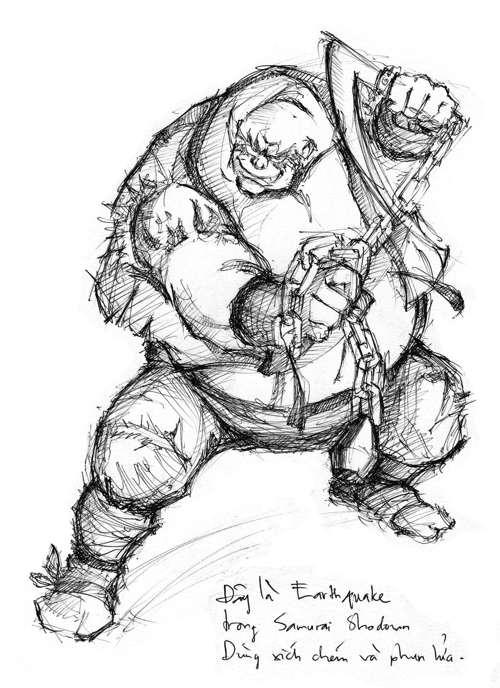
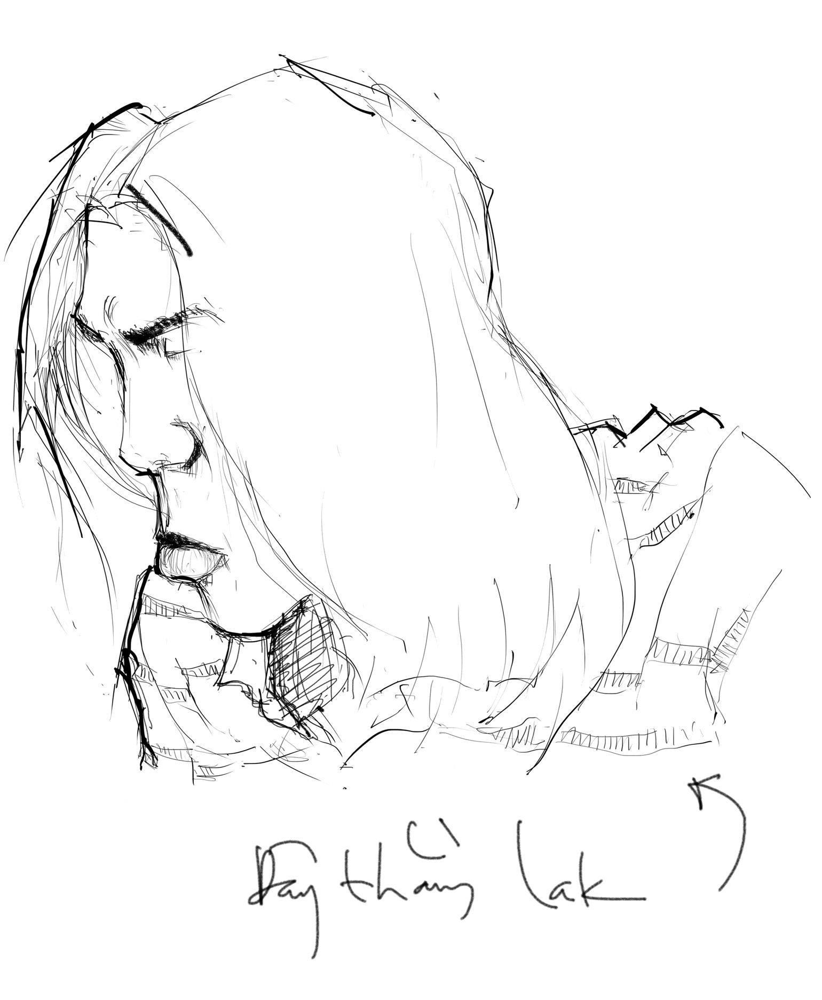
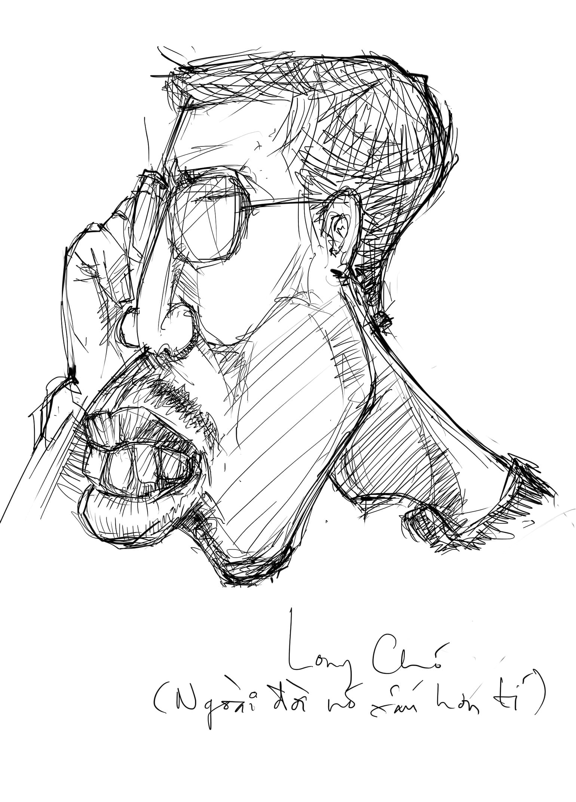

# 3

_Em đừng thương anh nữa  
Anh đi lủi thủi trên đường  
Đánh mất lòng tin  
Tìm về bếp lửa  
Xem trẻ mục đồng  
Múa trong tượng gỗ  
Những đôi vợ chồng  
Cởi áo cho nhau_

— Lưu Quang Vũ

   

Dạo gần đây anh không viết nhiều. Anh hay đi lang thang ngoài đường, nghe nhạc, chụp ảnh và vẽ. Anh đăng hình biếm họa nửa mùa lên The Daily Faces[^1], gửi icon tạp nham cho Six Revisions, tút lại LinkedIn và đều đặn post bài trên Thica.net. Cái máu văn chương của anh, cái giấc mơ điên cuồng bất đắc chí của anh – làm một thằng nhà văn nổi tiếng lật nghiêng lật ngửa văn đàn Việt Nam và được đăng tên lên Đại Tự Điển Bách Khoa Toàn Thư Open Wiki – coi như đã nguội quá nửa. Đôi lúc anh nhìn lại mình ngày xưa mà vừa tự khâm phục vừa tiếc rẻ cho mình – cách đây ba năm, uống vài chai Sài Gòn Đỏ, ngà ngật say, ngồi chống mắt gõ bàn phím lốp cốp lúc ba giờ sáng trong khi thằng Long Huế hăng say múa kiếm và nhảy Audition, còn thằng Quang mập thì ngủ lăn cù quay trên chiếu, lâu lâu lại gãi cái lưng đầy lang ben một cách rất sồn sột. Thời đó vì rảnh rỗi không biết làm gì cho hết thời gian nên anh viết về mọi thứ: quán cà phê Cóc Ghẻ nằm cạnh quán cà phê Chuồng Bò trong hẻm Xương Chó với cây xoài Tịt Đẻ và chị chủ lưng khòm có tài đi ngang Như Cua, hố xí lềnh bềnh cứt của trường Đại học Kiến trúc Thành phố Hồ Chí Minh với bài thơ bất hủ Ước Gì Anh Hóa Ra Giòi, siêu phẩm _Darling Sài Gòn phố_ nhái lại thơ Phan Vũ – nay đang được đăng tải khắp nơi nơi với tít _Thơ trào máu họng_, thằng cha cảnh sát giao thông mặt lợn chuyên nấp cây cứt lợn thổi xe chở lợn đặng moi tiền dân rất lợn, cây cầu bắc qua sông Kwai bị đặt bom làm cả khối đại nhân vật vong mạng vì đủ thứ lí do ngu như bò, anh hùng Nga Xô Vắc-xi-li chuyên gia bắn tỉa chui trong chăn chổng mông đít trắng hếu làm tình trong tư thế cực nhọc lạc với đào vú bự Rây-xồ Vây thật rất chi gợi dục vân vân và vân vân. 

Dạo gần đây do một số lí do cá nhân anh không viết nhiều được như thế. Nhưng – nói không phải là để tự sướng với bản thân như giới tự sướng hiện nay vẫn hay gọi là tự sướng – anh vẫn còn đi nhiều, đọc nhiều, thấy nhiều, và xem khá nhiều. 

Thật thê thảm cho anh.

Không có gì thê thảm cho bằng đi nhiều đọc nhiều xem nhiều thấy nhiều mà chỉ rặt toàn những chướng tai gai mắt. 

Họa chăng chỉ có việc thấy chướng tai gai mắt mà bán thân bất toại toàn thân bất lực là có vẻ thê thảm tương đương. 

Vì khoa học đã chứng minh rằng, không bị bất lực tức là có ít khả năng bị xì trét, tăng cường miễn nhiễm, tránh được các bệnh nan y có thể tái đi tái lại như táo bón, hăm bẹn, sùi mào gà, trĩ búi, ung thư tuyến tiền liệt; thật là kinh tế, thật là hay, mọi nhẽ.

Cái thê thảm thứ nhất là anh phải chứng kiến càng lúc càng nhiều ăn mày và các dạng đồng vị của ăn mày. 

Anh ngồi bên bờ kè đường Trường Sa – Hoàng Sa, đoạn gần cây cầu sắt đen sì sì bắc ngang qua dòng kênh đen sì sì dưới một bầu trời cũng đen sì sì, quanh năm suốt tháng bốc mùi hôi thối. Cứ mỗi năm phút một, đều đặn như một quả lắc đồng hồ, hoặc là từ trái anh có một ông lê qua, hoặc là từ phải anh có một bà lết lại. Đủ hết các thành phần, đủ hình đủ dạng, đủ thể loại, đủ màu sắc mùi vị. Què vì xe đụng – có! Cụt chân vì dính miểng đạn từ mùa hè năm 72 – có! Rụng hết các ngón vì phong cùi – có! Tứ chi trụi lủi theo phong cách One của Metallica – có! Miệng mọc lệch sang một bên má như di chứng động kinh – có! Mù – có! Chột – có! Giả chột giả mù – có! Kính râm Terminator – có! Thân hình cong vẹo – có! Thân hình thẳng đuồn đuột – có! Thân hình gãy gập về phía trước – có! Thân hình gãy quặp ra đằng sau – có! Đi trên chân – có! Đi trên đầu gối – có! Đi trên xe lăn Kiến Tường – có! Đi trên tay – có! Đi trên mông với mông trên dép – có! Trồng cây chuối – có! Nhảy chồm chồm – có! Bò lê bò toài tiếp cận mục tiêu bảo đảm tính bất ngờ – có! Ăn mày vì già yếu bệnh tật – có! Ăn mày vì bị con thảo dâu hiền đạp ra đường – có! Ăn mày vì bị hàng xóm cướp đất – có! Ăn mày vì thích cái đẳng cấp, yêu cái sĩ diện, mê cái xì-tai, ghét cái định kiến xã hội mà quý cái kiêu hãnh nghề nghiệp – có!

Cứ thế lắc lắc, lăn lăn, lê lê, lết lết, lại lắc lắc, lại lăn lăn, cái binh đoàn Cái Bang hùng vĩ ấy vừa dõng dạc điểm danh vừa hoành tráng diễu qua diễu lại trước mặt anh với những mũ và nón thò ra và thụt vào, tung bay rợp trời như một sớm đầu thu khai trường khi Thanh Tịnh còn bị mạ nắm tay lôi xềnh xệch trên con đường bờ kè dài và hẹp cách đây không lâu còn chạy qua chạy lại nhiều lần, khi Quang Lê còn bé nhỏ theo mẹ đến trường học cách ngồi hố nhỏ, và khi Bùi Đình Thảo cùng với Minh Chính hai người một mình giương cái dù cọ che nắng bên dòng Nhiêu Lộc nước trong thầm thì đi tung tẩy tung tăng. Thỉnh thoảng lại có một chín túi đeo cây đàn điện gắn cục ắc-quy nhớp nháp đầy dầu mỡ, đánh sô lô tiếng clean theo phong cách ngũ cung Pentatonic pha Dorian, lâu lâu trượt tay hóa ra điểm xuyến vào một vài nốt hoa mĩ y boong Steve Vai[^2], làm các chú đang ngồi xem pê-đê chế biến lẩu cá kèo rất là một lòng giậm giựt, vung muỗng đũa gõ chén gõ nồi hát ca nhặng xị cả lên. Nếu trời không mưa có thể lại có một thằng nhóc vận võ phục của môn phái Lang Thang Đường vác miểng chai lưỡi lam đến nhai rào rạo, phun dầu đốt lửa không thua gì Earthquake của Samurai Shodown[^3], rồi thét “Á a Á a” thực là khiếp kinh, hoặc một thằng không nhóc lái xe tành tành đến dựng ở đầu kia vỉa hè rất hồn nhiên đứng ca bản “Và anh sẽ không bao giờ, không bao giờ anh bỏ em, và anh sẽ không bao giờ, không bao giờ anh bó tay” cũng kinh khiếp không kém. 

Cũng có thể chỉ tại anh đi nhậu khu bờ kè ngày càng nhiều. Nhưng _bà mẹ_, ăn mày ăn nhặt ở chốn nào tòi ra mà lắm thế. Đến nỗi đôi khi anh có cái cảm giác kì quặc là, giống như có một phong trào thi đua đang được phát động mạnh mẽ trên toàn quấc, con dân cái đất nước này khi mới đẻ ra, trong đợt phỏng vấn đầu đời, đã thay vì bốc giẻ chùi bảng (sau làm nhà giáo nhân dân) hay bốc phân (sau làm nhà súc vật học) hay bốc mô tơ máy bơm nước (sau làm kĩ sư chế tạo máy bay trực thăng và máy bóc vỏ đậu xanh) hay bốc muỗng cà phê (sau làm công nhân khai thác mỏ nhôm) hay bốc bi (sau bán vé số kiến thiết miền Bắc ích nước lợi nhà chúc các bạn may mắn) hay bốc tất (sau làm chính trị gia) thì chúng nó dở hơi thế nào lại bốc mấy cái bị cói với lon sữa bò móp nhằm định hướng nghề nghiệp. Tất nhiên như thế thì còn ăn thua gì nữa, em ạ, em không thể có được một cuộc sống khả dĩ ổn định lâu dài hướng tới tương lai với một cái định hướng sai lầm đã được chạm khắc vào vỏ não của em từ phát đét đít thứ nhất trở đi. 

Cho nên, phải rồi, ngu thì chết chứ bệnh tật gì? Lão khú đế đừng khóc với tôi, mụ già khằn què liệt đừng run lẩy bẩy với tôi, thằng lỏi con nhãi nhép đừng có mà quỳ mãi trên cái vũng nước đó nữa. Thế nào gọi là “lòng tốt cũng có giới hạn?” Tiền có phải vỏ hến đâu mà phân phát được đều đều – bữa nhậu hôm nay vì lỡ mồm kêu tôm hùm nguyên kí mà coi chừng phải ghi sổ nợ đây. Cho nên thằng nhãi đứng lên đi kẻo ướt cả đũng quần, mụ già kiếm ít rơm bó vào người theo phong cách truyền thống đi – tuy có ngứa tí nhưng mà ấm, còn lão khú thì đi ra chỗ miếng bê tông đâm ra chân cầu sắt mà khóc ở đấy đi, nhân tiện nhảy tõm như Michael Phelps luôn đi cho nước nó trong. Có trách thì trách bản thân các người bất tài vô tướng có mỗi chuyện chọn ngày chui ra cũng hỏng việc, để đến nỗi sinh bất phùng thời, rơi lạc vào đất dữ. Ngu thì chết, bịnh tật gì? 

Ấy là anh nghĩ thế chứ không dám nói to. Em lạ gì anh, miệng hùm gan sứa, chỉ được cái nỏ mồm. Nói to chúng nó lại chẳng bâu vào đập anh chết cha bỏ mẹ. 

Cái thê thảm thứ hai là, càng ngày anh càng thấy mình bất tài trong lĩnh vực văn học. 

Thế này. Anh biết đọc từ khá sớm. Những năm ba bốn tuổi, khi bạn bè rủ nhau đi học mẫu giáo kiếm phiếu bé ngoan thì anh ở nhà đọc Thành Trì của A. J. Cronin và ngâm thơ dân gian ca ngợi thuốc lá đầu lọc CAPSTAN:

_Con Anh Phá Sản Tại Anh Ngu  
Chiếc Áo Phong Sương Tình Anh Nặng  
Nặng Ân Tình Số Phận Anh Chen  
Cho Anh Phát Súng Tim Anh Nát  
Nhưng Anh Tin Số Phận Anh Còn._

hoặc thuốc lá bao mềm không đầu lọc Dalat:

_Đời Anh Là Ăn Trộm  
Tống Anh Lên An Điềm  
Đít Anh Lát._

hoặc ngân nga một bài tứ tuyệt tức cảnh:

_Khi anh đi không người đưa tiễn  
Khi anh về năm bảy người khiêng  
Chiếc xe dép từ từ lăn bánh  
Đưa anh vào nghĩa địa bình yên._

Thế là làng trên xóm dưới người ta cùng nhau ngợi ca anh là thần đồng ngàn năm có một. Ngày tết Trung Thu, người ta bắt anh dẫn đầu đám con nít trong xóm chạy lên chạy xuống toàn thôn, đọc liên tục bài thơ “hai bên bờ bụi rậm rì, chúng em rước ánh đèn đi xin tiền.” Cuối năm anh được cử đi dự đại hội Cháu Ngoan Bác Hồ ở huyện, được quay phim. Ngày anh lên tivi, cả xã anh đánh nhau giành ghế ngồi xem thời sự, cha mẹ anh rất hãnh diện, anh chị anh đi đến đâu cũng được thơm lây, rất hoành tráng. 

Mấy năm cấp hai anh xuống thành phố học, lại đại diện cho trường phổ thông cơ sở Lý Thường Kiệt đi làm cỏ sáu vạn dân thành Ung, chém chết hai tướng giặc là Trương Thủ Tiết và Phềnh Thất Thân, xong lại vang vang đọc bài thơ Thần trên bờ sông Như Nguyệt làm cẩu binh Tống chết cả hàng chục vạn, đành phải Khứ… Tức là, từ năm 1996 đến năm 1999 sau Công Nguyên anh đều đều tham gia kì thi học sinh giỏi văn cấp thành phố và đều đặn ôm các giải này nọ tê. Sang cấp ba anh không còn thi thố gì vì bận ngủ gật trong lớp, vẽ biếm họa các thầy cô và giật phao dây chun, tuy nhiên đến tháng 7 năm 2002 sau Công Nguyên anh lại may mắn thi đỗ vào khối Đê đại học ngoại thương Hồ Chí Minh sau khi xuất sắc bình bài _Giải đi sớm_ của Hồ Chủ tịch được 5 điểm vớt. Với những chiến tích vĩ đại vẻ vang từ ấu thơ cho đến trưởng thành như thế, từ bấy đến nay khi anh cùng cha mẹ rằng “nỏ Ngoại thương mô, Kiến trúc cơ” rồi bắt đầu chuỗi ngày của những thất bại trong trường đại học Kiến trúc cơ – mặc quần sáu túi, tóc tai rũ rượi, ngồi phệt bên vệ đường Nguyễn Đình Chiếu móc cứt mũi ráy tai và uống cà phê sữa đá, hay khi anh bỏ Kiến trúc mà học Aptech cơ, tay phải gõ C# tay trái bốc mì tôm nhét miệng, anh vẫn cứ đinh ninh tự phụ mình là tài năng văn chương tót vời, sở dĩ chưa quách thành danh chẳng qua chỉ tại vì chưa gặp vận, phỏng thời vận đến thì chỉ dăm bữa nửa tháng anh lại nổi lềnh bềnh như cù lao Ré[^4] chứ chẳng phải bư bư nói chuyện giỡn chơi. 

Cái niềm tin sắt đá ấy của anh, tưởng như có cầm chùy đồng mà vồ cũng không lung lay nổi, gần đây lại bị lúc lắc dữ dội. Dần dà anh phát hiện ra rằng, ở ta anh chả là cái đinh gỉ gì, đinh tán đít nồi không, đinh móc quần xì cũng không mà đinh đóng cọc chuồng lợn lại càng không nốt. Vì thiên tài trên đất ta dường như đang được đẻ với tốc độ của ruồi (con cháu trong một mùa hè có thể nối đầu vào đít dài cho đến sao Thiên Vương) và cường độ của ếch (cả ngàn trứng mỗi một phụt), cho đến nay đã đạt đến sáu thiên tài mỗi mét vuông, đặc biệt ở những địa điểm người và ngợm chen chúc nhau như Catwalk, Gossip, Lush, Apocalypse thì mật độ thiên tài còn dày đặc hơn nhiều. Nhà văn, kí giả, dịch giả, nhà phê bình chạy lăng quoăng như ngỗng ỉa khắp nơi nơi, mà cứ chiếu theo các vị ấy thì đất nước ta đang ở vào thời kì cực thịnh cực khoái, đời vua Thái Tổ Thái Tông chẳng là mốc xì lầu xanh gì cả. Theo các vị ấy, ở ta người với người chỉ sống để mặc áo lông chèo Gondola[^5] trên sông Đáy-nuýp, làm quen với nhau trên xe buýt ở Hamburg hoặc trong một quán cà phê nho nhỏ ở New York, yêu nhau thiết tha dưới trời mưa rả rích trong một khu phố Tàu với đèn lồng đỏ lủng lẳng treo cao, xích nhau vào chân giường và dùng dương vật giả xù xì cắm vào nhau, xé rách của nhau trong sự khao khát tột cùng một làn da nâu. Theo các vị ấy mọi thứ phức tạp đều trở thành đơn giản, trong khi những thứ đơn giản lại trở thành rối rắm lung tung beng, mà nói theo ngôn ngữ văn chương là “ngột ngạt, bức bối, dương vật cương cứng một cách đau đớn đằng sau nịt vú như có ai đang bóp tịt, rã rời như có ai đang cắt xuỵp, kiệt sức, tiệt tức, xịt cứt, liệt giường.” Theo các vị ấy, nỗi đau của người phụ nữ đương thời trong cuộc đời chỉ xoay quanh vài ba thứ rất cơ bản: đau bụng khi hành kinh, đau đáy khi mất trinh, và đau lòng khi bị đá đít sau vài màn hun hít cho dù nghe có vẻ phi lô-ga-rít. Theo các vị ấy những kẻ xấu xa phản diện trên đời này chỉ tuyền hoặc bị bất lực thích trò búng dây chun hoặc mắc chứng bạo dâm thích xài sex toy chứ không phải là ông gì bà gì quá cao siêu, và nhiệm vụ thiết yếu của cái xã hội vốn dĩ phức tạp này chỉ là mở ra một con đường giải thoát cho những người phụ nữ tội nghiệp đã, đang và sẽ phải ngày ngày dạy dương cầm cho lũ trẻ mồ côi ở viện dưỡng lão, với một ông chồng đại gia vì một lí do thầm kín nào đó lại không đủ tiền mua Viagra, và một ngọn lửa hứng tình luôn bùng cháy hừng hực trong lòng. 

Cái niềm tin sắt đá ấy của anh, tưởng đã ra đời trong bão táp, được trui rèn trong lửa đạn như Taras Bulba[^6], không vượt trội thì cũng ngang hàng Pavel Kornikova[^7], thì ra cũng chẳng khá khẩm gì hơn viên đá xanh xông cảm cúm, nhúng vào trong nước nó kêu xèo xèo vang dội đấy nhưng lôi ra ngoài bỏ ngồi chung mền với một thằng bệnh hoạn rồi chẳng mấy chốc mà nguội ngắt như miếng bánh mì patê thiu. Anh lên YouTube[^8] nhìn những nhà văn trẻ kiêm người mẫu kiêm ca sĩ của hôm nay – cứ sau mỗi giờ viết sách lại quay vi-đê-ô cờ-líp tân nhạc, ôm cây guitar điện không có sợi jack gãi dũng mãnh, chạy lon ton trên đồi quanh các gốc cây to, nhảy qua nhảy lại như những muốn song phi bộ mông phát triển phì nộn vào mặt khán giả, hát bài “Anh hái hoa hồng xin biếu em,” xong xuất bản quyển sách hai trăm trang chữ to như gà mái, kiếm cả trăm triệu tác quyền mỗi năm – mà tự cảm thấy nhục nhã cho mình. Anh bàng hoàng đau xót nhận ra rằng bao công lao vun trồng của cô Hường – dạy Văn cho anh hồi cấp hai, qua đời năm ngoái vì bệnh ung thư gan – đã đổ sông đổ biển hết không còn một miếng cặn nào, rằng lời căn dặn “Con có tài về văn học, cố giữ đừng lãng phí” của thầy Dũng – dạy Toán cho anh hồi cấp hai, mất ba năm trước vì tai biến mạch máu não – chỉ là lời võ đoán nông rất cạn của một ông giáo tỉnh lẻ, rằng câu nhận xét “Nó còn nhỏ mà đã có suy nghĩ rất chín chắn” của cô Thạnh – dạy Anh văn cho anh hồi cấp ba, đã tám năm không có tin tức gì – xem ra nên dịch thành “Cô đã già mà khả năng nhìn người vẫn còn rất ấu trĩ và bồng bột.” Thầy ơi cô ạ, biết đến bao giờ con mới đạt được cái đẳng cấp văn chương như thế kia, để có thể vươn ngực ra trước ưỡn mông về sau, viết vài cuốn sách xây cái nhà lầu mua quả xe hơi, khả dĩ cho thầy cô được vỗ đùi đánh bét mà cười hai tiếng kha kha kha nơi chín suối? 

Thôi tốt nhất là khi hoàn thành cuốn sách này, anh sẽ đóng cửa luyện Adobe InDesign® hay QuarkXPress™ gì đấy khoảng một năm, rồi tự lên layout khoảng sáu tháng, rồi ôm cái ổ cứng di động đi đập cửa tất cả các nhà xuất bản mà gào lên rằng: “Các ông in sách tôi đi, tôi xin đấy, in đi mà, tôi xin đấy. Sách tôi dở thì có dở, hỗn cũng hơi hỗn, tục thì tục thật, nhưng tôi cũng như ai, biết cởi truồng quấn lụa che lông mu (nhân tiện xin thề luôn mu tôi có lông) rồi chụp nuy làm minh họa, bảo đảm hút khách chẳng kém gì chị gái anh giai. Tôi lại có lợi thế con nhà nghèo – các ông nhìn cái bản mặt tôi đây này, xem có phải là hiện ra chữ HÈN rất to không – in sách cho tôi tức là các ông đã cho tôi tiền mua bánh mì Sài Gòn đặc ruột thơm bơ ăn đỡ đói, tức là đã xây cái tháp cao chín từng. Mai này nếu may mắn không vì thiếu muối mà bị bệnh vô sinh hay thiếu chuối mà mắc nàn liệt dương thì tôi sẽ thuê người đúc tượng thạch cao của các ông chưng ngay vào gian giữa, tượng Đê-vít lòi chim và Vê-nút hở rún đứng hai bên, bắt con cháu ngày ngày nhang đèn cúng bái.” Nếu đã van xin đến thế rồi mà chúng nó vẫn dửng dưng không động thì anh lại rút bộ dao Super Knife[^9] ra xông lên ăn thua đủ với lũ vô lương tâm khốn nạn một phen. 

Ấy là anh nghĩ thế chứ không dám nói to. Em lạ gì anh, miệng hùm gan sứa, chỉ được cái nỏ mồm. Nói to chúng nó lại chẳng bâu vào đập anh bỏ cha bỏ mẹ. 

Cái thê thảm thứ ba là, anh phải nhìn những bạn bè anh, sinh ra trong hòa bình, lớn lên trong no đủ, đáng lẽ phải tươi trẻ và xuất chúng biết mấy, thì lại trở thành một lũ gàn dở, suốt ngày móc cứt mũi, chán ghét thực tại và chỉ biết đắm chìm trong quá khứ. 

Tính cho đến năm nay – hai mươi mười, theo kiểu Tây nó hay gọi – mỗi thằng trong đám chúng nó đã hai mươi sáu – theo kiểu Tây nó hay tính. Mặt chúng nó nhờ uống cà phê nhiều nên còn rất trẻ và tỉnh, khối đứa nhìn cứ tưởng mới hai nhăm. Cổ họng chúng nó hãy còn bự, chửi bới vẫn nghe oang oang. Tay chúng nó hãy còn rất khỏe khoắn, rút thuốc quẹt lửa vẫn còn nhanh nhẹn. Chân chúng nó hãy còn rất dẻo dai, điển hình như thằng Văn mỗi sáng dậy vẫn đạp con Honda 67 ngoài đầu hẻm từ năm giờ ba mươi đến sáu rưỡi không biết mỏi. Nhưng đến như cái đầu của chúng nó thì thôi rồi, già cỗi cổ hủ không để đâu cho hết. 

Chắc em vẫn còn nhớ thằng Nguyên, thằng bạn nối khố của anh những năm còn học Kiến trúc. Từ năm lớp ba khi nhà sa cơ lỡ vận, phải đi lang thang bán hột vịt đầu làng cuối xóm, cho đến khi vào Sài Gòn ôn thi phải ăn mì tôm loại năm ngàn một bao tải, cho đến khi đậu đại học xin ở nhà lão An bên cạnh chợ Bến Thành, phụ quán thay tiền trọ, cho đến khi bị đình chỉ học, rồi lại cho đến khi bị tông xe móp sọ phải nuôi não, rồi lấy vợ đẻ con, nó vẫn là một thằng ngang tàng đầu đội trời chân đạp cứt đếch sợ gì ai. Có một thời nó bỏ mối cà phê ở quận 12, đêm đêm phải chạy khắp hang cùng ngõ hẻm giữa trời hôm khuya khoắt. Nó đi cái xe máy không đèn mất phanh, phía trước đèo bịch cà phê bự ràng cẩn thận bằng sợi thun đen, sau lưng đeo cái ống vẽ thước hai thật là nghệ sĩ, nhìn ung dung thư thái như sinh viên đại học Mỹ thuật đi học hỏi tiền bối đâu bên Pixar về. Nhưng chỉ cần thoáng thấy đầu cầu bên kia lố nhố có người[^10] là nó lập tức nhảy phắt xuống xe, rút xoẹt cây kiếm Nhật giấu trong ống vẽ ra cứ thế chém lia xả lịa theo phương châm “tiên hạ thủ vi cường” trúng ai nấy xui xẻo, xong rồi trong lúc hỗn độn tiện tay vứt luôn hung khí cho chìm nghỉm trong bùn, nhảy lên xe phụt khói ra đằng sau mông đào thoát. Lưng nó vì thế mà đầy những sẹo, đầu tóc nó bù xù đầy gàu, quần áo nó dơ dáy hôi hám, răng nó đóng bựa nửa vàng khè nửa đen thui vì hút thuốc mà không súc miệng, nhưng nó thích nhạc Trịnh và nhạc không lời hơn bất kì một ca sĩ tóc óng mượt da mịn màng nách thơm tho nào mà anh biết. Không biết đàn địch gì, nó cũng lọ mọ để dành đâu được năm chục ngàn, mua rẻ lại cây đàn ghi ta vạn niên của lão già sửa giày đầu hẻm. Sau những giờ chạy bàn, cứ được phút nào rảnh rỗi nó lại lôi cây đàn với tập nhạc phô tô ra bắt anh với thằng Vũ Phú Yên đệm tùng xèng tùng xèng cho nó hát. Cái đàn của nó, mỗi dây lạc một quãng, cần đàn thì cong queo, thùng đàn lại bị thủng một lỗ to tướng, nhưng nó không cần. Mỗi khi hát đến khúc nào đắc ý, tỉ như “Còn thấy gì sáng mai đây thôi ta còn bạn bè” “Còn bao lâu cho thân ta lưu đầy chốn đay,” nó lại nhắm tịt mắt, ngân nga ư ử trong cổ họng, rung rung thanh quản bắt chước nhà nghệ sĩ ưu tú là Sừ Quang Lý, đầu nó lắc lắc đít nó lư lư, xong nó mở mắt ra rít rột rột một hơi thuốc lào rồi ngửa người tựa vào thành cửa sổ nhả khói mù mịt qua hai lỗ mũi rộng hếch đen ngòm, nở một nụ cười mãn nguyện ngô nghê, thật là thống khoái. 

Chắc em cũng còn nhớ thằng Lak, một thằng bạn Kiến trúc khác của anh, cái thằng có máu nghệ sĩ từ ngoài da vô đến trong máu. Tướng nó ốm nhách, tay nó dài như tay vượn, tóc nó buộc thành đuôi ngựa lủng lẳng sau lưng. Nó hay mặc cái quần Jean cũ mốc meo, rách lòi đầu gối tong teo củ lạc, cùng với thằng Quang mập hai đứa ngồi uống cà phê đen không đường trong hẻm Xương Chó, tai nghe nhạc xưa, thuốc lá đốt vàng tay, đùi rung rung, mắt khép hờ, miệng lẩm nhẩm hát theo Thái Thanh từ “Anh viết gì? Đời thối phải nói là thơm, ngòi bút là chiếc cần câu miếng cơm”[^11] sang “Tôi về không gặp nàng, má ngồi bên mộ vàng, chiếc bình hoa ngày cưới đã thành chiếc bình hương.”[^12] Hồi anh còn ở trọ dưới chân cầu Kiệu, nó cặp kè với một em tên Mai. Em này giọng nói the thé, mặt vuông chành chạnh, rất cá tính và mạnh mẽ, mạnh mẽ đến mức chúng nó chia tay nhau cứ hai ngày một bận. Mỗi lần như thế, thằng Lệnh Hồ Xung thất tình khốn nạn lại ôm một chai chuối hột loại hai xị, nửa đêm lộc cộc chạy xe qua nhà anh đập cửa rầm rầm, dựng đầu anh dậy bắt “uống với tao một chai tao rầu quá.” Khi anh gắng gượng làm một vài li chiều lòng thằng bạn quý hóa xong lăn lông lốc ra ngủ tiếp, nó buồn thiu ngồi thu lu một mình cho đến sáng, giải quyết xong chai rượu với trái xoài để lại cái hột gặm nham nhở, rồi lại lộc cộc ruổi con Wave Tàu chạy đi làm huề với em Mai. Dạo chia tay ẻm lần cuối, nó suốt ngày nhai đi nhai lại bản _Mắt lệ cho người_[^13] “mưa soi dấu chân em qua cầu” tiêu nghe rất chi là bi đát. Nó mê uống cà phê nghe nhạc Khánh Ly tới mức lấy nick Yahoo là _cafe_kl_, thường cứ hễ nốc đế vào sương sương là lại ngồi chống đầu gối lên quá tai, tay gãi ống quyển, hai mắt lờ đờ, vổng mõm chửi _đếu mẹ_ Khánh Ly “tình nghĩa như _con buồi_, năm hai ngàn lẻ một làm cái _chó_ gì mà không về dự đám tang Trịnh Công Sơn?” Từ giọng hát Khánh Ly, nó nghiên cứu qua dòng nhạc phản động nhạy cảm của Trầm Tử Thiêng, Nguyễn Đình Toàn, Hà Thúc Sinh và đại để. Nó ham vẽ thư pháp và mọi thứ lung tung như Bồ Đề Lạt Ma, mặt Phật, Trịnh Công Sơn ngậm cuống điếu Con Mèo chìm nghỉm dưới cơn mưa, gái cởi truồng đứng bê bình, và những thứ vớ vẩn cứ thế. Ngoài ra nó còn nghiên cứu thiền học, thích đọc kinh Phật, tin vào nhân quả, luân hồi, thiện tâm, sống kiểu vô ưu, tự giải thoát, chán ghét cảnh trần gian khổ não, cùng bao nhiêu thứ khác mà anh không thể nhớ hết để liệt kê ra đây. 

Chắc em không nhớ mặt thằng Long (hỗn danh Long Chó), cái thằng em mới gặp một lần mà lúc ấy trời đã tối mịt. Nói ngắn gọn như bạn bè đã thống nhất với nhau, tướng nó có giàu hũ giàu hòm cũng không sang được. Cả cái dáng người của nó là một điển hình tội nghiệp của tất cả sự thống khổ ở trần gian mà thằng Lak suốt ngày hăm he đòi giải thoát: thân hình nó tong teo xiêu vẹo, bộ nó đi tất tả, bụng và ngực nó lép kẹp lòi đủ các thể loại xương sống xương sườn, mặt mày nó nhăn nhó khúm rúm, hai con mắt nó ti hí hấp háy đằng sau cặp kính cận dày cộp, hàng râu con kiến mỏng dính vàng lơ thơ trên cái mồm thi thoảng lại ngoác lên cười hềnh hệch nhưng lại nghe rất gượng, để lộ hàm răng vàng khè thò và thụt khắp nơi. Nhìn nó không ai dám cả gan nghĩ là có một tâm hồn văn thơ nhạc họa ẩn nấp đằng sau vẻ ngoài thê thảm đầy tính bệnh tật ấy. Nhưng cái sự thật có thể gây giật mình là, nó hay cùng với thằng Văn ngồi uống cà phê lết đằng sau lưng Nhà Hát Lớn hoặc nốc Sài Gòn Đỏ nhắm trứng cút lộn đầu đường Pasteur gần cây xăng, hai thằng đứa tung đứa hứng, ngâm thơ hát nhạc từ trời chạng vạng đến tận khuya. Thơ nó ngâm tuyền là thơ thẩn ngớ ngẩn từ thời A Khuê còn chăn bò, Tường Linh ngồi câu cá, Nguyên Sa mê áo lụa, Nguyễn Tất Nhiên đạp xe tán em gái Bắc Kì, Cung Trầm Tưởng dụ đào vào công viên, Phạm Thiên Thư lẽo đẽo mòn cả giày đi theo Hoàng Thị Ngọ; nhạc nó hát toàn nhạc sầu thảm thừa hơi kiểu Đặng Thế Phong khóc giọt mưa thu tận đâu trên trời, Phạm Duy khóc dã tràng tít đâu ngoài biển, Văn Cao khóc mùa thu chết lá vàng rơi, Vũ Thành An khóc ngàn sao mọc đêm ba mươi, Ngô Thụy Miên khóc mùa thu trên rừng trên rú. Chừng như chưa đủ ép phê, nó lại tìm tòi sưu tập thêm những Đạo ca, Tủi nhục ca, Ngục ca, Hoan ca, Tục ca, cùng rặt những ca từ có thể mang đến cho mỗi ca sĩ vài năm tù giam trong trường hợp cải tạo tốt – tức là không vác bồ cào móc đầu quản giáo khi đang xới đất trồng đậu cô-ve chẳng hạn. 

Anh cứ tưởng cái thằng Nguyên bây giờ đã có vợ có con, tâm tính phải thay đổi không nhiều thì ít. Anh cứ ngỡ cái thằng Lak mới bị nhọt ở mông phải mổ nằm liệt cả tuần, hay cái thằng Long Chó có bồ mới suốt ngày dung dăng dung dẻ, tâm tính phải đổi thay không ít thì nhiều. Hóa ra anh sai rất nặng. Ba thằng này, cũng như một tá những thằng bạn khốn nạn bất trị khác của anh, bóng câu phóng cửa sổ dáng trâu phi cửa cái đã bao nhiêu năm nay vẫn bư bư như thế. Mỗi khi gặp lại chúng nó anh lại phát bệnh vì phải lặn hụp bơi ếch trong cái nỗi niềm hoài cổ của chúng nó mà nghe chúng nó than van rên rỉ và tặc lưỡi lạch chạch như thạch sùng. Anh đã thử đem hết nước bọt cùng với miệng lưỡi cố gắng thuyết phục cho những cái đầu u tối ấy thủng ra rằng đừng có cực đoan chủ nghĩa như thế vậy, rằng mỗi thời có mỗi hay mỗi riêng, rằng nhà thơ bây giờ lâu lâu cũng lọ mọ chế biến ra vài bài ngửi được không thối, rằng nhạc thị trường thỉnh thoảng cũng có đôi câu không lộn mửa, rằng nhạc sĩ hiện đại cũng có thằng không ăn phải bả danh lợi mà tuyền sáng tác mấy giai điệu ruồi bay muỗi lượn giòi búng tạch vân vân và vân vân. Nhưng chúng nó có nghe đâu. Chúng nó bỏ tất những lời khuyên chân tình thống thiết của anh ra ngoài tai, đúng rặt một lũ lợn. Chúng nó cứ rít thuốc Con Mèo hai ngàn ba điếu, vênh những cái mâm chứa mụn lên trời nhả khói phì phèo, coi lời nói của anh như rơm như rác, tay tiếp tục chậm rãi gõ nhịp bài _Lá đổ muôn chiều_ mà rằng “Mày biết không, theo như nghiên cứu khoa học thì Từ Linh chẳng phải là nhạc sĩ _đếu_ gì sất, chẳng qua chỗ tình cảm bạn bè nên lão Đoàn Chuẩn mới bỏ tên vào cho nó _ấm đít_ thế thôi, mày thấy chưa ngày xưa người ta sống có nghĩa có tình chứ đâu có _chó đẻ_ như bây giờ” “Mày biết không, Khánh Ly tức là Khánh Kỵ cộng với Yêu Ly, tức là sử kí Tư Mã Thiên, tức là Xuân Thu Chiến Quốc, tức là ngày xưa người ta có cái đầu cái hiểu biết, đến đặt cái tên đi hát _xướng ca vô loài_ cũng Đác Uynh thông thái, chứ đâu có _ngu si dốt nát_ toàn Danh Mã Phi Hùng Thiên Hài Địa Trưởng như bây giờ” “Mày biết không, Phạm Duy chính là con của Phạm Duy Tốn sống chết mặc bay, chồng của Thái Hằng mà Thái Hằng lại là chị của giọng ca sầu não ai oán Thái Thanh, rồi lại có con trai Duy Quang ca sĩ, Duy Cường thâu âm, con gái Thái Thảo, con rể Tuấn Ngọc, tức thị một nhà nghệ thuật một dòng nghệ sĩ, chứ đâu có nòi con múa kiếm cha tham nhũng, _sâu dân mọt nước_ như bây giờ.” Em có tưởng tượng được không, thở ra những hơi sặc mùi yếm thế như thế là một bọn mỗi thằng chỉ mới hăm sáu, hăm bảy tuổi.

Anh nhớ đâu đó có người viết rằng: một đất nước coi như đã đến hồi mạt vận nếu những người trẻ tuổi có tài chỉ suốt ngày hết luyến tiếc quá khứ lại chuyển sang thở dài hoài cổ. 

Lạy trời. Chắc không phải nước mình, vì anh yêu nước mình. 

Vả chăng, nói cho thẳng thớm ra, mấy thằng bạn anh làm gì có cửa mà đại diện cho giới trẻ tài năng của tổ quốc chúng ta để quyết định vận mệnh nước nhà. Không có cửa, em ạ. Không có. Hoàn toàn không. Tiếng Anh nó gọi là _no door_. Vì chúng nó chẳng hơn gì anh, quanh quanh quẩn quẩn trong cái tổ chim cu, không dám nhìn ra phía trước vì sợ sự thế đảo điên sau này phải đi ăn mày, không dám nhìn xung quanh vì tự ti cái trình độ hãm tài không làm nổi nhà văn đầu nhớn kiêm diễn viên điện ảnh mông to, cũng không dám nhìn xuống nhìn lên gì gì cả. Cho nên mất sạch phương hướng, chúng nó đành ngậm ngùi nhìn lại phía sau lưng mình mà tự an ủi rằng cuộc đời vẫn đẹp, để dòm ra xa xăm mà buồn cái buồn thời đại ba mươi bốn lăm – cái thời u uất mà Xuân Diệu viết Tỏa nhị kiều, Nguyễn Tuân viết Chém treo ngành, Thạch Lam viết Hai đứa trẻ, Ngọc Giao viết Ga xép. Ừ, hai năm rõ mười là có cái thời như thế, cũng như anh có một lũ bạn ngán ngẩm như thế. 

Tóm lại _chúng nó chẳng làm được cái gì, chúng nó chỉ có tài chửi đổng_. 

Ấy là anh nghĩ thế chứ không dám nói to. Em lạ gì anh, miệng hùm gan sứa, chỉ được cái nỏ mồm. Nói to chúng nó lại chẳng bâu vào đập anh bỏ cha bỏ mẹ. 

_Bỏ cha bỏ mẹ.  
Bỏ cha bỏ mẹ.  
Bắt cô trói cột.  
Bắt cô trói cột.  
(Echo cho cho cho...)_

  

[^1]: Cái trang này ngày xưa anh vẽ nhảm, giờ ngỏm rồi em ạ.
[^2]: Là tay tóc dài kia quê ở Mỹ, hay đánh guitar điện ở Mỹ, có kĩ thuật đỉnh cao, từng đoạt vài ba giải Grammy liền liền. 
[^3]: Nó là một cái game thùng (còn gọi là game bỏ xu) hồi xưa thời thơ ấu anh hay chơi thiếu nợ quán bà Thanh đầu hẻm, trong có hiệp sĩ mù Ukyo Tachibana, ninja Quạ Hanzo Hattori, ninja Chó Galford, Hai Lúa Genjuro, Cóc Ghẻ Genan, với những tuyệt chiêu như chém vào chân làm đứt đôi người rớt ra tiền, ra bông, ra quạt, lại có đại tuyệt chiêu Thiên Hạ Củ Nhân Sâm (quay kiếm bảy vòng hết máu) của samurai Hảo Ma Rù, kinh kinh lắm.
[^4]: Tên chính thức là huyện đảo Lý Sơn, nổi tiếng cả nước nhờ hai thứ đặc sản: gỏi tỏi trên đất liền và ngư dân gặp nạn trên biển.
[^5]: Là một loại thuyền đáy bằng ở Áo, dùng để chở khách du lịch đi lòng vòng lấy tiền. 
[^6]: Тара́с Бу́льба tức là nhân vật chính trong tiểu thuyết cùng tên của Đại văn Hào Gô-gôn, là một lão già Cossack ái quốc, chiến đấu oanh liệt, xong bị trói vào cây, xong bị đốt, xong chết.
[^7]: Tuyển thủ chính trong thiên tiểu thuyết _Quần vợt đã tôi thế đấy_.
[^8]: Tức Mày Hả Ống, một cái mạng chiếu vi-đê-ô rất bự bị Google là một công ty còn bự hơn mua lại vào tháng mười một năm 2006, nay được dùng để chiếu vi-đê-ô.
[^9]: Là một bộ dao xén gì cũng đứt vẫn hay được quảng cáo trên ti vi, gồm ba con: chặt, cắt, bào. Hai câu tục ngữ Tàu “Dao sắc không gọt được chuôi” và “Thép tốt phải dùng ở lưỡi” chính là lấy cảm hứng từ bộ dao này.
[^10]: Chả phải họp chợ gì đâu, đây là cô hồn các đảng (được thuê) chặn đánh vì tội giành địa bàn.
[^11]: Cái này là lời bài hát _Quán bên đường_ của nhạc sĩ Phạm Duy, phổ thơ Minh Phẩm. 
[^12]: Còn cái này là lời bài hát _Áo anh sứt chỉ đường tà_ cũng của nhạc sĩ Phạm Duy, phổ thơ Hữu Loan. Bonus thêm, hôm nay 18/3/2010 là ngày mất của nhà thơ Hữu Loan.
[^13]: Bài này thời không phải của Phạm Duy, bài này thời của Từ Công Phụng. 
