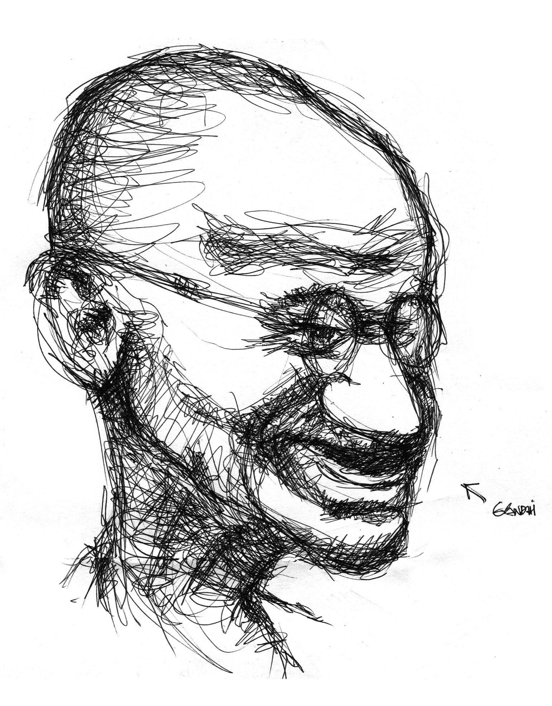

# 4

_Muốn lên tàu đi đâu thật xa  
Nhưng nhà ga đã sụp  
Ngã tư mưa nhớ em  
Vừa thương vừa trách giận  
Sao chân em dẫm đạp  
Lên những gì tôi yêu?_

— Lưu Quang Vũ

   

“Anh ơi em mới đi công tác về. Ấn Độ anh ạ. He he! Vui lắm anh ạ, bên đấy trâu bò đi đầy đường. He he! Bụi bặm kinh khủng. He he! Ấn Độ nghèo lắm anh ạ, mạt rệp luôn. Y chang như trong phim Slumdog Millionaire. He he! Em ở Ấn Độ xong về thấy Việt Nam mình thật là sung sướng. Công tác phí mỗi ngày ba trăm đô, mà chả phải làm gì cả anh ạ. He he! Ở khách sạn năm sao anh ạ! He he! Sắp tới em sẽ đi Sri Lanka. Sao mà đời em sướng quá anh ạ! He he! Em chỉ lo kiếp sau không được sướng như thế này. He he!”

He he.

Em, thế ra chúng ta sướng hơn Ấn Độ rồi sao? 

Anh biết đâu. 

Nói ra thật xấu hổ, vì suốt ngày bận lao xe trên xa lộ đi kiếm tiền và mua bệnh lao phổi nên anh chưa được tới Ấn Độ bao giờ. Trong cái kiến thức hạn hẹp của anh, Ấn Độ là một đất nước kia ở phía Nam châu Á, đông đúc hạng nhất nhì thế giới – dân số chỉ thua mỗi anh Ba Tàu, cái anh mà nếu để dân chúng xếp hàng một diễu qua trước mắt em thì cái hàng sẽ không bao giờ dứt vì cứ đẻ hoài đẻ mãi không ngừng nghỉ. Khác với dân Tàu, dân Ấn da đen nhẻm, mắt to tướng lồi ra, mũi cao cao khoằm khoằm, đàn ông có râu mép rậm rịt, đàn bà có cái chấm ngay giữa trán, thích mặc đồ truyền thống lùng nhùng hay đội bình lên đầu ngồi thổi rắn. Ấn Độ có nhiều người không ăn rau thờ bò thì cũng nhịn đói một tháng mỗi năm. Ấn Độ có những du-già thích đi trên lửa, ngồi trên chông, tắm dưới thác, lại có nhiều đền đài miếu mạo hai bên bờ sông Hằng, trong đó nổi tiếng nhất phải kể đến Taj Mahal là cái lăng mộ kia do ông vua kia xây cho bà hậu kia, nhìn thực trắng thực to, hai hàng trụ tròn hai bên một bể bơi vuông chính giữa, thật mũm mĩm xinh xắn. Ngoài những cái đó ra, theo chỗ anh được biết, Ấn Độ còn có Linh Hồn Lớn Mohandas Gandhi với kĩ thuật giải phóng dân tộc bất bạo động đã luyện thành thục đến mức độ kĩ xảo và Thánh Sư Rabindranath Tagore với tuyệt nghệ làm vườn ra thơ đem đi dâng đoạt giải Nobel văn học từ những năm đầu tiên của thế kỉ trước, một lắm râu tóc một trọc lóc đầu, cả hai cùng vĩ đại như nhau. 

Thế a, chúng ta sướng hơn Ấn Độ rồi sao? Anh đọc _Thế Giới Phẳng_, thấy trong đó Thomas Friedman nhắc tới Ấn Độ không biết bao nhiêu là lần với thái độ vừa nể vì vừa kính sợ không giấu giếm. Ấn Độ của Friedman nắm trong tay nền khoa học kĩ thuật và công nghệ của cả nước Mỹ bằng những công ty outsourcing[^1], thách thức và san phẳng thế giới với những tổng đài dày đặc ở Bangalore và Mumbai. Còn chúng ta đang ở đâu? 

_Ế a_, chúng ta sướng hơn Ấn Độ rồi sao? Anh chơi Age of Empires III, thấy có cả một phần dành riêng cho cuộc binh biến năm 1857 của những _sepoy_ đứng lên chống lại ách thống trị của công ty Đông Ấn. Anh thấy những tấm sari đủ màu sắc, những tòa nhà Ấn Độ, những cái tên Ấn Độ, những con người Ấn Độ, những kì quan Ấn Độ. Anh thấy từ pháo đài Agra đến tháp Chiến Thắng rồi đến đền Taj Mahal, những trận đánh anh hùng của quân khởi nghĩa Ấn Độ từ Barrackpore, Delhi đến Shimla, Calcutta. Còn Việt Nam? Không em ạ, trong Age of Empires Ba La Mã không hề có áo dài hay áo tứ thân hay áo ba lỗ hay áo giật gấu vá vai mẹ anh chưa có vợ già chưa khâu, không có thuốc lào dép lào gió lào hắc lào, không có cây tre làng hay cây gạo hay cây gõ hay cây gòn _mới lên đã thẳng như chông lạ thường_, không có gốc đa giếng nước đầy rêu nơi những người gánh nặng vẫn thường trượt chân ngã chổng gọng nái vỡ bọng đái, cũng không có lão Hạc tung chiêu chơi thật đểu con Vàng rồi qua nhà khốn nạn ông giáo ơi ngồi khóc tu tu. Microsoft Games[^2] không buồn quan tâm đến chàng Lía bị mụ vợ lừa đến nỗi khốn đốn trong thành Truông Mây rợp trời chim én lượn khi gió đồng ngát hương, đến Nguyễn Hữu Cầu bơi qua bơi lại như con cá he giữa Hai Bà Trưng và Trần Quang Khải những giờ cao điểm, đến Hoàng Diệu cây đa tuẫn tiết, Phan Đình Phùng thân xác bị đốt ra tro trộn vào thuốc súng bắn xuống sông La cho cá lìm kìm rỉa hay Nguyễn Trung Trực hỏa hồng Nhật Tảo kiếm bạt Kiên Giang làm cả đất trời cùng quỷ thần đều lòi mắt há mỏ nước dãi chảy ròng ròng, để rồi bị chém đầu ngay giữa chợ.[^3] Không em ạ, chúng ta hân hạnh được nhắc đến trong phần giới thiệu địa lí và lịch sử lãnh thổ Đông Dương dưới cái tên thật là vẻ vang hoành tráng là An nam[^4], cùng với Thái Lan, Miến Điện, Cam bốt, Mã Lai và Lào, rằng vùng đất này chịu ảnh hưởng nặng nề của Trung Hoa văn hóa, rằng Trung Quốc đô hộ từ một một một trước công nguyên đến chín ba chín sau công nguyên, rồi chính phủ Pháp bảo hộ từ một tám tám bảy đến hiệp định Giơ-ne-vơ một chín năm tư, rằng chấm. Nào, đã có người chấm rồi, giờ em hãy mút đi. 

Ý anh là em hãy hãnh diện đi. 

Vì Ấn Độ là một đất nước kém vệ sinh có hàng tá hàng tá trâu bò cứ suốt ngày gõ móng lộp cộp ngoài đường, ý hẳn chúng nó ỷ mình là vật thiêng nên thả giàn phóng uế khắp nơi. Chúng ta không có trâu bò đi ngoài đường, rất khác với Ấn Độ, mặc dù anh vẫn hay nghe trên tivi trong chương trình thời sự rằng “tuy cách xa nhau gần bốn nghìn cây số đường chim bay song Việt Nam và Ấn Độ có nhiều nét tương đồng về văn hóa, phong tục, tập quán… đều là nước nông nghiệp đang phát triển… rất có nhiều bò… là một đối tác quan trọng, đầy tiềm năng trong thời kì hội nhập… đồng chí Văng Văng Nghe Sa Sả chân thành cảm ơn và vui vẻ nhận lời mời đến thăm trong một tương lai gần không xa… lộp bộp lộp, lộp bộp lộp, lộp bộp lộp bộp lộp.” Không, trâu bò nước chúng ta nằm trong chuồng hoặc đi cày ruộng chứ không đi ngoài đường – là một thằng ngu như bò quanh năm suốt tháng ban ngày ra đường buổi tối về chuồng, anh có thể hiên ngang vừa đứng tè đường vừa làm chứng cho sự thật này. Thật ra thì trên đường của ta, ngoài người và thỉnh thoảng chó ra anh không thấy con động vật nào cả. Anh chỉ thấy những nường xinh đẹp như chim sa cá lặn, da trắng hếu như trứng vịt lộn từ bẹn trắng xuống và đầu vú trắng lên, trắng cả bụng và trắng cả lưng, đi cái xe cũng trắng lại vẽ nhiều hình trang trí lòe loẹt như đuôi trĩ, vừa cười hô hố hô hố như khỉ sở thú vừa lao vỡ cả lề đường gãy cả gốc cây như voi Tây Nguyên. Anh thấy những chàng đẹp trai răng trắng bóng khỏe như hải ly, tóc nhuộm vàng xức mút còn dính xác vài chục con ruồi, phủ xõa một bên mắt như thành viên nhảy bè nào đó trong ban nhạc Ê Mô, áo sơ mi mở phanh để loòng thoòng sợi xích chó giữa đống xương sườn, quần jean đen bóng bó hai chân khẳng khiu như cò hương, cong người trên chiếc xe cưa ống bô như tôm, nẹt ga rồ rồ như cứu hỏa, khói xanh bốc ra từ đít như nhà cháy, phóng vượt đèn đỏ như điện giựt, nhưng không ngờ lại có anh cảnh sát giao thông mẫn cán đã nhẫn nại như rùa, ẩn nấp từ sáu giờ sáng như đang ôm cây đợi thỏ, giang cánh như con mèo dạy hải âu bay, xông ra nhanh như chim cắt, vừa thổi còi toe toe như chim cu vừa vồ lấy con mồi như chim ưng, vung dùi cui đòi tiền ngay như chim đại bàng. Anh thấy những em điếm ế cất công son phấn mắt xanh mỏ đỏ như vẹt nhưng vẫn xấu đau xấu đớn như đười ươi vì hàm răng hữu ý hay vô tình đã hô như ngựa, chân dài tới nách như đà điểu, hút phì phèo một lúc hai điếu Con Mèo, đi lang thang như dơi trên vỉa hè gần công viên Hoàng Văn Thụ lúc nửa đêm về sáng, mắt lồi cả ra như cá vàng, ngoác mồm mặc cả ồm ộp như ếch với một lão già ham của lạ da mốc như da rắn lại điểm những nốt mụn cóc và tàn nhang như trứng cút, bụng phễnh phệ như ễnh ương và lưng gù như lạc đà hai bướu. Anh cũng thấy những cô cậu học sinh đang độ tuổi trăng tròn, ùa ra khỏi trường trò chuyện với nhau líu ríu như chim sẻ, ôm vai bá cổ nhau thân thiết như bầy thiên nga, xong rồi chửi nhau sa sả như bồ nông, đánh nhau khốc liệt như Kinh Kông, lột áo nhau như ve sầu, cước vào bụng nhau như bọ ngựa, vả vào mồm nhau như cọp tát, làm chân lông anh dựng hết cả lên như gà. Quả đúng như thế em ạ, chúng ta không có trâu bò hay động vật hay súc vật nào giữa trưa rong chơi ngoài lộ, nào em hãy cùng anh gáy đi. 

Ý anh là em hãy tự tin lên đi. 

Vì anh vừa đọc xong _Cọp Trắng_, cuốn sách của một người Ấn Độ viết về xã hội Ấn Độ. Phải nói ngay để em còn liệu đường mà thất vọng, nó là một tác phẩm văn học khô như ngói, không tình yêu, không tình dục, không du học, không du hí, không ung thư cổ tử cung, không bay không bướm. Thế mà nó lại giật giải Man Booker uy tín của năm 2008, thật là kì diệu thật là phép mầu. Trong _Cọp Trắng_, Aravind Adiga so sánh cả xã hội Ấn Độ với một cái chuồng gà lớn, và chín mươi chín phần trăm dân số Ấn Độ bị kẹt trong cái chuồng gà đó. Kiểu như Mắc Xích[^5] của Atmosphere ấy, em nhớ không: _chuồng gà, chuồng gà, mỗi người là một con gà, chuồng gà, chuồng gà, tại sao tôi lại là gà, chuồng gà, chuồng gà, tôi không muốn làm con gà_. Em hãy tự tin, vì Việt Nam ta không thế. Đứng trên gà mà nói thì chúng ta không chịu thua ai – tất nhiên trừ nước Thổ Nhĩ Kỳ, nơi cả đất nước là một con gà to – chúng ta có cả dịch cúm gà cũng như không hề ngần ngại tiêu thụ trứng gà giả. Nhưng, chưa có ai đánh đồng xã hội ta với cái chuồng gà cả. Không, chẳng ai nghĩ đến, mà cũng chẳng ai dám, ngay cả những lão xe ôm say bét nhè anh vẫn thường gặp hai bên bờ kè, ngồi tụng bia hơi hạng bét với món rau muống xào tỏi mà bàn chuyện trên trời dưới đất, hay mấy ông sồn sồn vẫn hay đánh cái quần xà lỏn, ngồi ôm con gà chọi ở góc đường, bình luận xem bên nào sản xuất ra quả bom nguyên tử to hơn, Bắc Hàn hay Mỹ. Không có ai xem xét mối tương quan giữa chúng ta và cái chuồng gà, không ai dại thế. Anh chỉ nghe bảo rằng thay vì chuồng gà, chúng ta đang sống trong một cái giỏ cua _(giỏ cua, giỏ cua, mỗi người là một con cua)_, rằng chúng ta có nhiều chân, nhưng chúng ta lại chỉ bò ngang; rằng chúng ta không ăn sóng nói gió gì cho ra hồn, thế mà chúng ta lại rất hay sùi bọt mép; rằng càng chúng ta to, nhưng chúng ta không dùng chiến đấu, chỉ dùng để huơ qua huơ lại, huých đẩy nhau khụi nhau kiếm chỗ ấm thân; và rằng chỉ cần có một con lò dò mon men bò lên miệng giỏ hăm he tẩu thoát thì lập tức chúng ta bâu vào kéo xuống cho bằng được. Cũng giống như chuyện trăm con thằn lằn bám trên trần nhà mà có lần anh kể em nghe ấy: một con chẳng biết đứng tấn Thái Cực Quyền kiểu quái nào lại trượt chân lộn cổ xuống, sau đó đúng một giây chín mươi chín con kia nhất tề phóng đít rơi theo – chúng nó quá hăng hái vỗ tay mà quên phứt đi rằng cái kiếp thằn lằn sống trên đời này là để đu bám bóng đèn đớp mòng đớp muỗi. Em, em đừng bao giờ quên mục đích tối thượng ấy, cho nên, nào, hãy cùng anh đớp đi. 

Ý anh là em hãy cùng anh vui sướng đi. 

Hãy cùng anh vui sướng đi.

Nói ra thật xấu hổ, vì suốt ngày phải lao xe trên xa lộ Hà Nội để kiếm tiền mua bệnh lao phổi nên anh chưa được đi Ấn Độ bao giờ – anh thật tủi thân, anh không thấy mình sướng. Nhưng anh dòm ra xung quanh: khối người còn chả biết Ấn Độ là cái loại ấn gì (ấn ấn ai hay ái ái ân) – anh thật hả hê, anh thấy mình sướng. Anh chẳng biết trong khách sạn năm sao người ta lát gạch bông như thế nào – anh thật quê mùa, anh không thấy mình sướng. Nhưng anh nhìn tứ phía: cả một lũ đang còn phải chen chúc nhau trong mấy cái chòi vịt rách nát bên bờ rạch hôi rình ngồi đợi khoai lang chín – anh thật khoái trá, anh thấy mình sướng. Để kiếm được vài ba trăm đô anh phải đổ mồ hôi sôi nước mắt suốt cả tháng trời – anh thật lam lũ cực nhọc, anh không thấy mình sướng. Nhưng anh lại nghĩ đến lão Hòa què quê anh mỗi ngày lắc cắc chống cái chạc ổi lê la hết huyện này sang huyện nọ mà không xin được nổi vài lon gạo lót lòng – anh thật phỉ dạ, anh thấy mình sướng. Anh xem phim _Slumdog Millionaire_ mà không biết bao giờ nền điện ảnh nước nhà mới làm được một phim giật giải này giải nọ hết nam hay đến nữ đẹp như thế – anh thật tự ti hãm tài, anh không thấy mình sướng.[^6] Nhưng rồi anh nhận ra cái nước Bắc Hàn suốt ngày cạo sắt chế bom nguyên tử còn chẳng có được cái ti vi quèn để theo dõi tình hình tài chính phố Uôn nữa kia – anh thật tự hào, anh thấy mình sướng.[^7] Anh nhìn lên trời thấy Icarus đang giương cánh sáp bay phành phành đầy tự do – anh không biết bay, anh thật hèn mọn, anh không thấy mình sướng. Nhưng khi Icarus té xuống biển chết trụi cả lông, anh lại nghĩ thôi bay bổng mà làm gì, bò lết cho nó lành, hèn cũng được mà mọn cũng xong, miễn còn sống tươi đây – anh thật thỏa mãn, anh thấy mình sướng. 

Hay là anh chỉ việc nhìn xuống? Vì anh cũng như em, muốn mình sướng hoài, sướng mãi, sướng cả đời. Anh sẽ sống như em đang sống, sẽ yêu đất nước này theo cách em vẫn yêu, sẽ cười nhạo những dân tộc để trâu bò đi nhông ngoài đường, cho dù họ là nền kinh tế đứng ở tốp đầu thế giới, cho dù họ mỗi năm đăng kí hàng trăm hàng nghìn bằng sáng chế, cho dù họ giành được những giải Nobel và Man Booker, cho dù thế nào cũng mặc. Mặc kệ người ta nhắc đến Việt Nam như là một đất nước nghèo đói và tham nhũng đỉnh cao, mặc kệ những thứ ít ỏi có thể khiến cho chúng ta tự hào cháy mặt báo nổ ti vi là bài hát Bông-dua, bổ đề Lăn-lăn-ai-biết-đến-từ-đâu-lăn-về-đâu và cuộc chiến tương tàn kết thúc đã ba mươi lăm năm rồi, mặc kệ, anh muốn mặc kệ hết mọi thứ, phủi tay mọi thứ, nhổ vào mọi thứ. 

Nhưng khi anh đọc Thế Giới Phẳng, không biết bao nhiêu là lần anh phải dừng lại, gấp sách đánh “bộp,” ngồi thừ người ra, máu sôi lên, và ước gì cái đất nước mà ông Friedman đang ca ngợi không tiếc lời đó không phải là Ấn Độ mà là Việt Nam, là đất nước của anh do anh và vì anh, của cả một lũ da vàng mũi tẹt cùng ăn hại suốt đêm ngày như anh. Anh không cần biết cờ đỏ hay cờ vàng, chuyên chính vô sản hay đa nguyên đa đảng, anh không quan tâm thể chế chính trị, anh bỏ ra ngoài tai ai là chủ tịch ai là thủ tướng ai là bộ trưởng ai đứng đằng sau Tám Bốn Không Sáu ai điều hành x-cafe ai ra tòa ai cơ hội ai chụp mũ, anh nhắm mắt kệ ai bị xe cán ba lần ai chín mươi ba tuổi còn đi ăn xin mua quan tài ai cho không biếu không đất rừng ai phán “dân là gian.” Vì sự an toàn của bản thân, anh miễn nhiễm với tất cả những thứ đó rồi. Anh chẳng cần ba trăm đô mỗi ngày, anh chẳng cần ở khách sạn năm sao, bể bơi giường nệm chăn bông tủ đá máy lạnh gì. Anh chỉ có một ước muốn nhỏ mọn hèn đớn đó thôi – sao cho cái ông Thomas Friedman mà anh không hề quen biết ấy, cái ông ở cái đất nước Cờ Bông mà anh chưa hề đặt một ngón chân đến ấy, cái ông Mèo Đực Người Chiên Giòn đã gần đất xa trời ấy, viết một tí tị tì ti gì về Việt Nam trong cái thế giới vừa tròn quyn vừa phẳng lịt này thôi, với một ít khâm phục và nể sợ gì đấy thôi. 

Được vậy thì anh mới thực là sướng, em ạ. Chỉ lo cả cái kiếp này anh chả được sung sướng như thế. 

He he.

  

[^1]: Ta dịch là “công ty thuê ngoài.”
[^2]: Là cái bộ phận viết phần mềm trò chơi vi tính của Microsoft, đã viết nên cái trò Age of Empires tức Thời Đại Những Đế Chế.
[^3]: Nói cho công bằng thì một số năm sau đó, Microsoft Games đã viết thêm một bộ mở rộng cho cái trò Thời Đại Những Đế Chế này, trong đó có _showcase_ anh hùng Le Loi của chúng ta. Khỏi phải nói chắc em cũng biết anh em ngồi nhà đóng cửa chơi game đã tự hào sung sướng thế nào.
[^4]: Cái tên sặc mùi bị trị này hiện vẫn đang được đặt tên cho một số nhà hàng quán nước ở quận 1.
[^5]: Đây là một bài nhạc rock theo phong cách Thrash Metal mà anh thường bị lũ bạn khốn nạn tra tấn vào những giờ lên đồ án ở trường Kiến trúc. Anh không nhớ rõ lời cả bài, nhưng đoạn điệp khúc thì đại để như sau: Mắc xích! Mắc xích! Mỗi người là một mắc xích. Mắc xích! Mắc xích! Mỗi người là một mắc xích. Xúc xích! Xúc xích! Mỗi người một cục xúc xích. Xúc xích! Xúc xích! Tại sao lại là xúc xích? Tôi không muốn ăn xúc xích! Aaaaaaaaaaaaaa!
[^6]: Thật ra cái phim này là của Anh Quấc nó làm, nhưng vì Ấn Độ có một đóng góp nhỏ nhoi là cả giàn diễn viên và một số đạo diễn, nên anh vơ vào thành một nắm luôn. Chắc thủ tướng Ấn Độ cũng chả vì việc này mà trách cứ gì anh. 
[^7]: Thật ra dân Bắc Hàn thì quan tâm gì đến phố Uôn, họ còn bận đi đổi tiền, nhưng chắc chủ tịch Bắc Hàn cũng chả vì việc này mà trách cứ gì anh. 
