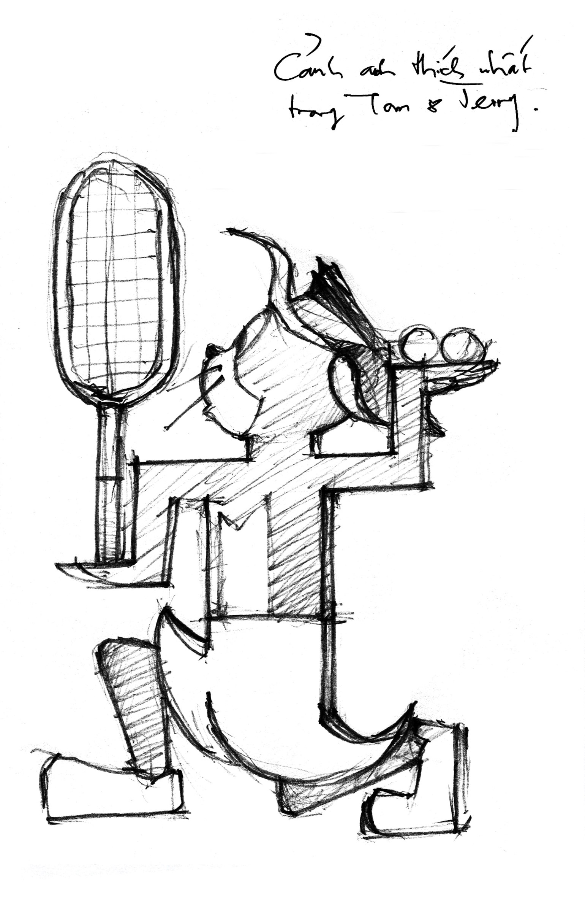

# 5

_Tại sao em lại yêu anh  
Gã con trai viển vông và thất bại  
Người ta bảo: có lẽ hắn cũng có chút tài  
mà lầm lẫn, mà buồn, mà trơ trọi_

— Lưu Quang Vũ

   

Tại vì anh sợ anh sẽ chết sớm. 

Trên đời này từ đàn ông cho chí phụ nữ không phân biệt giai cấp tầng lớp, từ trẻ em còn mũi dãi lòng thòng cho đến người lớn ngồi trong văn phòng móc mũi đợi hết giờ làm, từ bác nông dân bán một kí thóc năm ngàn đồng cho chí anh công nhân ăn một bữa trưa bốn ngàn đồng cho chí me xừ viên chức hút một điếu thuốc mười ngàn đô(`ng), không ai là không sợ một cái gì đó. Ta hãy nhìn sang Tàu: Tần Thủy Hoàng chạy quanh chân cột la hét đủ loại Hán tự vì sợ Kinh Kha dụng trủy thủ đâm; trăng sợ bị Lý Bạch độ cồn trong máu quá cao tung ngón cẩu vồ; ông cụ xóm Thạch Hào sợ bờ tường cao quá tuổi già gân nhão đầu gối run trèo không nổi. Ta lại hãy nhìn sang Tây: Lev Tolstoy cuối đời bỏ nhà đi lang thang đầu đường xó chợ đến nỗi chết lạnh ở nhà ga vì sợ vợ, Pushkin tuổi trẻ nông cạn, cương ẩu đấu súng đến nỗi tiệt mạng vì sợ mất vợ; Hitler có chòm râu cứt mũi trông oai phong lẫm liệt, giết người như ngóe thế mà lại đi sợ máu, dân Do Thái thông minh tuyệt đỉnh dám đóng đinh cả Giê-xu râu dài tóc dài lên trên thập giá lại đi sợ râu một mẩu tóc một nhúm là Hitler; George Washington thời thơ ấu chặt phăng gãy cẳng cây đào rồi đi sợ daddy, mà daddy của George Washington có thằng con dũng mãnh như Thạch Sanh lại bắt chước Lý Thông mà đi sợ thiên hạ đệ nhất chìm nghỉm là cái rìu. 

Trong cái _viu_ như trên, bên Tây anh tự xếp mình ngang ngửa với Victor Hugo, và bên Tàu anh tự xét thấy không mảy may thua kém Thái Sử Từ. Anh sợ chết. 

Chỉ mới gần đây thôi. Trước đây, khi Hugo văn gia được đưa vào điện Panthéon và Thái Sử võ tướng được Lục Tốn kéo từ trận tiền về thì anh chưa đến nỗi sợ chết như thế. 

Khi anh còn nhỏ, anh hay lên nhà bà nội bác xin cam. Nhà bà anh có một khu vườn rộng lớn trồng toàn cam, ra trái rất nhiều và rất to và rất ngon và anh rất thèm và nhà nuôi chó rất to và có lẽ rất ngon nhưng vì còn nhỏ chưa biết ăn thịt chó nên anh chưa thèm. Anh còn nhớ như in, lúc ấy anh khoảng bảy tám tuổi, cao bảy tám tấc nặng bảy tám kí lô thân hình hoàn toàn bình thường, da đen thùi lùi tóc cháy khét lẹt, mặc cái quần tà lỏn màu cháo gà, áo thun ba lỗ dính đầy nhựa chuối, mũi xanh thò lò, chân đi đất đầy mụn nhọt, chạy lên nhà bà chào hi grandmom rồi ra tọt ra sau vườn. Anh đi quanh quanh, mắt anh hau háu nhìn lên đám cam lủng lẳng, miệng anh mút mút mấy ngón tay đầy ghét, rất là một vẻ hèn hạ. Bà anh lúc đầu còn thương tình thằng cháu đói khát nên cũng xách cù nèo quèo cho anh mấy trái về ăn, dần dà về sau chắc chán ngán cái thái độ liên tục xin cam không biết điều không biết xấu hổ không biết sĩ diện nên cứ để mặc kệ. Anh đi tới đi lui trong vườn chán, mút tay chán, bị con chó ngon nhà bà cắn cho một phát răng ngập lút vào trong đầu gối, chạy về nhà khóc te te. Cha anh kiến thức y học lúc ấy hãy còn nông cạn hơn Pasteur ít nhiều, trong lúc bối rối không biết làm sao, đành rút đại túm nhang trên bàn thờ châm lửa đốt xòe, quơ qua quơ lại trước chân anh, miệng khấn ông bà lâm râm, khói bốc lên nghi ngút làm anh thấy rất hay, rồi bà nội anh lại đem xuống bịt vào mồm anh nguyên một thúng cam rất to làm anh thấy rất ưng dạ, nên chi anh không khóc nữa. Nghĩ lại, lúc đó con chó kia mà bị điên thì coi như anh cũng ngỏm dại, nhưng anh quả là thiếu niên anh hùng, gan dạ thật không kém cạnh Lê Văn Tám[^1], vừa ngồi ăn cam vừa gãi ghẻ sồn sột, coi cái chết tựa như tơ hồng chung tình làm đôi, chẳng sợ tí quéo nào. 

Lớn thêm một chút, anh ra thành phố học, được tiếp xúc với thế giới văn minh, có nhà xi măng, đường nhựa, kem ăn được cả li nghe rôm rốp, đồng hồ quả lắc vừa lắc vừa kêu boong boong, xe rác vừa hốt rác vừa kêu leng keng, nước vặn vòi chung cư buổi trưa kêu tồ tồ buổi khuya kêu tỏng tỏng, thật là thiên đường trần gian. Nhưng cái đặc biệt hơn cả là thành phố có điện. Những buổi tối khi trời không cúp điện, nhà nhà lại mở các loại đèn ống trắng soi phòng khách nơi người ta ngồi và đèn tròn vàng soi hố xí nơi giòi bò ruồi nhặng bay, rộn rã tiếng trống đồng quay tít mù trên ti vi báo hiệu chương trình thời sự và tiếng hát ngợi ca anh hùng Lâm Xung vừa thét gào những mối cừu hận “Lý Sư Sư ngươi dám lé sơ sơ hả” bằng tiếng Quảng Đông vừa phi khinh công trên nắp áo quan phóng bát xà mâu đâm xuyên thấu ngực Cao Cầu vì y đã can một cái trọng tội rất khốn khổ khốn nạn là đá cầu cao. Năm ấy anh chừng mười tuổi, chân ướt chân ráo từ trên núi xuống, chỉ mới nghe danh ông Thomas Edison qua bài giảng đạo đức lớp ba “Cụ già giành ghế của Ê-đi-xơn trong xe cứu hỏa và bị lơ xe đánh kinh kinh lắm, các em nhớ cẩn thận biết thân phận mình đừng dại dột đánh nhau với lơ xe,” nào có biết điện đóm là cái mô tê gì, cứ tưởng là một loại củi mới. Cho nên một chiều nọ sau khi tắm táp vệ sinh cơ thể xong anh mới nhón chân thò tay vào sau cái ổn áp Lioa đặt cạnh bồn cá cảnh, thứ nhất là để sưởi ấm thứ hai là để hong khô. Điện đang điềm nhiên ngồi trong cái ổn áp xoay xoay các chiều, tự nhiên thấy có bàn tay thò vào, tất nhiên ngứa mắt liền giật anh một cái “è” làm anh ngã lăn ra. Cũng may thời ấy dân ta còn xài điện áp thấp một trăm mười vôn, nếu không anh đã cháy thành than từ rất lâu rồi. Ấy thế mà anh không sợ. Anh nằm trên sàn nhà, tê cứng toàn thân từ đầu đến đít được chừng vài phút, xong ngồi dậy phủi đít phèng phẹt gãi đầu sồn sột đưa ra kết luận rằng điện không ấm như củi, rồi xuống nhà dưới ăn cắp của bà chị năm trăm đồng đi qua nhà hàng xóm mua kem ăn, miệng lại đọc bài “Chú thợ điện” rất ăn giọng, như sau:

_Như chim gõ kiến  
Bám dọc thân tre  
Ồ, chú thợ điện  
Đu mình tài ghê!_

_Quần áo chú xanh  
Trời không xanh thế  
Bàn tay chú khoẻ  
Bóp cong gọng kìm._

_Hoa sứ bắc lên  
Trắng hai vai cột  
Dây điện từ đất  
Chú căng ngang trời…_

_Cháu đứng quên chơi  
Ngắm nhìn chú mãi!_[^2]

Sau khi đã làm quen với điện, lớn thêm một chút nữa anh được đi xe đạp. Vì thành tích học tập xuất chúng mấy năm cấp hai, anh được gia đình yêu mến mà chu cấp cho một chiếc xe đạp sản xuất từ thuở bá tước Drais còn tại vị, truyền đến anh đã qua vài mươi đời. Phàm cái gì đầu tiên trong cuộc đời con người ta cũng đều nhớ như in, ví dụ tiếng khóc đầu tiên, ngụm sữa đầu tiên, cái tã đầu tiên, cú rắm đầu tiên, cú bĩnh đầu tiên, cú đét đầu tiên, cú đút lót đầu tiên, cho nên anh cũng nhớ như in cái xe đạp đầu tiên của anh. Nghe đâu thời ông cố anh theo quan quân từ Bắc mang gươm đi mở cõi xuống phía Nam thì nó được sơn màu vàng Hoàng Kim. Sau đó ông nội anh vì căm ghét chế độ phong kiến Bảo Đại suốt ngày săn voi và cưới hoàng hậu Nam Phương quá đẹp nên cạo vàng Hoàng Kim mà sơn vào đỏ Kì Vĩ. Sau đó nữa cha anh lại vì cuộc sống thời bao cấp bế tắc khổ đau chỉ còn biết thở bằng niềm tin và hi vọng nên lột luôn đỏ Kì Vĩ mà phết vào xanh Bờ Lu. Cuối cùng khi anh đặt đít ngồi lên thì cả xanh đỏ tím vàng đều đã cùng hai ông cố nội đi mất dạng, còn tuyền một lớp rỉ sét phủ toàn khung chỉ chừa mỗi cái ghi-đông với hai cái lốp. Phanh xe tất nhiên chỉ còn tác dụng trang trí, quả chuông xe là để lâu lâu cầm xoa xoa nắn nắn thật vừa tay vui tay, yên sau mang tính chất thử nghiệm độ đàn hồi của mông đít và thằng ngồi trên yên trước là chuột bạch. Anh thượng lên cái xe như thế, giữa trưa trời trưa trật còng đủ các loại lưng, nổi xương sống lên tạo hình bản nhạc _Marcia alla turca_[^3], cần mẫn đạp đi học dưới trời nắng chang chang, mồ hôi muối cùng với mồ hôi phèn túa ra ròng ròng. Vì cái phanh xe ăn hại mà không biết bao nhiêu lần anh không thắng kịp ở ngã tư, đành phải nghiến răng xông thẳng vào đoàn xe tải xe ben đang ùn ùn kéo qua. Những lúc như thế ấy anh giật tay lái mãnh liệt chẳng khác nào tay đua Công Thức Một lừng danh là Mai-cơn Xu-ma-khơ, chân anh cà xuống mặt đường làm lửa tóe ra và bốc lên hàng tấn khói phốt-pho, miệng anh gào thét giả tiếng còi xe “Bịp tránh ra nào bíp cút ra nào” máu lửa và rốc không kém Phương Thanh ca _Giã từ dĩ vãng_ “cô đơn cô đơn nỗi đau cõi đời lạc lõng như vinh tồ,” hết lách sau đít xe này lại lạng trước đầu xe kia cứ vun vút, làm thằng Hồng Lĩnh thằng Thái Hà đang đứng đợi đèn đỏ hoặc phục sát đất hoặc vãi ướt quần hoặc cả hai. Từ đầu đường Trưng Nữ Vương đoạn gần sân bay Nước Mặn cho đến trường cấp ba Phan Châu Trinh trên đường Lê Lợi, ngã ba ngã tư ngã năm ngã sáu ngã bảy nào cũng từng chứng kiến cảnh anh tông xe hoặc móp vành hoặc gãy căm hoặc đứt xích hoặc cắm đầu xuống đất răng môi lẫn lộn hoặc chí ít cũng trầy xước chân tay phải lấy dầu cù là bôi vào. Cứ mỗi cuối tuần anh lại dắt xe ra tiệm sửa xe đầu hẻm cho lão già thọt chân kiềng lại vành bóp lại thắng, đều đặn đến nỗi hễ tuần nào không thấy anh lão lại bồn chồn sốt ruột đứng ngồi đều không yên, cứ phải nằm dài trên võng ngâm nga “Không mợ chợ vẫn đông, mợ đi lấy chồng thì chợ vẫn vui,” lâu lâu lại ngỏng cổ lên nhìn ra cửa xem thằng khách hàng thân thiết đã đến chưa. Trên người anh bây giờ trừ cái sẹo to chó cắn và ba cái sẹo nhỏ mổ nội soi ruột thừa ra thì tuyền là sẹo tông xe thời này. Thế mà lúc ấy anh không sợ, buổi trưa anh vẫn thong dong nhét tập vào cặp đạp xe lên đường tầm sự học, buổi chiều anh lại ung dung nhét tập vào cặp vứt sự học ở lại mà đạp xe về nhà ăn rau muống chấm nước tương, cuộc đời thật là vui vẻ sảng khoái. 

Kể lể quanh co như thế chỉ để chứng minh rằng tuy ngực không có lông, anh vẫn thật là gan dạ. Cha mẹ anh có sáu đứa con bốn gái hai trai, anh hẳn là đứa gan dạ nhất. Anh đi xem bói thì thầy gieo quẻ nói rằng, nếu xui xẻo thế nào anh vào quân ngũ thì chắc chắn anh sẽ lên lon Đại Tướng, còn như đi theo con đường giang hồ đầu bò đầu bướu thì anh sẽ đua ngựa vằn cùng với Đại Cathay, không thể nào sai được. 

Vậy mà lớn lên anh đâm khác hẳn – lão thầy bói mù dở khốn nạn! Anh chẳng phải Đại Tướng mà lại càng không phải Đại Cathay. Anh không cưỡi được ngựa hoang cũng chẳng kị nổi bà cụ[^4]. Chẳng biết từ lúc nào anh đã trở nên thật là nhục nhã đớn hèn. Anh sợ chết. 

Ví như, ngày xưa anh nhấp nhổm mông đít trên chiếc xe đạp đứt thắng mất phanh, miệng này huýt gió Freewheel burning miệng kia nhai kẹo cao su, vượt các loại đèn như điên như ngộ. Bây giờ anh ngồi Future Neo vững chãi, thắng chân thắng tay đầy đủ, nhưng hễ đến ngã tư anh lại quýnh quáng không biết xử lí ra làm sao. Vì nếu anh quen thói xông pha của những thời ấu trĩ, biết đâu đằng sau gốc cây bên kia đường lại rình rập những mối hiểm nguy không ngờ tới, biết đâu lại có bác cảnh sát đen thui mập phệ như con bổ củi đội lốt cánh cam nào xồ ra trên lưng chú chim bồ câu trắng xanh bay đuổi anh trắng bệch chạy khắp thành phố bắt kì được cho đủ chỉ tiêu, biết đâu trên đường gian nan bôn tẩu anh lại xui xẻo thiếu sự tập trung cần thiết mà cắm đầu vào thân cây trốc gốc gãy đổ trên đường Nguyễn Du, biết đâu cái nón bảo hiểm trị giá năm trăm ngàn đồng hằng ngày anh vẫn đội một cách dương dương tự đắc lại là hàng lậu nhập từ Trung Quốc[^5], biết đâu não anh văng ra đầu anh lại bẹp vào, biết đâu anh hưởng dương hai mươi sáu tuổi, bia mộ màu xanh lóng lánh chạm bốn chữ vàng lung linh[^6]. Còn nếu anh làm công dân gương mẫu dừng xe trước vạch vôi – có rất nhiều vạch vôi, anh thường chọn một cái bất kì – biết đâu sau lưng anh lại có chiếc xe ben mất thắng ủi đến, biết đâu anh bị xe buýt nó cán cho dẹp lép, biết đâu thằng tài xế xe công ten nơ nó chạy tới chạy lui cho anh đứt ra làm hai, chết hẳn đỡ tiền nuôi bệnh. Cho nên anh dừng thì anh ngỏm mà anh chạy anh cũng toi, anh tuân thủ luật hay anh phá luật thì kết cục của anh cũng là chết thảm, thật quả tiến thoái lưỡng nan đi về lận đận. Hay biết đâu chừng anh phải làm luật mới họa chăng có chút cơ may sống sót? Em ạ, ai biết đâu. 

Vì biết đâu sáng mai nắng anh phơi quần đùi. 

Anh đi trên đường thì anh sợ ngã hố ngã hầm. Sài Gòn dạo này rộ lên phong trào thiết kế thi công hầm hố, nơi mỗi cái hố là một nghệ thuật và người đào hố là một nghệ sĩ[^7], với cái cuốc chim và xe móc đất là vũ khí mà con phố thân yêu nơi anh đang ở lại trở thành chiến trường, với sự ngu dốt là đồng minh và an toàn giao thông là thù địch[^8]. Hố hầm mọc xuống khắp nơi nơi, có những cái hố hình vuông, có những cái hố hình tròn, có những cái hố hình bầu dục giống như phòng làm việc của tổng thống Huê Kì, có những cái hố hình ngũ giác đều Pentagon, có những cái hố hình ngôi sao trên đại lộ Danh Vọng, có những cái hố hình con cá trê, có những cái hố hình con lợn, có những cái hố to đến mức có hình con đường, lại có những cái hố giống như con lị Amíp chứa đầy nước nhờ nhờ đục đục mà cứ sau mỗi giờ lại chuyển sang một dạng thù hình khác nhau, liên tục tạo nên sự bất ngờ thú vị cho khách tham quan. Trên miệng hố có nơi cắm tấm bảng “Công trường đang thi công, xuống xe tắt máy xuất trình tốc độ 5 cây số giờ,” có nơi cắm miếng vải tiền thân là quần xi-líp màu hồng cánh sen bay lất phất phơ, có nơi cắm một nhành nguyệt quế biểu tượng cho chiến thắng và vinh quang, lại có nơi cắm nguyên một chú công nhân quần xanh áo xanh nón cối vàng rất là đa tài, vừa hút thuốc lào vừa thổi còi vừa chửi thề vừa giang tay dạng háng chặn xe hơi như Raymonde Dien chặn tàu hỏa. Anh lò dò đi trên những con đường ghẻ lở chốc mòng như thế mà lòng những nơm nớp lo âu, không biết mình lao đầu xuống hố gãy cổ chết lúc nào. Cứ lâu lâu một lần anh xem báo lại hay tin anh ấy em ấy cô ấy chị ấy trong một tối đi đêm đã vô tình hay hữu ý lọt thẳng xuống cống tử vong. Em ạ, biết đâu một ngày nào đó không xa từ đây em cũng nhận được hung tin anh tử vong do lọt cống, anh chết trong trạng thái lõa lồ, thiếu răng vêu mõm như Trần Mạnh Tuấn thổi kèn sắc xô, tay chân anh còn đang huơ quáng quàng như nghệ sĩ ba lê đang múa theo một bản nhạc Ai Cập cổ đại. Em ạ, ai biết đâu. 

Vì biết đâu sáng mai gió gió bay quần đùi.

Ngoài đường đã thế, anh ngồi ở nhà thì lại sợ ăn cướp xông vào lấy mạng. Anh có một ông anh rể làm bác sĩ pháp y suốt ngày mổ các loại xác chết, lão hay vừa tu bia ừng ực vừa kể nhiều vụ kì án cướp giết hiếp nghe thật rất kinh hoàng. Tỉ như có một thằng cháu nọ giết bà nội đến chết để lấy tiền. Hay có một thằng con nọ chặt bố thành từng khúc đem ra thả trôi sông. Hay có một nường nọ mặt hoa da phấn ra tay cắt cổ của con người ta trong xe tắc xi. Hay có một ông nọ để bầy chó bẹc-giê nọ cắn banh xác bà nọ. Hay một thằng em nọ túng tiền xông vào nhà ông anh nọ giết từ trên giết xuống dưới cứ như Tào Tháo múa kiếm trong nhà Bá Sa. Thật là kinh. Anh nghe đến đâu mồ hôi lạnh túa ra đến đó, bèn gom tiền đi mua cả chục cái ổ khóa đủ các loại từ Việt Tiệp cho đến Việt Tiến, từ khóa thường cho đến khóa chống bấm, khóa chống cắt, khóa từ và khóa vân tay. Nhà anh anh khóa từ trên xuống dưới, từ trước ra sau, khóa cửa sổ cửa chính, khóa toi-lét khóa chạn bếp khóa ngăn kéo khóa cổ chó. Anh lại có một cái vòng bằng i-nốc sáng loáng của thằng Lak đem từ Ban Mê xuống tặng, ngày xưa vẫn hay đeo tay trái như là minh chứng tình bạn cao cả, dạo này anh tháo cất luôn vào đáy rương nhét thẳng xuống đáy tủ vì sợ chúng nó tưởng là vòng bạc vòng bạch kim gì lại đâm dao găm vào cổ họng anh. Cái túi đựng máy tính xách tay của anh, anh đã mua màu Penten loại không tan trong nước, bỏ ra cả buổi chiều ngồi nắn nót viết một dòng thư pháp phông chữ VNI Ông Đồ rằng “Thưa ông cướp cái đây nhìn nó na ná thế thôi chứ không phải là laptop đâu đừng cướp tôi đừng giết tôi đừng hiếp tôi ông nhé.” Thế mà anh vẫn thấy khó ghê không được an toàn. Buổi tối ngủ anh không dám tắt đèn, cứ phải chong cái bóng điện kêu o o, lại mở liu riu bài Courage Cường Đảm Cương Liệt của ban nhạc hộ pháp Manowar mua lấy sự an tâm. Những lúc ở nhà một mình, ngồi trong phòng nóng hầm hầm mà người anh cứ run bần bật, lâu lâu lại lấm lét liếc ra sau lưng, gió mùa xuân êm đưa rung hàng cau lưa thưa cũng làm tóc anh dựng đứng tưởng có ai sắp vạch ngói nhảy xuống chém chết anh mà cướp của. Vì biết đâu thời buổi này lại là thời buổi nhiễu nhương. Em ạ, ai biết đâu.

Mỗi cái xác trôi lềnh bềnh trên sông Sài Gòn lại làm niềm tin vào “tình thương lòng nhân ái của con người” của anh ngắn đi một khúc. Mỗi cái cổ gãy do rớt cống lại làm cái đạo lí “thương người như thể thương thân” đối với anh giảm sự thiêng liêng đi một mớ. Mỗi thân người phừng phừng cháy do bị tưới xăng đốt cướp xe lại làm tóc gáy anh rụng đi một nhúm. Mỗi tiếng xèo xèo do da thịt ông thầy nào đó bị học sinh tạt a xít lại làm cái truyền thống “tôn sư trọng đạo” đối với anh thối đi thêm một lóng. Mỗi cú ủi của xe lửa vào thằng nhóc đi xe đạp ngang qua đường ray không có thanh chắn lại làm nỗi sợ hãi nhục nhã của anh dài thêm một đoạn. 

Em, anh không phải con mèo, anh không đào đâu ra chín mạng. Cái mạng của anh – do mẹ anh chín tháng mười ngày mang nặng đẻ đau sinh ra được ba kí hai, cha anh mấy chục năm cày sâu cuốc bẫm nuôi lên ba hai kí, tốn không biết bao nhiêu là cơm gạo – chỉ có một và chỉ một mà thôi. Đầu anh không trọc, anh không phải họ Thích, tên anh không phải là Ăn Bánh Vẽ, anh tương đối tin vào bánh xe và chu vi bánh xe tính theo số Pi là hai mươi hai phần bảy nhưng tuyệt đối nghi ngờ thuyết luân hồi. Đối với anh chết là hết – không cầu Nại Hà không cháo lú không Charon không gì sất. Cho nên anh sợ chết. Anh đi trên cầu thì cầu sập. Anh ngồi trên lề đường thì xe lao lên cán gãy chân anh. Anh đi rút tiền ATM thì bị điện giật chết. Anh đi mổ ruột thừa thì chị anh phải dúi tiền cho mụ y tá mặt dài như ngựa có râu mép với ba ngàn nốt ghẻ ruồi, nếu không mụ cứ để anh nằm mãi ngoài hành lang với cái bụng cương cứng lủng ba lỗ cũng đến cảm lạnh phong hàn mà chết. Anh đi ngang qua vũng nước mưa lỡ làm sình bắn lên áo đầm đẹp hai dây dự dạ hội của một thằng cha hộ pháp, hắn chặn đầu xe anh lại quờn ngay một nắm đấm đầy lông lá và hình xăm chùy xanh vào mặt anh, anh mà không xin lỗi và đái trong quần kịp chắc đã bị hắn đánh cho sụm xương sườn mà chết. Sống trong cái xã hội cứ rảnh được vài giây lại lăn quay ra chết ngỏm củ tỏi như thế này, anh có bao nhiêu mạng cho đủ? 

Em, anh còn biết làm gì bây giờ? Anh đâu phải Thái sư Trần Thủ Độ, anh đào đâu ra dũng khí để mà dõng dạc “đầu con chưa rơi xuống đất xin cha mẹ đừng lo?” Mà biết đâu ngay cả Trần Thủ Độ hảo hớn còn sống đến lúc này cũng chẳng có được cái dũng khí trời long đất lở như thế. Vì rằng thời thế thì tạo anh hùng, ở đâu cũng có thằng khùng thằng điên. Lắm lúc bức xúc đứt nút anh cũng muốn đấm hai tay vào ngực bình bịch mà gào to lên rằng: Trời ơi là trời, bớt rẻ rúng sinh mệnh của tôi giùm cái đi! Nhưng rốt cuộc anh cũng chẳng dám gào thét. Biết đâu anh gào lên người ta lại nhảy ngay vào họng mà trơ trẽn trả lời anh “Hề hề, trời có phải của riêng nhà nào” thì chẳng hóa chút lòng tin ngoan cố còn sót lại trong người anh cũng bốc thành xú khí mà bay mất cả sao. Em ạ, ai biết đâu. 

Vì biết đâu biết đâu đấy toi luôn quần đùi. 

  

[^1]: Nói thêm, anh còn vượt trội hơn Lê Văn Tám ở chỗ anh có cái sẹo rất thẩm mĩ ở chân, anh có cam ăn, và anh có thật. 
[^2]: Chú làm nhiều vào / Cháu cho nghìn tỉ.
[^3]: Tức một thể loại nhạc vừa giao hưởng vừa không lời theo điệu hành khúc của Thổ Nhĩ Kỳ, nổi tiếng có phiên bản kia của Mozart, nhạc đại để như sau: _Tèng teng teng teng téng teng teng teng tèng / Tèng teng teng teng téng teng teng teng tèng_.
[^4]: _Bà cụ mao như tuyết / Tứ túc cương như thiết / Tướng công kị bà cụ / Bà cụ tẩu như phi._
[^5]: Hàng nước bạn nhập vào nước ta chủ yếu theo hai ngõ là Móng Cái và Lạng Sơn. Anh mù tịt về địa lí nên chả biết Móng Cái với Lạng Sơn nằm đâu, chỉ phỏng đoán đâu chừng chúng nó nằm trên biên giới giữa hai nước, có thể du di dịch qua bên này một ít hoặc bên kia một tẹo. 
[^6]: Ngu Thì Chết
[^7]: © Bột Ngọt Vedan
[^8]: © Edmondo De Amicis
