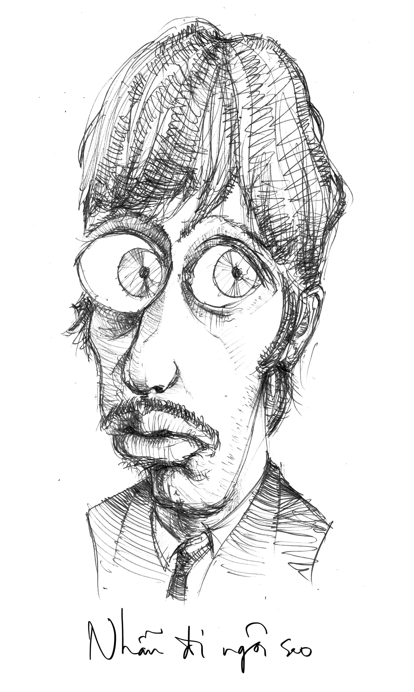
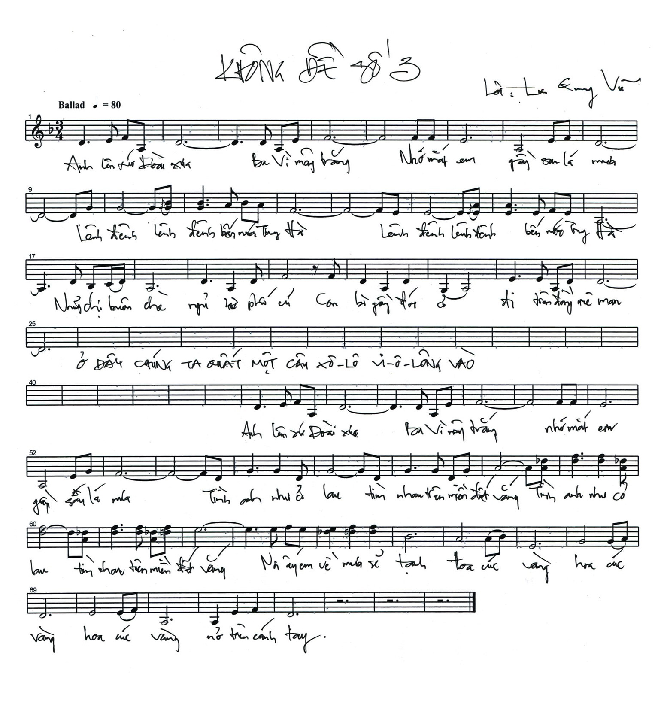

# 6

_Tôi không muốn viết những lời như thế  
Tôi không thể viết những lời như thế  
Chẳng muốn ai vui lòng khi đọc thơ tôi  
Tôi viết những bài thơ chống lại chính tôi  
Chống lại bóng đen trì trệ của đời  
Chống lại những bài thơ tôi đã viết cùng những ai ưa thích nó  
Làm sao đọc thơ tôi anh giận dữ băn khoăn xấu hổ  
Cãi lại tôi hay ghét tôi đi nữa  
Nhưng anh thôi hờ hững sống bình yên  
Tôi xé đi vòng hoa giấy bức màn sương  
Những niềm vui dại khờ những nỗi buồn yếu đuối  
Cuộc sống còn dở dang  
Cần đóng góp không cần ngồi ca ngợi._

— Lưu Quang Vũ

   

Ở một góc phố nọ, nơi giao nhau giữa hai con đường tấp nập tên là đường tấp nập này và đường tấp nập nọ, có một quán bia hơi nho nhỏ xinh xinh gọi là quán bia hơi nho nhỏ xinh xinh nọ. Thật ra khách quan mà nói, đối với một cựu sinh viên Kiến trúc mau mắn bỏ học trước khi bị tống cổ như anh, quán cũng chẳng xinh xắn khỉ mốc gì. Ngoài cái mặt bằng dẹp lép hình chữ nhật bẹt và cái cầu thang lồng sắt chật hẹp dẫn khách đi thẳng vào lỗ cửa hố xí luôn luôn bốc mùi nôn mửa tởm lợm, ngoài dăm ba cái ghế gỗ cũ kĩ mốc meo xếp xiêu vẹo san sát nhau như cá mòi gần ban công cong queo gỉ sét, nơi các loại khách có thể tùy theo hứng mà thò tay ra túm búi dây điện đung đưa chơi, hoặc tung chân đá vào ống quyển của nhau rồi đứng lên tát nhau lốp bốp, ngoài lão chủ quán hay mặc quần đùi khoe lông chân đứng tính tiền hoặc dắt xe máy thì cái quán tẻ ngắt tẻ ngơ, chẳng có gì hay ho. Thế mà dạo này anh rất hay ngồi lì ở đó, châm bia và rít thuốc lá, rồi lại nhìn xuống, rồi lại nhìn lên, rồi lại nhìn chung quanh, một mình huýt sáo vài bài, hát nhảm vài bài, một mình cười dở hơi như Papillon[^1] mới cùng hiệp tác với Mc Murphy[^2] trốn trại thành công, một mình trông yêu đời như thằng cha táo bón kinh niên bỗng dưng một ngày ăn hai tấn đu đủ nhuận được trường bèn đánh những quả rắm tung bay, mắt môi xinh tươi mặt mày rạng rỡ hai tai vẫy như bướm vàng. 

Là vì cuộc sống ở cái góc phố ấy thật muôn màu muôn vẻ, cứ như cờ treo ở trụ sở Liên Hợp Quốc, làm anh mê mệt đến mức có thể cắm đầu xuống đất được. Trước đây anh cứ nghĩ để mở mang trí tuệ con người ta phải ra sân bay mua vé giá rẻ hoặc nhảy lên tàu nấp vào toa-lét đi lậu vé hoặc bơi thuyền thúng đến xứ sở hiện đại văn minh nào đấy như sang Miên sang Thái sang Miến-Điện, lại sang Đại-Hàn sang Nhựt-Bổn sang Tân-Gia-Ba sang Phi-Luật-Tân sang Gia-Nã-Đại sang Ba-Lê, lại sang Mễ-Tây-Cơ sang Bồ-Đào-Nha, lại sang Á-Mỹ-Lợi-Gia cùng với những là Nữu-Ước và Ca-Li và Hoa-Thịnh-Đốn, hoặc thám hiểm những xứ còn hoang sơ chỉ sống được tuyền những chủng loại súc vật và phân hữu cơ, như cưỡi lạc đà hai bướu đi lắc lư trên sa mạc Xa-ha-ra, như đi săn hải cẩu mặt trơn da bóng ở Bắc-Băng-Dương, như trèo núi tuyết trên đỉnh Hy-Mã-Lạp-Sơn, hoặc ở nhà vừa trồng cây chuối vừa coi chương trình thế giới động vật có những loại như là san hô và cá đầu búa choảng nhau với lươn phóng điện dưới đáy vực Ma-ri-a-na. Hóa ra là không phải. Gần đây anh mới ngộ ra cái chân lí rằng, nếu chịu khó quan sát và tìm tòi anh sẽ có một cuộc sống thực là phong phú thi vị mà không cần phải lủi thủi lếch thếch đi đâu cho nó xa xôi, cũng chẳng cần mất thêm xu teng nào cả. Cuộc sống muôn màu muôn vẻ chẳng phải tìm nơi chốn mênh mông nào, nó chỉ ở cách anh một cái ban công mục nát và một lỗ hố xí hôi rình, đích thực là như thế. 

Ví như, anh thích xem xiếc. Tuổi thơ anh ngoài cắn nhau với chó và đánh nhau với Edison – như anh đã kể với em một lần rồi – còn có các gánh xiếc thỉnh thoảng lại tạt qua làng từ các ngõ Duy Thu, Đại Thắng, Quế Sơn, Đại Lãnh, quây các loại vải xanh đỏ bay phấp phới và đạp xe đạp đầu làng cuối ngõ bắt loa vặn echo cỡ cực đại, kêu oang oang như sau: “A lô _lô lô_, xin mời bà con cô bác bác bác tối nay lúc bảy giờ rưỡi _rưỡi rưỡi_ tập trung tại sân vận động thôn ba _ba ba_ để đón xem chương trình xiếc – ảo thuật – tấu hài tạp kĩ đặc sắc _sắc sắc_ do các nghệ sĩ nổi tiếng tham gia trình diễn _diễn diễn_.” Anh lúc ấy liền ăn vội ăn vàng cho xong chén cơm độn bắp, trốn cha trốn mẹ, len lén trèo ra đường theo nẻo chuồng trâu, cùng chúng bạn chạy từ đầu xã đến cuối xã gần ba cây số _số số_, chen chúc giữa đống người mồ hôi nhễ nhại, chửi thề nhau tung tóe, huých thụi cẳng chân cẳng tay vào nhau túi bụi, mắt tròn mắt bẹp mắt lại lác thiên lác địa xem những màn diễn rất là một sự hiểm nguy như ông già nuốt gươm vào cổ, ông sồn sồn thọc giáo vào bụng, ông trẻ đi trên sợi thừng chăng giữa hai cái cây, ông con nít ấu trĩ nuốt bông gòn đầu này nhổ ra đầu kia, trong khi một ông sơ sinh ấu nhi cứ đem mấy viên tròn tròn đen đen như cứt dê mà lại khai khai như nước đái bò, đi quanh quanh gào lên the thé rằng đây là thuốc đặc hiệu của bổn đoàn, chuyên trị di tinh kết hợp xổ sán xơ mít, cô nào chồng bỏ chồng chê uống nửa viên thuốc chồng phê sập giường anh nào mắc chứng liệt dương liếm thử một liếm nó cương cường lên ngay, và đại loại như thế, làm anh mê tít thò lò. Mỗi lần đi xem xiếc về anh lại bị mẹ nọc ra đánh cho đít vỡ làm đôi, nhưng hễ có nhóm xiếc nào qua làng đít anh lại lành lặn trở lại và anh lại tót đi xem, thật là hồi hộp thật là vui nhộn thật là rất hay. 

Thế cho nên kể từ khi phát hiện ra ở cái góc phố nọ có biểu diễn xiếc miễn phí, ngày ngày anh lại lê mông đến đấy kêu chai bia với cái tẩy đá rồi mặt dày ngồi xem xiếc từ bên này đường sang bên kia đường. Bên kia đường là một loạt bàn ghế kiểu cổ đặt lộ thiên, có rất nhiều các Tây mặc quần tà lỏn lòi chân lắm lông và áo “Tôi yêu Việt Nam” vàng đỏ, đeo kính râm ngồi uống bia hơi nói xí lô xí là về Ha Long Bay các loại. Trước mặt các Tây là một thằng nhóc cỡ chín mười tuổi mặc võ phục sạch sẽ tinh tươm phải đến cả hai thế kỉ rồi không giặt ủi, mặt hắn gầy choắt da hắn đen nhẻm, mồ hôi hắn chảy ròng ròng, tay phải hắn gân guốc vằn vện cầm lủng lẳng võ khí đầu tiên là một con rắn lục dài cỡ hai mươi xăng-ti-mết. Các Tây tò mò quá nên bắt đầu chỉ trỏ ồ ố ô. Hắn gồng mình đứng tấn đô con lực lưỡng như đồ đệ Tiệt quyền đạo thật đếm không hề ít hơn lão sư tổ nửa cái xương sườn nào, dõng dạc thét lên “A Chó!!!” rồi bỏ tọt con rắn vào mồm, tay kéo kéo cái đuôi còn ngoe nguẩy cho nó trườn tới trườn lui trong cổ họng rất rùng rợn. Bên xứ các Tây kiếm đâu ra trò ấy vui? Các Tây vẫn chỉ trỏ ồ ố ô. Hắn liền ọe con rắn ra nhét ngay vào giỏ, rồi nước dãi nhỏ ròng ròng, lôi ra võ khí thứ hai là một cặp que dẹp dẹp dài dài nhìn hao hao như đôi đũa ăn mì lạnh Hàn Quốc, một đầu quấn vải dầu, vung vẩy tới lui. Các Tây lại chỉ trỏ ồ ố ô. Hắn châm lửa đốt que kêu xòe, gạt que vào nhau bắn tàn tung tóe ra xung quanh rực rỡ như pháo hoa ngày Tết được đặc tả trong thơ Nguyễn Duy[^3], rồi lại cắm que đang phừng phừng cháy vào mồm như xiên thịt, lưỡi mút đầu que như mút kem, tiếng  nước bọt bốc hơi kêu xèo xèo, khói bay nghi ngút. Bên xứ các Tây lại kiếm đâu ra trò ấy vui? Các Tây tiếp tục chỉ trỏ ồ ố ô. Ý chừng đã tạo được một cái ấn tượng rất là im-pơ-rét-xi-vè, hắn lại cất que vào giỏ, lôi ra võ khí cuối cùng mang tính chất hủy diệt là một cái tộ gốm tròn tròn nâu nâu trong có mấy đồng xèng. Hắn kẹp cái tộ gốm giữa hai cánh tay, chắp hai bàn tay trước bụng rất kính cẩn, bắt đầu đi quanh từng bàn, đầu gục gặc xin tiền. Thế là các Tây ngừng chỉ trỏ, tiếp tục xí là xí lô về động Phong Nha vườn quốc gia Kẻ Bàng, huýt lên vài tiếng gió _Wind of change_ hát về vụ đập tường Berlin để Đông Đức đừng cắn chuối của Tây Đức, làm một thằng ghiền nghe rock hâm mộ Klaus Meine[^4] như anh rất đồng cảm, lại thấy thật là vui nhộn thật là rất hay. 

Sau xiếc, anh thích đọc sách. Cho đến khi anh bỏ làng ra thành phố thì làng anh từ dưới kênh lên hết núi chưa bao giờ nức danh về truyền thống hiếu học, họa chăng chỉ tạo được ít tiếng vang trong vùng khu Bê với bà Thu Yên ngụ tại chợ Bến Dầu hay đi lui đi tới ngở ngở ngân ngân chân đất đầu trần miệng cười khúc khích, hoặc bà Bảy Khùng sau vụ bị ông Bốn hàng xóm hiếp dâm vẫn thường ra đầu ngõ tựa vào gốc cây sầu đâu, chúm chím tạo dáng làm duyên mà la lên rằng “Bốn ơi ra đây nhanh nhanh tao chảy nước rồi.” Sách ở quê anh thời ấy bị cho là cái gì đó xa xôi tư sản, chỉ có tụi nhà giàu cơm no rửng mỡ mới đọc. Ấy thế mà cái nhà nghèo rớt mồng tơi như nhà anh lại có nhiều sách. Nhiều tới mức gian dưới chứa không xuể, cha anh phải lấy dây chuối ràng lại thành từng bó, bỏ vào thùng lớn cất trên gác xép. Anh bắt đầu tám tuổi đã luyện đến mức độ kì tinh xảo trò đu cột bám xà như rắn mai gầm, trèo gác xép như khỉ đít đỏ, lôi ra đọc đến tận những cuốn nằm dưới đáy thùng dính đầy cứt gián và bị mối ăn nham nhở, lâu lâu lại tấm tắc vừa chặc lưỡi vừa cười hí hí. Sau này lớn lên, cứ dành dụm gom góp được vài cắc bạc là anh lại vào tiệm sách cũ, chổng mông phủi bụi và xông xáo mặc cả và nuốt nước bọt trả tiền. Mỗi khi mua được cuốn nào hay trông anh cứ như thằng nghiện đang vật vờ trong nhà xí, anh dí mũi vào hít lấy hít để cái mùi hôi thối mốc meo của nó[^5], xong anh sè sẹ lật giở từng trang sách vàng ố, cứ sợ nó mủn nát mất đi, xong anh đọc ngấu nghiến như nuốt từng chữ từng từ một, xong anh nghiến răng trèo trẹo chửi thề văng mạng vì cứ đến đoạn cao trào lại có một tờ bị xé phân nửa, nửa còn lại nham nhở răng cưa có ghi dòng chữ “Đoạn này hay lắm hô hô bố mày đọc hết rồi nhé đồ con lơn[^6].” Nhờ có những cuốn sách kinh điển rách một nửa như thế mà anh biết được bao nhiêu là điều hay của lạ, chuyện trên trời dưới đất tận khắp đâu đâu anh cũng thâu vào trong não cho kì hết không chọn lọc tí gì. Ví như các thể loại khỉ heo ngựa trâu nước và sư cọ cùng cưỡi nhau đi Tây phương, trước mỗi khi đánh nhau lại ngâm một bài thơ khoe khoang võ khí. Hay ví dụ chuyện một người nọ lạc trên đảo phải nuôi gà và đập đá vào gốc cây để lấy lửa. Lại có một thằng nhóc nửa đêm vào nghĩa địa xem người ta vác bia mộ bổ vào đầu nhau rồi sau lạc trong hang động lượm được cả tấn vàng, còn thằng bạn nó thì trốn nhà chèo xuồng đi xuống đi lên trên dòng Mít-xi-xi-pi câu cá mèo hút ống píp vân vân. Tất nhiên sau này lớn lên não dần có nếp nhăn anh phát hiện ra rằng tự cổ chí kim không có con heo nào đi thỉnh kinh, rằng Rô-bin-xơn chỉ là một sự phóng đại hay còn gọi là nói láo ăn tiền, rằng thông thường con người ta hay dùng bia Tiger hay bia Heineken mà đập vào đầu nhau hơn là bia mộ, cũng như người ta cất vàng tấn trong nhà băng Thụy Sĩ để sau này con cháu đi du học Mĩ chứ không đổ đống trong hang; nhưng cái ấn tượng thời thơ ấu của anh không vì thế mà phai lạt đi chút nào. Anh cứ nhìn thấy sách là anh khoái. 

Thế cho nên kể từ khi phát hiện ra ở cái góc phố nọ có nhiều sách, ngày ngày anh lại lê mông đến đấy kêu li cà phê đá rồi mặt dày ngồi xem sách từ bên này đường sang bên kia đường. Bên kia đường là một mớ những ghế bàn kiểu cổ đặt từ trong nhà ra đến ngoài trời, trên chễm chệ rất nhiều Tây tay cầm sách bìa đen mắt đeo kính trắng nhìn vô cùng trí thức. Thỉnh thoảng từ góc đường bên phải xuất hiện một bà nọ mặc áo bà ba cháo lòng, đầu đội nón lá, tay khệ nệ ôm một chồng sách cao dễ đến mười mét. Em cứ tưởng tượng, một chồng sách cao mười mét mà đổ vào con người ta thì dễ thân hình phải lún đến ít nhất vài phân tây, chân khoét phải đến giếng dầu mà đầu lại cắm vào nền gạch con sâu tư thế thẳng băng thua gì Từ Hải đâu. Thế nhưng bà kia thật xứng danh liệt nữ kiên cường, thứ nhất giữ cho chồng sách không đổ thật là cân bằng như đòn bẩy Át-xi-mết[^7], thứ hai giữ cho người không lún, cho dù có là Neo Amstrong nhún một bước đi trên mặt trăng bằng cả sáu bước nhảy trên trái đất cũng chẳng có cơ mà so cạnh a bê xê gì. Bà ấy mới cõng cái chồng sách cao chót vót ấy mà đi tới mà lại đi lui mà đi dọc mà lại đi ngang mà năn nỉ mà khóc lóc mà rằng sách này hay lắm sách này nhập từ Tây phương sách này kể chuyện đời kĩ nữ chân dài tới nách mỗi khi bôi thuốc chống hôi nách lại xức nhầm vào bẹn sách này cho biết tiền hung hậu kiết sách này giúp con người ta cuộc đời tươi đẹp hơn biết là bao nhiêu. Các Tây nghe tiếng bồi chắc cũng hiểu được không chín thì mười, nên mới cười hê hê như vịt tiềm mà lịch sự bảo rằng chúng tao không mua và tại sao cứ lằng ằng và mày lùm xùm ấy là sao và cứ thế. Bà kia thật là kiên nhẫn lại đi ngang mà đi dọc mà khóc lóc mà nỉ non với cái nón lá trên chóp sọ mà rằng sách này hay lắm sách này từ trâu Âu truyền sang mà sách này kể chuyện vũ nữ thân gầy dài chân tới háng mỗi khi xức ghẻ bẹn lại bôi nhầm vào mắt cá nọ đầu gối nọ này nọ kia. Các Tây rằng thật là dai như đỉa sao không cút đi cho tao đọc những câu truyện thanh cao về ma cà rồng nửa đêm và ma két tinh chạng vạng, các Tây lại cười tô tô tô tô làm bà kia thật hổ thẹn về vốn kiến thức kém cỏi chỉ loanh quanh ở nách với bẹn của mình, đành rất hèn hạ mà lỉnh đi chỗ khác, nước mắt giọt ngắn chen nhau với chẳng giọt dài, má môi lẫn lộn hết cả, bà ấy mới thầm nguyền rủa lũ Tây có cái gu xui xẻo làm sao mà lại không đẹp đôi, bà ấy mới khệ nệ vác chồng sách chục mét đi qua ngã tư khác mà lại rằng sách này hay lắm rằng sách này có những là kiều nữ chân dài đến xích vân vân và vân vân, làm anh thật bội phục tại sao lại có những kiến thức quảng đại thâm sâu uyên bác như Đác-Uynh như thế vân vân và vân vân. 

Thế rồi, để cho cái sự say mê góc phố của anh được viên mãn, ngày ngày anh còn được chiêm ngưỡng bao nhiêu là cái hay cái lạ. 

Anh thấy một ông già kia mặt mày rúm ró, râu ria lùm xùm bẩn thỉu, răng rụng hết cả, miệng mồm móm mém chỉ còn lưỡi với lợi đá nhau, trên cái cổ gầy nhẵng mốc meo gân nổi chằng chịt thành từng búi như sợi thừng đeo một khay gỗ đựng đầy những hàng nhập khẩu lề đường như là kính mát, dây nịt, quế lót giày, kẹo gôm, thuốc lá, cả hộp quẹt Thái Lan cái nào cái nấy to bằng cục gạch, giá mà đập vào trốc thằng nào thì chỉ có vỡ sọ bẹp đầu. Ông già thấy anh mắt vàng ệch vì bệnh gan, da trắng bệch nhờ bạch tạng và lang ben, tóc đỏ quạch nhờ phơi nắng và toàn thân tỏa hương thơm nức mũi nhờ một loại xà bông trị ghẻ rẻ tiền, chắc nhầm anh với du học sinh mới du từ bển du về với giấc mộng du làm thủ tướng, nên mới ra sức năn nỉ anh mua ủng hộ giùm lão một Cigar. Thoạt tiên vì không biết hút xì gà quái nào nên anh từ chối phắt, làm lão nước mắt lưng tròng nước mũi sùi sụt cứ đứng tần ngần bên cạnh bàn anh, chân trái lão vẽ hình tròn chân phải lão kẻ hình vuông điệu nghệ không thua gì Ringo Starr[^8] hay Steven Alder[^9] hay Lars Ulrich[^10], lâu lâu lão lại thò bàn tay gân guốc đầy mụt ruồi, rụt rè sờ sờ tay anh một miếng mà phều phào kêu anh là “cậu hai”: “Cậu hai mua giùm con chai dầu gió đi cậu hai, nhìn mặt cậu xanh lè xanh lét hình như sắp trúng gió rồi đó cậu hai.” Anh thích quá – vì rằng đâu phải lúc nào ở đâu cũng có một lão già khú đế đáng tuổi ông nội xưng là con gọi mình là Cậu, nghe cứ vang vang oai hùng như Cóc – nên nói gì thì nói, cuối cùng anh cũng mua giúp lão một cái Đúp Bồ Min. Anh ngồi lột vỏ Đúp Bồ Min, bỏ vào mồm nhai nhóp nhép xem rất phong cách, lại tự hào yêu thương mọi người và yêu thương cuộc đời. 

Xong rồi anh thấy một cặp nam thanh nữ tú ôm vai bá cổ nhau đi vào quán. Chàng trai cao to chắc cũng phải được một mét chín mươi, tuổi chàng trai cỡ năm chục có lẻ, râu lông chàng trai mọc xồm xoàm nhưng tóc chàng trai lại hói đến mức đáng thương hại, đèn đường chiếu vào văng ra chói lòe cả mắt, chàng trai cứ phải lấy tóc từ hai bên bết vào chính giữa để tạo cái ảo giác xum xuê, và chàng trai người Tây. Còn cô gái cỡ mười tám tuổi, tóc cô gái bồng bềnh, mùi hương nước hoa của cô gái sực nức bay suốt từ bàn này qua tới bàn kia, cô gái có cặp đùi dễ cân được vài tạ thịt nạc và bộ ngực giá lấy kim đâm chắc phải hứng được một thùng tô nô mỡ đủ để thắp nến lên hai hàng, và cô gái nói liến thoắng với chàng trai những câu chuyện sâu sắc về tình yêu và cuộc sống, rồi cô gái người Ta. Tiếng Anh của anh thuộc dạng tệ hại, vả anh thập thò lén lút nên chỉ nghe lén được bì bõm vài câu, đại để “Anh muốn đi khách sạn với em không chúng ta cùng đi nào em thích anh lắm lần này coi như là đề-mô anh được miễn phí em không lấy tiền của anh đâu anh muốn đi hô-teo nào cũng được lần sau em mới lấy tiền anh nhé du quăn tu gâu hồ teo ai gâu quít du.” Cô gái Ta đã thành khẩn như thế hạ mình như thế rẻ tiền như thế rồi mà chàng trai Tây vẫn còn cư xử đúng con lợn không gentleman, cứ xô cô gái Ta văng tưng ra, làm ngực với đùi cô gái Ta nẩy lên bần bật như cây kim la bàn, khiến cho anh cảm thấy thật đau xót bất nhẫn cho phụ nữ Ta. Bụng anh bảo dạ, nếu anh mà là chàng trai Tây ấy thì anh sẽ đi hồ teo quít du ngay, không đợi cô gái Ta mời đến lần thứ hai thứ ba gì sất, vì từ nhỏ anh đã được dạy rằng người phụ nữ Việt Nam rất chân yếu tay mềm, rằng chúng ta còn nghèo và phải thương yêu đùm bọc nhau, rằng hai chữ “đồng bào” thật rất quý, rằng chúng ta không được đánh phụ nữ bằng một cành hoa mà làm cho ngực phụ nữ lắc tung như thế, vỡ tràn cả lít xi-li-côn là cái chất kia làm từ silic tức thị Cát có số nguyên tử mười bốn và được đặt tên cho Thung Lũng Công Nghệ Cao bên đất nước của chàng trai Tây vân vân và vân vân. Nhưng nói gì thì nói, rốt cuộc anh vẫn thấy một cái danh lam thắng cảnh như thế là in-tờ-rét-xờ-tinh, và giọng cô gái cho dù có gào rú tru tréo hay thê thảm van nài cũng đều nghe dịu dàng êm ái như một bản nhạc xì lô tha thiết nhịp 3/4 phách tám mươi do một vi-ô-lông kéo cùng một ghi-ta thùng đệm, nên chi anh không chen vào, anh chỉ ngồi đấy nhai tiếp kẹo gôm, hít khói thuốc đằng mũi rồi nhả ra đằng mồm, ung dung tự tại qua tháng ngày. 

Xong rồi anh lại thấy bên cạnh xe Nước Mía Tắc Ép Chanh Dây Nguyên Chất Thơm Mát – nơi bình thường vẫn có rất nhiều những con người rỗi việc ngồi trên ghế xúp, phơi rốn lên trời, tay cầm quạt nan phẩy qua phẩy lại đuổi đám ruồi kêu vo vo, kể cho nhau nghe những câu chuyện buồn rồi cười phớ lớ – xuất hiện một mụ già để đầu trần tóc muối tiêu búi tó củ hành cứ lọ dọ hết tới lại lui. Mụ có một vẻ mặt quái lạ vừa ngơ ngác vừa sầu thảm vừa trông hết sức gian xảo lại vừa có vẻ cực kì đần độn, với một cái miệng móm mém răn reo nằm dưới hai con mắt láo liên và hai lỗ đen ngòm hếch lên dưới cái sống mũi khoằm xuống khiến cho chỏm mũi cắm thẳng vào nhân trung, làm anh không kìm được ý muốn quẹt keo súp pe mà dán lên trán mụ tấm biển ghi “Tại đây triển lãm hỉ nộ ái ố mười tám trong một – quý vị không cần phải đến chùa Tây Phương làm gì giữa đường coi chừng còn bị cướp.” Đôi lúc anh cứ đinh ninh vì bao thống khổ trên đời đè xuống nên mụ sắp khóc đến nơi thì mụ lại cất lên tiếng cười hô hô nghe hoàn toàn thỏa mãn với cuộc sống, thế rồi đang hạnh phúc mề lí mê li như thế thì bỗng nhiên như thể có tin sét đánh ngang báo hiệu người thân lìa trần, mụ lại chuyển sang khóc ngay, mụ vuốt nước mắt ràn rụa trộn cùng nước mũi sụt sùi vo lại thành từng cục to bằng nắm đấm, mụ quăng một phát kêu đánh bẹt làm cả anh và ruồi cùng kinh hoàng bay tán loạn. Tay mụ cầm một mảnh giấy vàng khè không thua gì răng chẳng có chữ nào, mụ đi đến từng bàn mà dí tờ giấy vào tận mặt thực khách bắt người ta phải đọc, trong khi ấy mồm mụ cứ ú ớ những câu vô nghĩa[^11], rồi mụ nháy nháy mắt ra chiều tinh thông, rồi mụ lấm la lấm lét nhìn chung quanh xem chừng có ai đến bắt mình không. Anh nghe đồn đâu rằng ngày xưa mụ cũng có nhà có cửa chả thua gì ông to bà nhớn nào, nhưng trải qua vài cuộc bể dâu, nhà dưới nhà trên cả đất lẫn cát sắt thép xi măng bị người ta chụp lấy nhai nuốt với bán xới mất béng cả, nên mụ tiếc công tiếc của, đêm quên ngủ ngày lại quên ăn, nghiến răng nghiến lợi nghĩ ngợi đến rụng răng sói đầu bạc tóc, rồi hóa điên hóa ngộ, bắt đầu làm thơ như Bùi Giáng và lang thang phiêu du đi lung tung khắp nơi từ quận Ba sang quận Tư quanh về quận Một, gặp ai cũng đưa sổ đỏ phân bua nhăng cuội, có người thông cảm có người chột dạ có người thấy phiền toái, ai nấy đều phơi rốn lên trời mà cầm quạt giấy phe phẩy, xua mụ đi như xua đám ruồi trên xác mía rồi cười phớ lớ yêu một cuốn truyện hay có tiếng chim hót đầu ngày. 

Và yêu biển vắng. 

Em, anh hoàn toàn mù tịt về kinh tế tài chính và đối ngoại. Anh thậm ngu si dốt nát về số má, anh chẳng biết chữ đui về giá vàng giá đô gì cả. Nghe cụm mĩ từ GDP anh nghĩ đến chuyện ông nông dân và một trăm con gà[^12]. Nghe Cái Đuôi Dài anh tưởng người ta nói chuyện sở thú chim công chim trĩ nội và ngoại gây biến chứng lòi dom. Anh lầm cổ tức với một loại bệnh thông thường mà những người thiếu i-ốt chúng ta thường hay phải gánh chịu. Anh ngỡ bluechip là bộ vi xử lí Intel® Inside™ đa nhân siêu phân luồng. Vĩ mô và vi mô đối với anh là món vây cá bào ngư anh chỉ mới nghe tiếng chứ chưa bao giờ được nếm thử. Người khổng lồ xanh anh cho là The Hulk suốt ngày bẻ đôi xe hơi ném xe buýt vào nhà chọc trời chứ không phải Big Blue hay Big Black BBC. Anh nhầm Dow Jones với Don Juan tức Đông Gioăng cái tên đọc líu cả lưỡi, thằng cha Sở Khanh xứ đấu bò chuyên môn lừa gạt bọn phụ nữ ngu như bò. Anh ngạc nhiên thấy người ta không cần lít nước phông-tên nào cũng thả nổi được tiền tệ. Anh cũng biết ở những vùng đất em đã đi qua từ thời Leonardo da Vinci còn ngồi vẽ mô hình máy bay đã có những người lang thang trên đường phố đánh đàn măng đô lin, có những người ngồi cạnh công viên thổi kèn túi, có những người hát rong, có khu phố đèn đỏ, có khách sạn tình đi vào cổng trước đi ra ngõ sau, có nọ có kia cũng vui lắm xôm tụ lắm. 

Em, nhưng anh mang máng thấy trong cái hay hay và vui vui và xôm tụ anh vẫn thấy ở cái góc phố này, khi Bùi Xuân Phái[^13] đã chết được hơn hai mươi năm rồi, có cái gì đó không đúng. Có cái gì đó khổ sở, có cái gì đó ray rứt, có cái gì đó làm cổ họng anh nghèn nghẹn khó nuốt, có cái gì đó làm anh phải chui vào toi lét ói quặn cả ruột, nước dãi anh trong suốt chảy ròng ròng như chó vào mùa dại mà mắt anh thì đỏ ngầu như lồng đèn treo lủng lẳng vào những mùa Trung thu trăng tròn có múa lân và ông Địa cười nhăn nhở trong nhịp trống chiêng tùng xèng. Thôi em đừng lòe anh về giao thoa văn hóa và hội nhập thế giới, về nguồn thu nhập khổng lồ từ dịch vụ và du lịch, về bức tranh cuộc đời nhiều mảnh lắm màu sắc, về ánh gốm ánh đồng túi lấp lánh ánh kim chim long lanh ánh thép nữa, anh chẳng muốn nghe. Anh nhổ toèn toẹt vào. Có gì đó sai, rất rất sai ở đây. Một cái gì đó anh không tài nào định nghĩa được mà thằng Văn vẫn gọi là “đau em,” thằng Long Chó vẫn gọi là “đạp cứt,” thằng Bút Chì vẫn gọi là “mẹ cái đống cứt nát này,” còn anh thì đơn giản gọn gàng nhẹ nhàng tình cảm gọi là “thối.” Làm thế nào để anh có thể giải thích cho em hiểu tại sao anh nhắm mắt làm ngơ, mặc kệ những lạc đà hai bướu và cá vảy chân và đỉnh núi tuyết và chim cánh cụt nhảy và đà điểu bay, tại sao giữa bao nhiêu cái hay cái đẹp dưới ánh mặt trời chói chang và ánh đèn đường vàng vọt và cơn mưa đầu mùa cuối mùa giữa mùa xối xả anh chỉ nhìn thấy những ăn mày ăn nhặt, những người điên lang thang, những người nghèo khổ vì kế sinh nhai mà phải chịu đau đớn rách họng cháy mồm ngậm lửa nuốt dao, những ông bà già rách rưới bẩn thỉu bới rác dưới gầm cầu chữ Y, những đứa bé mặc đồng phục học sinh đi bán hoa lúc mười một giờ đêm, những thằng nhóc nằm co ro bên vỉa hè giữa trời khuya khoắc, những gái đĩ mắt xanh mỏ đỏ đong Tây ba lô đu Tàu bốn bị, những rốn lồi phễnh lên trời cùng với nước bọt đờm dãi văng xuống đất? Nếu anh đang ngồi điềm tĩnh rít thuốc phì phèo bỗng nhiên đứng dậy tát một cái Bốp vào mặt em mà gào to lên rằng một ngày nào đó chắc em phải rũ bớt những tự hào tự mãn điên khùng hãnh tiến mù quáng vô lối mà ngẫm lại thân phận đói nghèo nhược tiểu của mình đi rồi họa chăng mới dần dà khá lên được, liệu em có vừa xuýt xoa ôm cái má sưng vù vừa gật gù mà hiểu cho anh không, hay em lại nhảy chồm chồm lên trên đôi _high heels_[^14] màu da cam có quai xanh lá cây mà nhiếc móc anh _chó đẻ_, ngu xuẩn, khốn nạn, rằng đất nước ta cần những nhân tài chung tay góp sức dựng xây chứ không phải là lũ vô ơn bạc nghĩa vô dụng đần độn thiểu năng chỉ biết dậm chân la hét đấm ngực kêu gào, rằng đừng hỏi Tổ quốc ta đã làm gì cho ta mà phải hỏi ta đã làm được cóc khô gì cho Tổ quốc? 

Nói gì thì nói, lần sau nếu em có gặp lạc đà hai bướu thì đừng quên giương Nikon lên mà làm vài bô[^15] gửi cho anh. 

Cảm ơn em, _T.I.A._

_R.I.P._

  

[^1]: Nhân vật chính trong cuốn tự truyện của Henri Charrière. Anh rất ấn tượng với tình tiết nhét ống plan chứa tiền vào hậu môn rồi trèo tường vượt ngục của anh này. 
[^2]: Nhân vật chính trong cuốn tiểu thuyết “Bay trên tổ chim cúc cu” của Ken Kesey. Anh thích cảnh anh này đứng ngay giữa trại điên bóp cổ mụ y tá kêu ọ ọ ọ. 
[^3]: _Cả thành phố như cháy / lập lòe ánh hỏa châu / có bà già bới rác / nằm co ro gầm cầu_
[^4]: Ca sĩ chính của nhóm Scorpions tức “Những Bò Cạp,” uýnh bài Wind of change tức “Đổi Gió” rất đáng ngưỡng mộ. 
[^5]: Của quyển sách, không phải của thằng nghiện, lại càng không phải của nhà xí.
[^6]: Đến tận bây giờ anh vẫn chưa biết con lơn là cái con gì. 
[^7]: Có thể bẩy trái đất đi một xăng ti mét sau khoảng ba mươi triệu triệu năm.
[^8]: Tức Nhẫn Đi Ngôi Sao, đánh trống cho Beatles
[^9]: Đánh trống cho Guns N’ Roses
[^10]: Lại đánh trống cho Metallica
[^11]: Chẳng hạn như: _A bê xê dắt dê đi ỉa / Dê không ỉa dắt dê về chuồng / Dê buồn buồn dắt dê ra chợ / Dê gặp dợ dê cười hê hê._
[^12]: Nếu em chưa nghe chuyện này thì anh giải thích luôn. Có một trăm con gà. Một ông quan ăn chín mươi chín con. Chín mươi chín ông nông dân bâu nhau giành nhau xâu xé nhau những đầu cổ cánh sườn lông lá tù hủ của con còn lại. Theo thuật Trung Bình Cọng của môn Toán Học vĩ đại có từ trước cả thời văn minh Lưỡng Hà và Ai Cập cổ đại, ta lấy một trăm chia cho một trăm và suy ra mỗi người ăn số nguyên một con gà. 
[^13]: Là nhà họa sĩ chuyên vẽ tranh về phố cổ Hà Nội: phố ban đêm, phố ban ngày, phố nắng, phố mưa, phố sương, phố vân vân.
[^14]: High heels tức là giày cao gót ấy.
[^15]: Bô tức là pose ấy.

