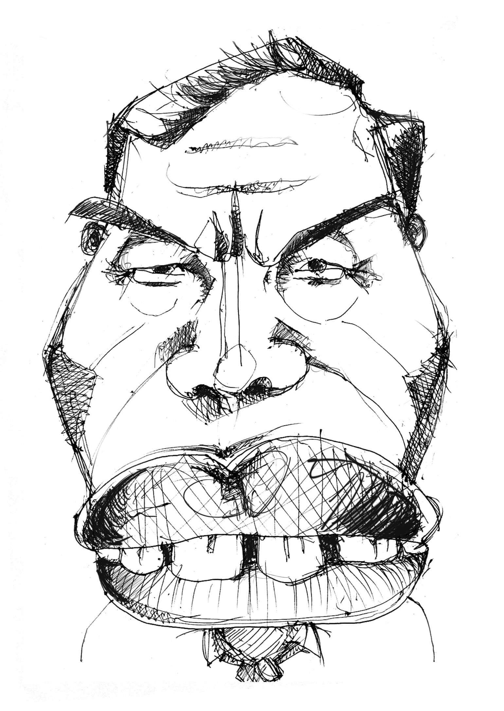
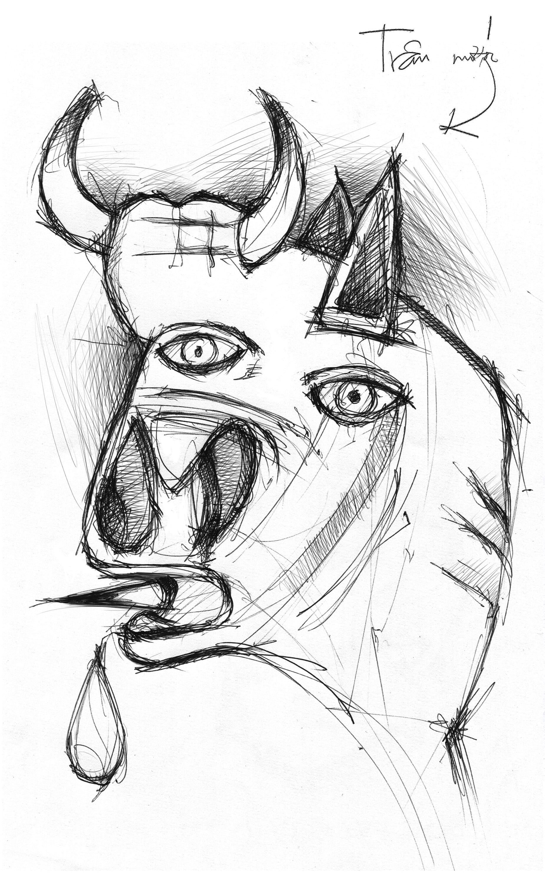

# 7

_Đêm nay say đất lở  
Em có nghe rạn vỡ  
Ra muôn mảnh li rơi  
Pha lê vạn chuỗi cười  
Bên nớ dạ thành khoe tráng lệ  
Trơ trẽn giai nhân phô lõa thể  
Bên ni phố vãng lòng ngoại ô_ 

— Cung Trầm Tưởng

   

Thành phố đang vào mùa mưa. Quả này mưa thực to. Cứ mỗi ngày vài bận, nước tích tụ trên trời lại đua nhau đổ xuống xối xả, gió tứ phía giật phần phật, sét đánh lung tung hỗn loạn, chớp lóe chói lòa khắp nơi, cây cối cùng hoa lá hòe sói rợp rợp tung rũ rượi bay, nhìn phê như con dê. Anh đi làm siêng năng chăm chỉ, mắt nhắm mắt mở chĩa vào phòng họp, mông lại quay ra cửa sổ nhìn xuống quán nhậu đầy những lợn béo thịt lợn béo, tay gõ bàn phím lốc cốc, những lúc nhức mắt đau đầu tứ chi bấn loạn cứ nghe tiếng gió mang theo luồng hơi nước mát lạnh từ biển Thái Bình Dương lồng lộng thổi vào thoang thoảng mùi mắm tôm anh lại cảm thấy như vừa được ai đó dùng cọc nhồi bê tông đả thông trí não, mới gào lên “mưa rồi kìa bây” rồi hát tiếp bài “em yêu chim em bắn chim” không sai một dấu thăng dấu giáng, làm các bạn đồng nghiệp cứ nhìn anh rồi bảo nhau rằng thằng này hay, nhìn mặt mày hiền lành như bần cố nông mà trông lại yêu đời. 

Hát xong anh ngồi suy nghĩ. Sét đánh ầm ầm xung quanh anh. 

Anh nghĩ rằng, nói theo phong cách Tây – dạo này anh đi làm nghề quảng cáo hoài đâm ra sính Tây – thì chúng nó đã không thể nào sai hơn, hoặc rất khó để mà sai hơn. Thật ra anh đang chán đời _bỏ mẹ._ 

Chán lắm. 

Ví như về viết lách. Anh muốn viết một cái gì đó mĩ miều hoành tráng mà ý tứ không có nên cứ hết đứng lại ngồi, mặt mày nhăn nhó như bị táo bón, viết xong anh lại xóa, xóa xong anh lại viết, rồi bôi rồi cạo, rồi chùi rồi tẩy, cứ thế không cùng. Anh cắm đầu vào sách vở đọc lấy đọc để để mở mang tri thức tìm cảm xúc, hết thơ Lưu Quang Vũ thời cận đại “gió và tình yêu thổi qua đất nước tôi” anh đọc lại Vũ Trọng Phụng thời cổ đại “bớ người ta thằng Xuân nó hiếp tôi,” anh ngốn cả mớ các sách thiếu niên nhi đồng như _Osho nhà hiền triết_ với _Zorba con người đàng điếm_ và _Lão Kẹo Gôm lão là đồ tồi_ cùng một lúc. Ngồi trong toilet anh tỉ mẩn nghiên cứu thành phần hóa học của thuốc Con Vịt rửa bồn cầu, đứng dậy đánh răng anh tò mò cầm xem hướng dẫn sử dụng bình xịt cạo râu. Tóm lại là văn chương thơ phú cứ như thuốc giun Fugacar nhập siêu vào bụng anh cả một bồ, thế mà rốt cuộc anh vẫn chẳng xuất ra được cái gì sất. Chữ nghĩa của anh cứ trôi tuồn tuột đi đâu hết cả, trong bụng anh dường như chỉ còn lại tuyền những quằn quại đau đớn, cứ như ở tít sâu trong ấy Osho đang quay cuồng đánh vật với thuốc rửa bồn cầu và Zorba lăn lộn cuông quày với bình xịt cạo râu, cả lũ chúng nó đồng khí tương cầu đồng thanh tương ứng, quyết tâm làm anh phen này phải trăn trở, trằn trọc, ấy là cái vấn đề. 

Anh cũng muốn vẽ cái gì đó đẹp đẽ thanh thoát như ngày xưa hồi còn luyện thi Kiến trúc anh vẫn vẽ, tỉ như quả táo màu đỏ để bên quả chuối màu vàng, cả hai quả xếp cạnh cái chai màu xanh, ba thứ cùng đặt nằm trên miếng vải màu trắng phủ lên cái ghế đẩu màu nâu, sau đó anh dùng bút chì 5B tô tất cả thành màu đen; nhưng tay anh bây giờ giống như bị gắn bi, cứ chạy theo quán tính; anh chỉ còn phác ra được những gương mặt xấu xa tởm lợm có hàm răng vẩu vàng khè và đôi môi thâm sì sì như trâu nước hút ống vố, toát lên một vẻ ngu độn thiểu năng lại thích lạm bàn chỉ số trí tuệ, tức ăn khoai lang xắt lát nói chuyện Các Mác Lê-nin vân vân. 

Anh lại những muốn cầm cây đờn ghi-ta điện hiệu là Schecter lên khảy những bài rốck thật hùng dũng, tay phải anh _economy picking_[^1] thật thanh thoát, tay trái anh chạy lên chạy xuống _blue scale_[^2] thật du dương, thỉnh thoảng anh lại chêm vào vài khúc _two-hand tapping_[^3] đầy kĩ thuật, rồi anh _sweep_[^4] sáu dây thật dẻo dai, xong anh _bend_[^5] thật cao _vibrato_[^6] thật nhuyễn, xong anh _hammer-on pull-off_[^7] thật lẹ. Nhưng hai tay anh giờ run như cầy sấy, đánh tốc độ anh không còn theo kịp Timo Tolkki của Stratovarius, đánh chậm rãi anh lại kém mượt mà xa Brian May của Queen, từ cái _amplifier_ thảm hại của anh chỉ còn phát ra những tiếng _lead_ the thé như tiếng con mụ nái xề nào đó bị ai đạp vào cổ họng, những tiếng _distortion_ rè rè oán thán như cung nữ một khúc của Nguyễn Gia Thiều, những tiếng _tẹt tẹt_ của một thằng ăn khoai nướng nhiều hơn mức dạ dày có thể xoay sở xử lí. Thật là đau đớn. 

Sét đánh ầm.

Đôi lúc anh nhắm mắt lại cố mơ mòng về một thứ gì đó cao cả sáng sủa, nhưng cứ mở mắt ra anh lại thấy những cảnh tượng mà hồi xưa có ông nhà văn nào đó tên là Vích-tô Huy-gô đã viết là “đến người chết dưới mồ cũng phải trố ra mà nhìn.” Theo như anh biết thì cuộc đời con người ta trung bình mở mắt nhiều gấp đôi nhắm mắt – trừ những bác những ông có mắt như mù có tai như điếc có miệng như câm thì không kể – thành ra trong đầu anh những tư tưởng tươi tốt về công danh sự nghiệp – với những câu hỏi đầy giằng xé cắn rứt ví như “Cuối cùng thì sự thành đạt là cái đếch gì?” – dần dần cứ như nước dưới chân cầu trôi đi hết cả, chỉ còn lại dăm ba ý nghĩ hèn hạ lẩn quẩn cứ khổ sở dằn vặt anh. 

Trời mưa rất to.

Anh nghĩ rằng, em ơi anh quỳ lạy em, em đừng cười nhạo anh mà tội nghiệp. Vì thật lòng anh có muốn thế đâu. Ai sinh ra làm con người – súc vật thượng đẳng – lại chẳng thích thoải mái sung sướng, được ung dung nằm ngửa mà hưởng thụ những dồi dào vật chất lẫn tinh thần. Anh cũng như em, thích được ngồi uống li cà phê Ban Mê mà bình luận bóng đá, hóng hớt những chuyện cầu thủ này sút cú vô lê quá trán đến nông nỗi rách hai cái quần một lúc, thủ môn nọ bay người chụp nhầm vào cột cầu môn vỡ cả lưng phải đi nẹp gỗ, tiền đạo đội kia lừa banh dẻo như làm xiếc làm hậu vệ đội nọ cùng bay người song song với mặt đất, mất đà vấp té ngã chổng lên nhau gãy hết các loại răng. Mỗi khi đi ngang qua những quán nhậu đang truyền hình trực tiếp mấy trận kinh điển bom hạt nhân tầm cỡ Bắc Triều Tiên đấu với Bồ Đào Nha trong vòng chung kết Quớt Cúp, nghe người ta gào thét chửi thề, máu trong người anh cũng rần rật theo, anh cũng muốn lao vào làm một vài két bia Heineken, giơ nắm tay lên trời oang oang dọa đấm vào mõm hoặc đá vào mông mấy thằng áo thun quần cụt đỏ xanh không quen biết đang chạy nhông cách anh cả nửa vòng trái đất. Trong khoảng thời gian hai giây anh chuyển ngay le-vồ từ “phổ thông trung học bỏ học đại học” xuống thành “vô học,” anh gân cổ chửi _con đĩ mẹ_ thằng tuyển thủ quốc gia 김정일 gần sát cầu môn như thế lại còn co chân đá ra ngoài đuợc quả thật bất tài vô tướng đếch phải tay ông, anh lại phê phán chỉ trích lão huấn luyện viên mặt ngựa 김일성 tầm cỡ quốc tế sao lại cho thằng chó ấy vào sân làm rối cả đội hình đội ngũ, có phải là cạn suy thiếu xét hay không. Rồi khi có ai đưa được trái banh vào lưới thì anh lại nhảy cẫng lên bằng hai chân sau, anh múa may như Xúy Vân động rồ, anh tung bờm hí đến đứt đôi cuống họng, anh thúc cùi chỏ vào con mụ bên cạnh, anh tát tai thằng phía trước anh đá hậu đứa phía sau, rồi anh lại bị thằng điên loạn nào đó kê một phát đầu gối vào mông, rồi anh hưởng những cú móc kiểu Mô-ha-mét A-li vào be sườn xương cụt, rồi anh té chổng gọng lên trời, mặt mày anh nhễ nhại mồ hôi mồ kê nhưng anh lại vùng đứng dậy đưa tay quẹt mũi, nở một nụ cười trông vừa dốt nát ngu si lại vừa hoàn toàn thỏa mãn. 

Nhưng anh chẳng làm thế. Vì đang yên đang lành tự nhiên anh thấy một đám giàu có bụng phệ ngồi ngả ngớn nốc hết bia này đến bia kia, tôm mực ốc hàu thừa mứa, có mấy con chó sủa loạn tranh nhau đống xương và bà già ăn mày lưng còng đến đất, quần rách lò xo ống thấp ống cao, mặt mày móm xọm, run lẩy bẩy trong xó tối húp sì sụp bát cháo lõng bõng vừa xin được từ các nhà Mạnh Thường Quân. Thế là bỏ mẹ hết, mắt anh bỗng chốc mờ đi như bóng bị kéo mây[^8], anh không thấy bóng thấy banh, không đá không đấm gì được nữa cả. Cái cảnh tượng người và chó cứ thế án ngữ trong đầu anh chẳng khác gì một bức tranh to vật đầy những chỗ sáng chỗ tối rối rắm khó hiểu của Picasso, có những màu sắc bầm tái và các loại súc vật dị hình dị tướng mặt ngựa đầu trâu, những tay chân què cụt còn gắng gượng cầm kiếm cầm gươm và những cái mồm đang há to lè lưỡi dao găm, gào thét điên rồ. Anh giật mình nghĩ: Thế là thế đếu nào? Sao ngay mới đây thôi có ông kẹ kia đứng chống nẹ trước quần chúng mà hùng hồn hoành tráng bảo rằng nước ta đã hết còn là nước nghèo, rằng hãy sánh vai cùng các cường quốc năm châu với những món trang sức lung linh là đường sắt cao tốc – một đơn vị, cổng chào hùng vĩ – năm đơn vị, và chỉ số IQ – tám đơn vị, rằng hãy cấp kì đi chợ bằng shinkansen và băm bổ đi học với vận tốc hai trăm cây số một giờ? Thế còn cái Guernica thời bình nào đây? _Chó đẻ_, lừa bố phỏng? 

Sét đánh ầm. 

Anh nhớ lại cách đây không lâu có lần anh cũng học đòi ặc-tít, đi quán cà phê nghe một ca sĩ nổi tiếng vừa hát vừa đệm đàn. Ca sĩ mặt mày nhí nhảnh xinh xắn, đầu tóc bung xù quấn băng đô, cặp mắt thông minh lanh lợi cứ lúng la lúng liếng, vận quần jean bó áo thun thụng ngồi cầm cây ghi ta gỗ cặp ca-pô gẩy rổn rẻng, dẩu môi ngọt thánh thót hát nhạc Beatles “Mi xen má bèn” rồi lại chêm vào mấy bài du dương tự sáng tác rất phong cách, mỗi lần hát xong lại vươn vai khoe ngực lép bảo “hay hè hay hè.” Thôi thì người gầy vỗ tay, kẻ béo tặng bông, cậu hói quay phim, cô trọc chụp ảnh, khắp nơi ca tụng ngợi khen một tài năng hiếm hoi rực rỡ mấy chục năm  rồi không thấy trên đất ta. Lúc ấy anh cũng chán nản nghĩ: Thế này là nghĩa lí đếu gì? Sao em không nhảy xuống khỏi cái bục ấy đi, đóng sập cửa cái gian phòng tối tăm chật chội đầy những bộ tịch đạo đức giả đi, nhổ toẹt vào những lời tán dương giả dối rỗng tuếch đi, vứt mẹ vào thùng rác cây đàn tẻ ngắt cùng những câu hát rối rắm cao siêu về Phật về thiền về sự sống về cái chết wisdom minh triết whisky rượu đế whiskers râu mèo gì đấy đi? Sao em không bước ra đường phố lúc ấy đã gần nửa đêm mà banh tai ra nghe tiếng lốc cốc buồn thảm của mấy tay đấm bóp giác hơi kiêm luôn cái nghề hùng tráng chói ngời người đời gọi hoa là Đĩ Đực vẫn thường hay đạp xe lê la gần khu chợ Bến Thành, giành khách của nhau và đánh nhau lõa đầu tóe máu? Sao em không viết thử vài câu nhạc thiền tặng riêng cho đám gái điếm sau mười hai giờ đêm vẫn túa ra từ các vũ trường khách sạn và lũ lượt kéo nhau vào quán phở bên đường, báo hại lũ bạn anh thằng Nguyên bưng tô vấp té, thằng Vũ đập đá dập tay, thằng Hùng dắt xe tróc móng ngón cái? Những thanh cao tao nhã em đang vừa lim dim mắt vừa hát một cách _phiêu linh_[^9] như thế, ngoài tác dụng ru ngủ như moóc-phin[^10] và giảm đau như moóc-chiê[^11] ra thì còn lại được gì? 

Sét lại đánh ầm. Em ạ, thành phố đang vào mùa mưa. 

Phải rồi, thành phố thân yêu, rất mực thân yêu của chúng ta đang hùng hổ tiến vào mùa mưa. Dạo này trời mưa suốt. Anh quàng vào người cái áo mưa màu vàng khè bốc mùi hôi thối vì không phơi kịp, nhảy lên xe đạp máy rồ một phát, lao vụt đi như tên bắn, sấm chớp vòng quanh, gió thổi văng tung, nước luồn ròng ròng vào cổ áo anh rồi chảy xuống cột sống rồi đến tận xương cùng, lạnh nổi cả da gà da vịt. Cửa hiệu hai bên đường sáng trưng, tiệm bánh mì cùng với tiệm sửa điện thoại di động và tiệm vàng vùn vụt chạy ngược về phía sau. Mặt đường ngập ngụa nước. Lá cây rụng lả tả. Biển quảng cáo Jet Star “bay về Đà Nẵng chỉ bốn trăm ngàn hoặc có thể rẻ hơn” cùng với pa-nô “khu nhà biệt thự Wonderland – đất lành chim đậu” thi đua rung bần bật. Em, có một ông già nhỏ thó cỏm nhỏm còm nhom nằm còng queo bên gốc cây trên đường Hoàng Văn Thụ, hai chân bị liệt cong quắp, trước ngực vẫn còn khư khư ôm chặt cái bị cói, rên rỉ khật khừ. Có một ông khác quỳ như nghĩa quân Đề Thám bị chém ngang lưng ở ngã ba Thép Mới – Hoàng Hoa Thám, mắt nhắm nghiền, tay cầm xấp vé số run rẩy. Có một bà bán cam dạo đứng nấp co ro dưới mái hiên, tần ngần nhìn đống cam lăn lóc dưới mưa, đôi mắt ngơ ngác buồn tủi chốc chốc lại liếc nhìn thằng bé gầy đen loắt choắt mang khẩu trang bịt mặt, tay cầm một xấp tờ rơi “SIM số đẹp” phát dở đang chửi thề “mẹ ông trời.” 

Thế mà, cũng trong lúc đó thì khắp nơi người ta bàn tán xôn xao về ngôi sao máy giặt đang nhảy nhót hát hò tự dưng lăn đánh đùng ra có chửa, vụ chửi nhau tàn mạt về hai cái túi xách màu hồng trị giá bốn ngàn đô[^12] mỗi chiếc xem cái nào _auth_ thật cái nào _fake_ giả ai tay chơi đẳng cấp ai tay ngang nửa mùa, vụ ca sĩ làm nhái video clip đang ngồi tình bĩnh bỗng bình tĩnh hết giấy đi cầu vụt đứng lên thét to “Mài Dà Hí” giữa hiện trường vung vãi, vụ án mạng chặt văng thủ cấp giết người làm tình không theo thứ tự thời gian, vụ nữ văn sĩ ba xu mông to vú bự bất tài vô tướng mặt dày mày dạn lại sắp xuất bản sách mới về hoàng tử Châu Tinh Trùng đánh son môi và công chúa Trứng Ứng Ứng ghi nhật kí, vụ những mối hận tình cùng băng vệ sinh mang lại nụ cười rạng rỡ hạnh phúc phì nhiêu tuổi xuân ôm trọn, tất thảy đang làm hao tổn bao nhiêu là giấy mực của bao nhiêu là phóng viên của bao nhiêu là tờ báo trăm hoa đua nở ở xứ ta. 

Mưa to dữ dội. 

Em, anh càng nghĩ càng cảm thấy càng thấy rằng nơi anh đang sống đây, cái thành phố nơi anh quanh quẩn đây có hai thế giới khác nhau rạch ròi. Một thế giới có những con người vui vẻ sung sướng, đàn hát xôn xao, quần là áo lượt, vàng đeo đỏ tay bạch kim khoen trắng mũi, mua cây kiểng về cho thỏ ăn, khóc khi chó ốm ngất khi chó chết, đi những hai bánh Ếch-hát và bốn bánh Mẹc-xê-đì, mua dâm học trò con nít, ăn của đút, đọc tiểu thuyết diễm tình, theo dõi vụ án li kì, giật mình thon thót khi nghe tin giá vàng lên, nhìn xã hội qua lăng kính màu hồng hai trăm với niềm tin yêu hi vọng màu xanh năm trăm, ngoắc lão bán vé số què liệt lại mua một tờ cầu hên rồi nức nở tự khen mình sao tốt bụng thế cao thượng thế. Một thế giới còn lại khốn khổ khốn nạn, nghèo túng, xin ăn, cùng quẫn, mù chữ, ngu dốt, khổ sở, cùi hủi, què cụt, mủ máu, líu ríu dắt díu nhau kẻ mù người ốm, lê la đá xê-ri[^13] quán nhậu bên đường, nhìn chân trời kéo mây mà bụng phập phồng lo sợ cho cái ổ rách tối nay. Người ở trong thế giới bên này không biết mô tê gì về thế giới bên kia, cũng chẳng quan tâm gì đến thế giới bên kia, và ngược lại. Thật ra, công bằng mà nói thì như thế cũng tốt thôi – nhân bất vị kỉ thiên tru địa diệt, sách vở từ xưa đến nay vẫn bảo rằng đời người chỉ sống có một lần, rằng phải sống sao cho cái đời ấy và những đời con cháu chắt chút chít về sau về sau về sau và về sau nữa được đảm bảo no cơm ấm cật, cho khỏi tiếc nuối những năm tháng đã sống hoài sống phí, cho khỏi nhục nhã ê chề về dĩ vãng ti tiện hèn đớn của mình[^14]. Cho nên như thế cũng là rất tốt thôi. Chỉ bất hạnh thay cho những thằng ôn ma xui quỷ khiến, cha sinh mẹ đẻ tính nhầm giờ nhầm thế kỉ thế nào lại phải đứng ngay trên lằn ranh giữa hai thế giới ấy, yếu hèn, đau đớn và bất lực, hết nhìn tới lại nhìn lui, cứ nửa đêm lại ngồi một mình với cái bóng in trên bức tường loang lổ dán mấy tấm đề can hình con mèo Kitty màu hồng không có mõm, muốn khóc không được mà muốn cười cũng chẳng xong, cứ gục cái đầu tóc tai bù xù xuống ngực mà nấc lên thành từng tiếng “ấc, ấc.” Bất hạnh thay cho những thằng viển vông thất bại cứ ngày lại ngày nốc vào một vài vại bia hơi, cùng với lũ bạn bốc phét vung tán tàn, xong lại đi lang thang xiêu vẹo trên đường phố gió rét, đèn đường soi bóng đổ dài về phía trước, tự miệng mình đọc cho tai mình nghe mấy câu thơ của Lưu Quang Vũ, hai nắm tay thu lại quệt nước mắt chảy giàn giụa trên mặt. Bất hạnh thay cho những thằng thiểu năng trí tuệ hết ngày này tới tháng nọ cứ chui rúc trong cái áo mưa hôi thối màu vàng rộng thùng thình, đứng múa trên bia mộ trong nghĩa trang Bình Hưng Hòa giữa đêm khuya mà ngẩn ngơ ngơ ngẩn hát bài “em yêu chim em bắn chim“ “tiến thoái lưỡng nan đi về lận đận” để cho nhà nhà cười nhạo người người chỉ trỏ. Bất hạnh, thật bất hạnh thay cho chúng nó. 

Anh nghĩ rằng... 

Đấy đại để cái đầu của anh bây giờ nó hỗn độn và chán nản như thế. Anh quẫn trí. Anh tù túng, ngột ngạt. Anh văng tục chửi thề khắp mọi lúc mọi nơi, mặc cho chúng nó nhìn anh như chó dại. 

Mà thật ra thì, chó dại thì đã sao.

Anh biết, anh là thằng người cực đoan. Đầu óc anh tối tăm. Suy nghĩ anh mâu thuẫn. Em đừng cố gắng hiểu anh. Em cũng chẳng cần phải khuyên nhủ hay tội nghiệp anh làm gì. Nãy anh lạy em là tiện mồm nói vui đấy. 

Dù sao mặc kệ, anh cũng không thỏa hiệp. 

Thỏa hiệp _đếu_.

  

[^1]: Búng tiết kiệm
[^2]: Thang âm buồn
[^3]: Gõ hai tay
[^4]: Quét lên quét xuống
[^5]: Đẩy ây ẩy ây ẩy
[^6]: Rung ung ung ung
[^7]: Búa vào kéo ra
[^8]: _Chát chát bum chát chát bùm / Cơn mưa nào lạ thế / Thoáng mưa rồi tạnh ngay? / Em về nhà hỏi mẹ / Mẹ cười: mưa bóng mây_
[^9]: Theo sở học của anh thì từ này, cùng với từ "feeling" trong tiếng Ăng Lê và “чувство” tiếng Mắc-xê-đoan, đều bắt nguồn từ chữ Trung Quốc 漂零, dịch nôm na là "nổi lềnh phềnh,” đang rất được chuộng dùng trong giới truyền thông báo chí ở ta. Một số ví dụ: cô ấy hát rất _phiêu linh_, anh ấy múa thật _phiêu linh_, ban nhạc cạo trọc lóc đầu mặc đồ trắng giả ma đứng hú hét ai oán như chó kêu mèo sủa lúc nửa đêm vô cùng _phiêu linh_ vân vân. 
[^10]: Một loại pháo hạng nặng
[^11]: Một loại ma túy dạng nhẹ
[^12]: Anh không có tham vọng lưu danh sử sách gì gì, nhưng nói dại biết đâu ba trăm năm sau có người nào đó một đêm mưa gió bão bùng nào đó ngồi đọc lại tác phẩm này của anh. Cho nên, hỡi các con cháu, sau khi lân la dò hỏi thì bốn ngàn đô la Mỹ vào thời ông cố nội lạm phát quy đổi ra được gần tám chục triệu Việt Nam Đồng, tức vào cỡ sáu tấn rưỡi gạo thơm. Ông cố nội các cháu sinh ra khi nền kinh tế nước nhà còn nhiều khó khăn nên thể trạng gầy gò, thân hình thấp bé, mồm không được rộng lưỡi chẳng nên dài, ngày ăn hai lạng rưỡi gạo. Như vậy vị chi mỗi cái túi xách đựng giấy chùi mũi ấy có thể nuôi ông cố nội các cháu được khoảng trên dưới bảy mươi năm có lẻ. 
[^13]: Đây không phải chuyện đá banh ở xê-ri A hay xê-ri Bê gì của Ý đâu, em ạ. Đá xê-ri ở ta nó như thế này: em chen chúc với một đống bạn của em tay cầm thùng gỗ tay cầm bàn chải lông ngựa, vừa hau háu nhìn một lão mập ú ăn tô bún bò vừa liếm mép cho bóng nhờn lên. Đợi đến khi lão ăn xong tô bún bò, tém râu quẹt miệng “khà” một cái thật kêu, phủi đít đứng dậy thì em lập tức gạt tất cả các loại cẳng của tụi bạn cho chúng nó ngã dúi dụi, gãy răng dập môi vô kể, xong em lao lên hô vang rằng “chú ơi cho con nha chú,” xong không đợi ai giả nhời em vồ ngay lấy cái tô còn thừa chút nước lèo, xong em húp lấy húp để. Đấy đá xê-ri ở ta nó khốc liệt cạnh tranh là như thế đấy. 
[^14]: Câu này không phải của anh, câu này ©Николай Алексеевич Островский.
