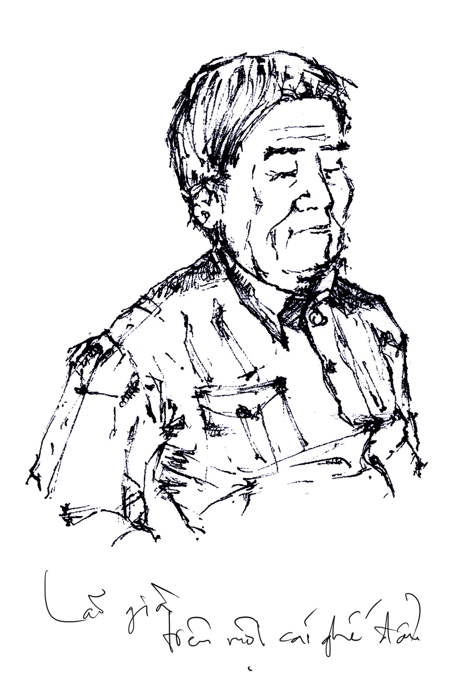
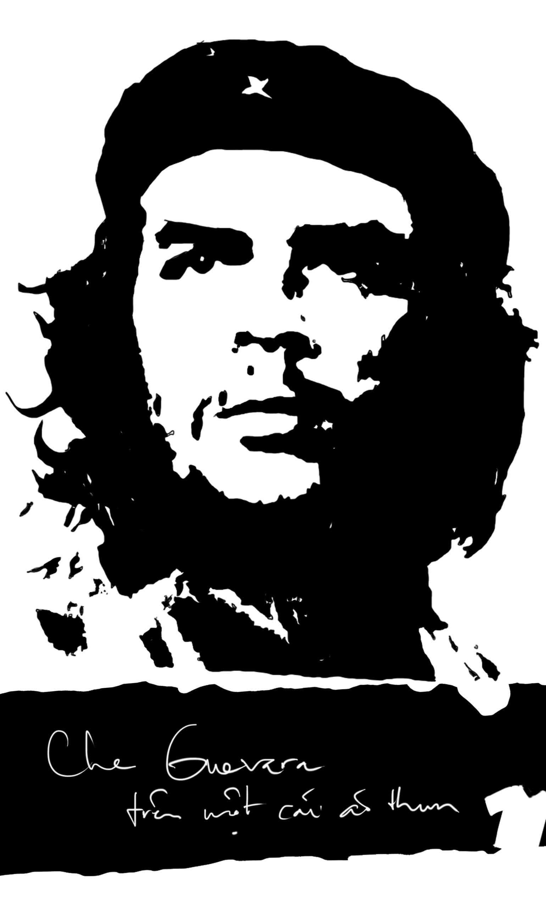

# 8

_Nỗi sỉ nhục buốt lòng  
Khi thấy mẹ ta bảy mươi tuổi lưng còng  
Phải làm việc mệt nhoài dưới nắng  
Khi thấy lũ em ngày càng hư hỏng  
Khi người mình yêu  
Nói vào mặt mình những lời ti tiện  
Khi bao điều tưởng thiêng liêng trong sạch  
Bỗng trở nên ngu xuẩn đê hèn_ 

— Lưu Quang Vũ

   

Lúc anh đến thành phố này thì trời đã tối mịt. Chớm thu, thay vì mang hương cốm và hương hoa sữa như tám mươi cây số về hướng Nam thì gió ở đây bốc mùi tanh tưởi lợm giọng của hàng thịt cá ôi thiu và rác rến tươi mới, lạnh lẽo thổi hun hút dọc những con đường dơ dáy bẩn thỉu đầy bụi bặm và ổ gà. Thỉnh thoảng lại có mấy con bò nằm bên vệ đường, con này ngủ gối đầu lên mông con kia, con kia gối đầu lên đuôi con nọ, con nọ gối đầu lên đống phân bò, những cái lưng gầy guộc nổi lổn nhổn những xương chậu cùng xương cụt cùng chĩa lên trời buồn thảm. Anh đeo cái ba lô nặng cả chục kí trên lưng trong đựng nửa kí quần áo và cuốn _Thương nhớ mười hai_ của Vũ Bằng, mắt đeo kiếng đen mua ở tiệm thuốc tây hiệu Đại Bịp, miệng che khẩu trang ca rô, cỡi chiếc Wave RS thuê giá năm chục ngàn một ngày đêm, vừa lượn tới lượn lui một vòng đại lộ vừa láo liên dòm tìm hàng quán ăn khuya. Một đoạn, thấy bên kia đường có ánh đèn tù mù giống hàng vịt lộn, anh liền thắng xe “két” một phát, tạt ngay vào, bụng nghĩ thầm rằng thôi hãy cứ mặc kệ những con bò cùng đống xương cụt, hãy cứ vui như mọi ngày mà làm vài táp cái đã. 

Cho nên anh thất vọng ghê gớm, vì cái quán bên đường nhìn vẻ ngoài rất phong cách ấy lại không bán vịt lộn. Nó là một cái chõng tre cũ rích mốc meo xiêu vẹo trên đặt tả pí lù tùm lum thứ hàng từ A đến Z, phong phú như Amazon cùng với eBay kí hiệp đồng làm ăn, nhưng tuyền không có một hột vịn lộn nào cả. Lão chủ quán đang ngồi gật gà gật gù trong bóng tối lờ mờ, thấy anh ghé vào thì mừng rỡ như bắt được vàng, gượng đứng lên xem chừng muốn ca bài ca quảng bá du lịch “Bạn ơi hãy đến quê hương trúng tôi, rừng cọ đồi chè đồng xanh ngào ngạt, nắng chói sông Lô hò ô tiếng hát, bến phà dào dạt sóng nước Bình Ca” song có lẽ vì hạn chế tuổi già sức yếu gối chùng gân mỏi nên lại phải ngồi phịch xuống, phều phào hỏi anh ăn gì uống gì. Thoạt đầu anh định quay lưng mang nỗi thất vọng hột vịt mà bỏ đi, nhưng cám cái cảnh lão già hí hửng nên đành ngồi lại gọi một chai Pepsi uống tạm cho qua cơn đói. 

Từ đây trở đi là những cảnh tượng anh nghe thấy và nhìn thấy và ngửi thấy và nghĩ thấy trong hoàn cảnh bụng sôi do thừa a-xít cờ-lo-hi-đờ-rít miệng ợ vì hơi ô-xít cạc-bon. 

“Tôi Nguyễn Đình Loát, nguyên viện trưởng viện kiểm sát nhân dân tỉnh Minh Hải, lại nguyên phó viện trưởng viện kiểm sát nhân dân tỉnh Bắc Thái. Nghỉ hưu đã mười tám năm. Ngồi hàng này cũng từ đấy đến nay.” 

Chủ quán là một ông già cỡ chừng bảy tám chục tuổi, tóc ba phần muối một phần tiêu, mặc áo bộ đội quần thể dục, mắt phải nhắm hờ, mắt trái bị tật đỏ đòng đọc và hấp háy. Như tất cả những lão già già đen khú đế khác, lão rất thích ba hoa xích đế chuyện quá khứ oanh liệt của mình cho những khách qua đường ngây dại ngồi hóng hớt nghe, miệng há thực to nước dãi chảy thực ròng. Tiếc thay cho lão, anh đâu phải thiếu nhi nào. Tuổi đời anh đã vượt các đầu ngón chân, mồm anh ngoài râu trên đã có thêm râu dưới, mặt anh đã bao lần cạo lông tơ, mỗi khi đi cắt tóc anh đã tự tin bảo thợ  lấy ráy tai xén lông mũi được một mớ, kinh nghiệm sống của anh đã khá là dày dạn, anh còn lạ gì những hạng người như lão. Quê anh ngày ấy cũng có Xí Hồ ngày ngày vẹt hàng rào ăn trộm chuối non nhắm với hai lít rượu đế, hết lăn bờ ruộng đến ngã bờ mương, miệng lè nhè khoe chiến tích năm xưa hành nghề cảm tử quân ôm bom ba càng xông vào quơ lưỡi lê như Triệu Tử Long múa giáo, đâm quân Tào Tháo chết cả vạn thằng. Thêm một lão Hòa què hành nghề ăn xin quanh năm suốt tháng lang thang Phú Đa Bến Dầu, những lúc thời vụ rảnh rỗi cứ buổi chiều lại chống nạng ra sân ngâm “Đèn Sài Gòn ngọn xanh ngọn đỏ, đèn Mỹ Tho ngọn tỏ ngọn lu,” xong chẹp miệng tiếc lúc xưa hoàng kim đốt tiền nấu trứng. Lại có một đại nhân vật tên là Ba Cụt, thời trai trẻ một bữa hăng hái vác cuốc ra đồng đào hố ỉa vất chẳng may trúng mìn cụt chân, về già lại quây quần với con cháu kể rằng ngày xưa tao chiến đấu cùng tiểu đội với La Văn Cầu, bị dính bom B52 xém tí vỡ tinh hoàn. Phàm đã là con người thì tuyệt đại đa số toàn là những kẻ mồm to như thế, chẳng có gì lạ cả. Nên chi khi lão già bán quán vệ đường này bắt đầu cất những lời khua môi múa mép, vừa hết câu thứ nhất chưa sang đến câu thứ hai anh đã lờ mờ đoán biết được toàn bộ cái cục diện sự vật sự việc rồi. Tất nhiên là lão nói phét. Phét lác. Bởi vì tất cả các loại trưởng như viện trưởng, thứ trưởng, bộ trưởng, hạm trưởng, cơ trưởng, đội trưởng, linh trưởng mà anh đã từng nhìn thấy trên tivi trong chương trình thời sự, bất kể đương, nguyên hay cố cựu, thảy đều không hoành tráng như Triển Chiêu thì cũng uy vũ như Bao Chửng, kẻ rút kiếm múa nhăng kẻ khênh máy chém kẻ lại liệng thẻ bài, mặt đen răng trắng mắt ti hí lại có sẹo Vừng Trăng thật kinh. Anh chưa thấy trưởng nào ngồi ngáp vặt, lâu lâu lại sờ sờ đếm đếm mấy gói khô bò buộc dây chun như lão già này cả.

“Mấy gói bò khô, tôi lấy dây buộc lại là để đề phòng trộm cắp đấy. Một lần tôi bị chúng nó lấy cả túm. Chạy đi chạy lại mình không để ý là chúng nó thó ngay. Cái thời này thật chẳng ra gì. Mét vuông có năm thằng ăn cắp.” 

Lão lại nói dối. Những ba lần liền. Thứ nhất thời này ra gì. Thứ hai mỗi mét vuông có mười thằng ăn cắp, không phải năm. Thứ ba chân tay lão líu quýu thế kia, nào phải Ặc-nôn[^1], không thể nào chạy đi chạy lại được. Anh ngồi uống nước ngọt đã lia mắt cú vọ quan sát rất kĩ, nhất cử nhất động của lão không qua được mắt anh. Tay lão gầy trơ những xương với gân, trên da lại điểm xuyến đầy những nốt đồi mồi đen đen nâu nâu nhìn rất tởm. Mỗi khi xúc đá bỏ vào cốc, cả hai bàn tay lão lại rung bần bật với biên độ rộng không hề thua kém bartender ở Lush Sài Gòn lắc rượu cocktail, làm những hạt đá vụn rơi tung tóe theo bán kính hàng cây lô mếch. Khi lão rót trà, nước vãi ra khắp nơi. Hai bàn chân lão, thay vì mang giày đinh loại chạy điền kinh cự li một trăm mét ở Thế Vận Hội mà Ben Giôn-xơn vẫn mang thì lão lại tương vào một đôi dép xốp màu xanh loại để dành đi trong nhà tắm, đế nhẹ lắm gai bám chắc đỡ trượt té, vẫn thường được bày bán dọc hai bên đường với giá hai ngàn đồng một cặp. Mỗi khi đứng lên để lấy cái gì, cặp đùi tong teo của lão lại run lẩy bẩy, dáng điệu lão như sắp ngã ngửa cả ra trông rất hèn hạ. Trộm cắp nước ta toàn là hạng có sĩ diện, đeo cà vạt, sống thanh tịnh, buổi trưa thích dùng món chay góc Pasteur Võ Thị Sáu, buổi tối hay cầm đồ ở hiệu Từ Tâm, cũng biết thương người tàn tật bệnh hoạn, lại còn phải đi từ Nam ra Bắc, bao nhiêu nhà lớn phải xây bao nhiêu cầu lớn phải làm, ai hơi đâu đi lấy bò khô của lão, vừa chả bõ dính răng lại còn mang tiếng tỏn mỏn. 

“Tôi cũng đi khắp nơi đấy chứ. Phía Nam tôi công tác Minh Hải Cà Mau bảy năm. Phía Bắc tôi làm việc Cao Bằng Lạng Sơn ba năm. Ngoài nước thì tôi đi Liên Xô, Ấn Độ, Pakistan, đủ cả. Ôi cái Liên Xô. Bên ấy hiện đại lắm cháu ạ. Người ta có cái máy cao chừng này này (lão giang hai tay ra), rộng chừng này này (lão giang hai chân ra), trên có cái khe dèm dẹp thế này này (hết thứ để giang ra nên lão không giang gì cả), mình cứ bỏ ba cô-pếch[^2] vào là nó nhả ra lon nước ngọt, bỏ hai cô-pếch vào nó lại nhả ra chai nước suối. Tôi với mấy ông trong đoàn thấy lạ quá, cứ đứng quanh nhét tiền vào mãi. Hiện đại lắm. Hí hí.”

Lão già làm anh buồn cười quá. Cái máy bán nước ngọt tự động ấy ở đâu chẳng có, làm gì mà phải đi sang mãi tận Liên Xô, tốn tiền tốn của của quốc gia. Từ mấy năm trước khi trường anh tổ chức lễ truyền thống ngày mồng chín tháng mười một, người ta đã khuân vào để quanh khuôn viên trường đến bốn năm cái đề-mô rồi. Tối hôm ấy trong khi dân tình tụ tập nhậu nhẹt đàn đúm hò hét từ trong trường ra đến ngoài cổng kéo đến bao vây cả Hồ Con Rùa[^3] thì anh với thằng Phong Đà Lạt thằng Thắng Đồng Nai ba thằng đứng xúm xít quanh cái máy xanh xanh đỏ đỏ, sờ soạng từ dưới lên trên từ sau ra trước, hoa tay múa chân tranh cãi ỏm tỏi về quá trình đồng xu trong túi mình chui tọt vào máy, lăn đến ngân hàng nhà nước rồi rớt tõm xuống lỗ nẻ trên hầm chui Văn Thánh như thế nào. Sẵn có tờ mười nghìn tiền polyme mới cáu bố mẹ vừa bán heo gửi vào, thằng Phong nín thở nhét vào khe máy, nhấn nút mua thử lon Coca-Cola™ thời giá lúc ấy là năm nghìn đồng. Cái máy nuốt chửng tờ tiền chớp nhoáng như một thằng quan tham nhũng trời đánh thánh đâm, sau đó khởi sự vừa gào rú vừa rung chuyển kinh thiên động địa như bên khu Nam Sài Gòn Phú Mỹ Hưng bị động đất sập nhà, một hồi tòi tẹt ra lon trà bí đao rồi im thin thít như cái đồ vô liêm sỉ đùn đẩy trách nhiệm chó chết, bọn anh vỗ về vuốt ve đến như thế nào nó cũng không chịu mửa tiền thừa ra. Cho đến khi thằng Phong tiếc tiền quá mất cả bình tĩnh bèn gầm một tiếng Sư tử hống, nhảy lên tung một cú cước cân đại truy thẳng vào màn hình, máy mới kêu khổ rồi lục cà lục cục nhả ra đồng bạc cắc mệnh giá năm trăm đồng đánh “keng.” Thằng Phong cầm đồng bạc mặt trước hoa sen mặt sau bông lúa nhét vào túi, chửi thề “má” một câu, rồi long trọng tuyên thệ từ giờ cho đến chết tao không bao giờ xài máy bán nước ngọt tự động nữa, vợ con tao mà đòi uống tao cứ thế mà tát cho rớt răng ra. Buồn cười. Thế mà lão già này lại phải đi đến tận Liên Xô. Buồn cười thật. 

“Con ấy à? Khối. Tôi được bảy đứa, năm gái hai trai. Con gái cả làm luật sư. Con trai út làm kĩ sư điện tử, sửa chữa điện thoại di động. Xã hội đang phát triển lắm, đâu đâu cũng là máy móc hết cả. Vi tính, điện thoại, ti vi tủ lạnh, máy giặt máy điều hòa, mô tơ máy bơm nước, bàn ủi quạt máy, bình điện ổn áp, máy lạnh máy hàn máy phát điện, những nghề ấy là có tương lai lắm hí hí.”

Bảy đứa con. Năm gái, hai trai. Chồng khỏe giống tốt vợ mắn mông lồng bàn, kể cũng đáng cho lão tự hào. Chỉ trừ việc kĩ sư điện tử không đời nào lại đi sửa điện thoại di động. Vì rằng cái thời hoàng kim của nghề sửa chữa điện thoại di động đã qua lâu lắm rồi. Bốn năm trước khi anh còn ở trọ khu bờ kè Cầu Bông, chung nhà có thằng Hữu sinh viên đại học Kiến trúc khoa Xây dựng, học sau anh một khóa, quê ở Quảng Ngãi (xứ này nay rất nổi tiếng với món đặc sản bò khô buộc dây chun). Thằng này ăn ở hiền lành, tóc tai gọn gàng, áo quần sạch sẽ, sống lối sống khoa học. Sáng sáng nó mang dép lác vận quần tà lỏn rách đáy chạy thể dục hai vòng quanh công viên Gia Định. Mỗi ngày sớm khuya nó tắm hai lần. Trong khi anh, thằng Quang, thằng Vũ, đứa nào đứa nấy hôi như cú vọ, lang ben ghẻ chốc khắp người thì đầu nó lúc nào cũng thơm tho mùi xà bông giặt đồ Tide. Một lần nó uống say uống xỉn ở đâu về ngồi khóc rưng rứt với anh mà bảo rằng “anh ơi sau Tết chắc em đi học một khóa sửa điện thoại di động... nhà em nghèo lắm ba mẹ em không có tiền... em học hai ba tuần xong ra đi làm mướn cho người ta mỗi tháng cũng được một triệu đồng... anh cho em mượn năm trăm ngàn đóng học phí...” nghe như con cò, rất nỉ non sầu thảm. Anh không nhớ rốt cuộc mình có cho nó mượn tiền không, chỉ nhớ thứ nhất là nước mũi của nó rất nhiều, lòng thòng nhìn rất kinh, thành ra khi lộ ra cái nghèo hèn thì ai cũng như ai, và thứ hai là ở thời điểm đó các lớp dạy nghề sửa điện thoại di động quả thật mọc lên như nấm sau mưa, đứa nào có được trong tay chuyên môn ấy thì tha hồ mà vênh váo, khách đông đến độ phải lấy que đập ruồi xua đi mới xuể. Nhưng cái thời hoàng kim ấy đã qua lâu lắm rồi. Bây giờ đời sống đã phát triển đến mức độ cao cấp, người ta đã chán ngấy những thứ đồ tẹp nhẹp bình dân như Nokia như Motorola như Sony Ericsson, người ta chuyển qua chơi những hàng doanh nhân bóng nhoáng như Blackberry như iPhone như Vertu như Mobiado như Goldvish, điện thoại chỉ cần trầy xước một tí thôi người ta đã vứt ngay vào hố xí giật nước trôi tong ra kênh Nhiêu Lộc để đi mua cái mới, không ai mang ra tiệm sửa chữa vừa mất công vừa tốn tiền vừa phí thời gian vô ích nữa. Các tiệm sửa điện thoại một thời chen chúc như kiến cỏ nay thành ra đói mốc mỏ, dọc hai bên Phan Đăng Lưu với Hai Bà Trưng toàn những thằng chuyên viên ngồi gãi ghẻ ngáp ruồi, bán những thẻ Mobi Vina ăn lãi từng vài ngàn đồng, hết sớm lại chiều bật băng cát-xét nghe Liên khúc nghèo của bộ ba hải ngoại khét tiếng là Mạnh Quỳnh, Mạnh Đình và Trường Vũ, chốc chốc lại thở ra một hơi dài thườn thượt nghe vô cùng bi đát. Nếu quả con trai lão học lớp kĩ sư điện tử ra thì tất giờ này đã ngồi nhà thất nghiệp suốt ngày đi lên cầu thang đi xuống cầu thang chửi đổng nền giáo dục như lão Hải Huế rồi, đào đâu ra mà sửa chữa điện thoại di động. Vả chăng, con trai kĩ sư con gái luật sư đời nào lại để ông già ra bán quán lặt vặt, mỗi tối bắt ghế ngồi vệ đường kiếm dăm đồng tiền còm thế này. 

“Về ghế, thì không được bắt chân lên ghế. Mấy ông trẻ là cứ hay bắt chân lên ghế. Từ lớp một là cô giáo đã dạy ở trong lớp không được bắt chân lên ghế. Cơ quan hội nghị họp hành cũng thế. Ấy thế mà vẫn có vị phía trên diễn giả diễn thuyết hăng say phía dưới mình lại cứ vắt vẻo như thế mà ngửa mặt lên trời ngáy khò khò như cái đồ vô học. Tôi là tôi ghét những đồ vô học. Cho nên thấy ai bắt chân lên ghế là tôi nhắc nhở ngay. Một tiếng không nghe, hai tiếng không nghe là tôi mời ra khỏi hàng, không ôn đơ gì cả.” 

Lại phét. Trời đất đổi thay đã nhiều, chế độ bao cấp đường tem gạo phiếu nay đâu còn nữa. Thời buổi này là thời buổi kinh tế thị trường theo định hướng chuẩn, không ai ngu dại gì vì mấy cái ghế nhựa giá mười ngàn một chục mà đi đuổi khách cả. Khách hàng là thượng đế ế ế ế. Đấy xem, có hai thằng nhóc chừng mười sáu mười bảy tuổi dừng con xe sáu bảy trước hàng, khói đằng ống bô hộc ra bốc mùi hôi thối nồng nặc. Một thằng ở trần vai trái xăm hình Đôrêmon xanh như đít nhái vai phải chạm hình Pôkêmon vàng như nghệ, một thằng mặc áo trắng toát vẽ hình Che Guevara đen thui đang nhìn xa xăm bằng hai con mắt tỏa hào quang lân tinh; chúng nó gọn lỏn rằng “một điếu Phi Lao[^4].” Lão già đang hùng hồn diễn thuyết vụ chân vắt lên ghế liền “vânggg” một tiếng lễ phép như cháu chào bà cháu đi mẫu giáo, cập rập đứng lên lấy bao thuốc lá đưa cho thằng Đôrêmon bằng cả hai tay, miệng lại cười với Che một quả nịnh nọt. Bộ lệ hèn hạ như thế mà vỗ ngực đòi đuổi đại biểu ra khỏi cuộc họp. Đào đâu ra ngực mà vỗ. Chỉ phét. Anh là anh ghét những đồ bốc phét. Kiểm sát hay kiểm lâm gì cũng thế thôi. Những đồ bốc phét. 

“Kiểm sát ấy à? Kiểm sát cả một đời người, nhiều chuyện lắm, vui buồn có cả. Như lần ông chủ tịch tỉnh có đứa cháu làm cửa hàng mậu dịch đấy, người ta lợi dụng  chức quyền mà tham nhũng, làm khó dễ cho trên cho dưới. Ai chứ tôi là tôi đấu tranh đến cùng. Các ông ấy dậm dọa tôi biết bao nhiêu. Tay cầm pháp luật mà không nắm luật pháp là chết đấy cháu ạ. Hổng chân một cái là người ta _chu di_ mình ngay. Cho đến khi khám nhà mậu dịch viên thì tìm thấy cao hổ cốt mười mấy miếng, quần áo bốn mươi bộ. Thế là cuối cùng các ông ấy chết đấy cháu ạ, mà tôi vẫn là thằng tôi, đầu đội trời chân đạp đất. Chẳng ai _chu di_ được tôi. Mình có chính nghĩa mà. Không sợ gì cả. Hí hí.” 

Đầu đội trời chân đạp đất. Hí hí.

Tội nghiệp lão. Thời lão còn thanh niên trai tráng vung búa gõ đế thì anh chưa được đẻ ra nên không biết trông lão phong độ như thế nào, chỉ thấy bây giờ thì lão nhìn người không ra người ngợm chẳng ra ngợm. Từ cái bóng đèn tròn bọc trong ba lớp giấy báo Nhân Dân, ánh sáng vàng vọt chầm chậm tỏa ra với tốc độ ba chục vạn cây số mỗi giây, soi lờ mờ bản mặt lão nhăn nheo, hai túi má bủng beo chảy xệ, lông mày lông mi bạc mốc mọc lơ phơ na ná lông con Chihuahua[^5] và cái miệng móm mém với hàm răng vàng ố dễ chừng rụng phải hết mất một nửa. Trời càng về khuya gió càng thổi lạnh, cái áo bộ đội vải dày như vải bao bố lão đã cài nút đến tận cằm vẫn không ăn thua. Lão ngồi co ro sau chõng hàng, tóc lưa thưa phất phơ lòi da đầu mốc meo, hai tay thu lu trước ngực chốc chốc lại co ra duỗi vào chuyển động năng thành nhiệt năng cho ấm. Lão lại bị chứng lãng tai rất nặng, muốn hỏi lão cái gì đó anh cứ phải gào lên càng lúc càng to cho cả làng xóm cùng nghe, đại để “ÔNG BÁN CÓ MỘT MÌNH À?” – “Ừ tôi bán một mình. Có bà mọi hôm còn phụ rang lạc, nhưng hôm nay bà bị ốm nằm nhà rồi không rang được, thành ra hôm nay không có lạc để bán,” “BÀ BỊ ỐM GÌ HẢ ÔNG?” – “Di chứng teo thận cháu ạ, teo cả hai quả một lúc, cứ phải nằm bẹp dí ở giường, đái ỉa một chỗ,” “BAN NGÀY ÔNG CÓ BÁN KHÔNG?” – “Không, ban ngày không bán, ban ngày tôi để vỉa hè cho thằng con giữ xe với cả dán xe,” “VỈA HÈ CỦA ÔNG À?” – “Không, vỉa hè này là tôi thuê của nhà ông giám đốc cán thép, đây nhà ông ấy đấy, có to không,” “TRÔNG ÔNG VẪN CÒN KHỎE NHỈ?” – “hả?,” “TRÔNG ÔNG VẪN CÒN KHỎE NHỈ?” – “Tôi bị đau dạ dày phải cắt mất đến ba phần tư, bác sĩ bảo chỉ sống thêm được vài năm thôi, thế mà đã mấy chục năm nay tôi vẫn còn phây phây đây, đã chết được đâu, hí hí.” 

Tội nghiệp lão. Nom lão người bây giờ không ra người ngợm không ra ngợm, nào có khác gì chết rồi. 

Lão làm anh nhớ đến một bà già khú đế khác có hai đứa con trai đã cùng mấy chục anh em đồng hương khác thi đua trôi sạch bách mất cả trong một trận lụt kinh điển; đành bỏ xứ, bỏ làng, bỏ mái tranh vách phân trâu, bỏ luôn những xí đào xí hố xí tõm mà tha hương cầu thực vào Hoa Lệ xí bệt, bơi sải giữa nắng bơi bướm trong mưa bơi ếch dưới cầu vồng, ngày lang thang bán vé số Bình Thạnh, tối chui chòi rách Thủ Thiêm, tích cóp từng đồng cắc gửi về quê nuôi bốn đứa cháu vừa trưởng thành chín chắn lại vừa tuyệt vời thất học. Ước nguyện một đời của bả là được trên chứng nhận hộ nghèo, một việc xem chừng bất khả vì theo lời bả nói thì có bán vé số cho đến mãn đời ngủm cù đeo bả cũng không để dành đủ tiền đóng lệ phí cho các anh công an xã. Hôm anh gặp bả trong một quán cơm thì bả vừa bị mấy thằng du côn đẹp trai đeo kính râm giật mất nguyên một tập vé số, nên bả cứ đứng khóc hu hu với anh, răng lợi rơi khắp chẳng màng. Muốn xua bả đi cho khuất mắt nên anh biếu bả chút tiền với chai trà thanh nhiệt mà những người vui chơi tiệc tùng thâu đêm nọng trong người vẫn thường uống. Thế mà bả không chịu hiểu ý, bả cứ cầm tay anh lắc lắc mà trầm trồ phều phào rằng “tội quá con” “phúc đức quá con” “trời có mắt trả lại cho con[^6],” anh mà không cản kịp thì có lẽ bả đã trồng cây chuối mà biểu diễn ngay một màn híp hốp lộn đầu quay mòng cho anh xem[^7]. Bả quê tỉnh Phú Yên, huyện Tuy An, xã An Dân, gần nguyên một chùm An Cư An Nghiệp An Ninh An Định. 

Buồn cười.

Anh móc túi trả tiền. Rồi không muốn nhìn cảnh lão già ngồi run rẩy đếm từng tờ giấy bạc, anh ngồi lên xe nổ máy phóng đi. Gió táp vào mặt anh, xói vào mắt anh cay xè. Em ơi, trời lạnh lắm. Những con bò vẫn nằm hai bên vệ đường, ngơ ngác nghếch đầu lên nhau. 

Tội nghiệp ông già, tội nghiệp bà già. Cũng một kiểu già nua lọm khọm, mắt mờ răng rụng tai nghễnh ngãng. Cũng nghèo đói thảm hại, sống lay lắt chắt bóp. Cũng chẳng còn biết tin tưởng vào cái gì khác ngoài các đấng cao xanh trời phật thánh thần còn đang gãi đàn hạc ngồi bông sen hít ozone cách người phàm mắt thịt chúng ta cả trăm ngàn cây số trục thẳng đứng, hoặc tự huyễn hoặc mình với quá khứ hào hùng đã phắn tịt cũng cả ngàn năm rồi. Cũng nhảy híp hốp. Trong khi những con người chân chính nay đã lần lượt rủ nhau trèo lên cột thu lôi mà song phi cả vào trong vũ trụ. 

Vậy mà trước giờ anh cứ nghĩ những ông già bà già đó lẽ ra phải sống vui vầy, đánh cờ tướng chơi cờ vây, sáng sáng hít đất ngoài công viên, tối về kể chuyện cho con cháu nghe. 

Kể rằng ngày xửa ngày xưa ở một xứ nọ có toàn là những ông bà già sống vui vầy, đánh cờ tướng chơi cờ vây, sáng sáng hít đất ngoài công viên, tối về kể chuyện cho con cháu nghe.

Kể rằng ngày xửa ngày xưa ở một xứ nọ có những người cứ nghĩ rằng toàn bộ những ông bà già trên cái xứ ấy đều đang sống vui vầy, đánh cờ tướng chơi cờ vây, sáng sáng hít đất ngoài công viên, tối về kể chuyện cho con cháu nghe…

Anh biết đâu rằng.

Tội nghiệp mụ già, tội nghiệp lão già.

  

[^1]: Tức Arnold Schwarzenegger, là một diễn viên kia thân hình to bự nhờ tập lăn tạ từ năm mười lăm tuổi, sau nhờ lăn tạ giỏi mà được chúng dân tín nhiệm bầu làm thống đốc bang kia ở Hoa Kì.
[^2]: Cô-pếch là cái thể loại đồng tiền của Liên Xô cũ, mệnh giá bằng một phần trăm của một rúp. Anh nghe đồn rằng Liên Xô mới không còn chuộng xài rúp với cô-pếch nữa, Liên Xô mới bây giờ xài đồng Ơ-rô nhiều hơn. 
[^3]: Lễ Truyền Thống của trường anh được tổ chức hằng năm đâu khoảng tháng 10 tháng 11 để anh em bà con tạt vôi và nước cống vào người nhau như lễ hội té nước ở Lào, rồi lại có biểu diễn nhạc Rốc inh ỏi không thua kém gì Woodstock dành cho đồng bào ngoại công thâm hậu tóc tai rũ rượi lắc cổ nhịp chân. Kết thúc lễ luôn luôn là những cuộc nhậu bí tỉ thâu đêm suốt sáng. Thằng Nguyên bạn anh có lần buổi tối còn ngồi quận 3 buổi sáng tự nhiên lại thấy đi xiêu đi vẹo ở quận 5 cũng là nhờ một cuộc nhậu tăng tình đoàn kết dạng như thế này. 
[^4]: Đến giờ anh cũng chưa biết Phi Lao là cái loại thuốc gì. Anh đồ rằng nó chính là Vinataba, vì cái thuốc Vinataba này có logo hình lá thuốc lá, những ai mắt mũi bù lệch có thể nhìn ra ngọn phi lao không chừng.
[^5]: Là loại chó kiểng nhỏ tí, được đặt tên theo một tiểu bang ở Mễ Tây Cơ, có lông ngắn lông dài và đôi mắt buồn theo phong cách Nhà Thi Sĩ Bùi Bán Dùi, đang rất được ưa chuộng. Lưu ý, cùng là chó nhưng chó này không liên quan gì nhiều đến chó béc-giê của anh Hoàng Vũ Bằng “Con chó của anh chưa phải nhịn bữa nào. Nhưng xác người chết đói ngập đường phố.” 
[^6]: Lúc đấy anh rằng “Mắt cứt.” Nhưng giờ nghĩ lại, biết đâu cứt cũng có mắt không chừng. Nào ai biết được. Hi hi.
[^7]: Anh không phóng đại đâu. Đứa nào xạo trời đánh chết. Có lần anh còn tận mắt chứng kiến một thằng kia vừa bán kẹo kéo vừa nhảy điệu Moonwalker tức Bước Giăng của Mai-cồ Giắc-xơn nữa kia. 
