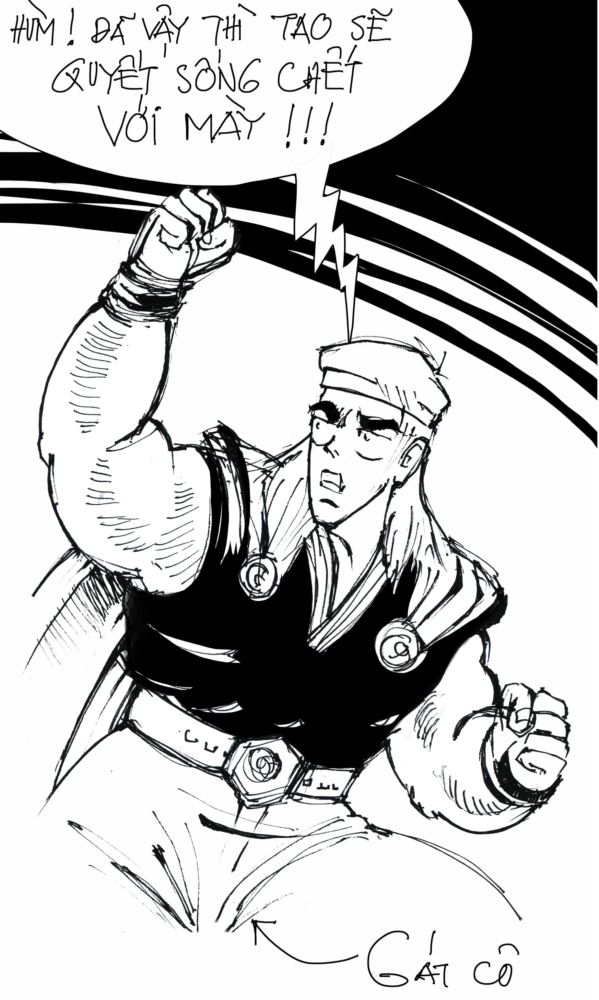
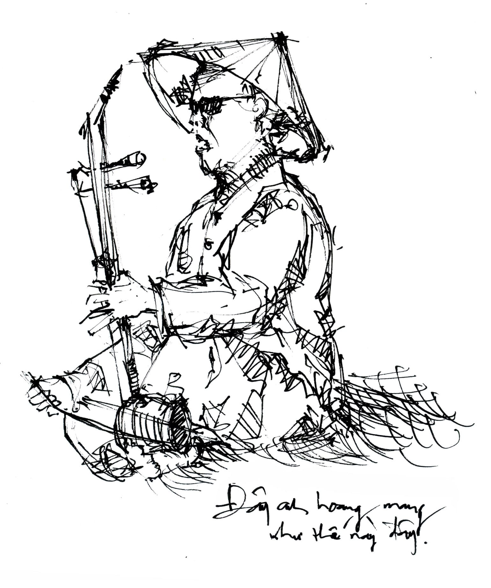

# 9

_Giải yếm sau lưng cũng tím hoa cà  
Cháu lên Kẻ Chợ cùng bà  
Nón quai thao, áo màu bay rực rỡ  
Những lò rèn phập phù bễ lửa  
Phường chạm bạc, phường đúc đồng  
Phố hàng Hài thêu những chiếc hài cong.  
Những cô gái dệt the và phất quạt  
Những hàng Điếu hàng Buồm hàng Bát  
Rùa trao gươm, chim lạ đến Tây Hồ  
Lụa làng Trúc, rượu Kẻ Mơ  
Phố Tràng Thi ngựa hí_

— Lưu Quang Vũ

   

Như trên đã từng nói, và mặc kệ ai muốn nói cái quái gì thì nói, dù gì đất nước ta vẫn rất đẹp. Từ khi lọt lòng mẹ chui ra anh vẫn là người rất khắt khe với cái đẹp, nhưng đất nước ta thì đúng là cực đẹp, là cái _hidden charm_ thiên hạ từ Bắc chí Nam bay qua Trung cùng đồn đại quả không ngoa. Đến mức một thằng lười vận động như anh phải nhấc mông ra khỏi cái ghế nệm êm ái của văn phòng mà gói quần jean ghém áo thun, nhét dấm dúi bàn chải dao cạo râu cây xức nách thuốc tiêu chảy, xông pha lên đường du hí, lá vàng trên đầu và sau lưng lả tả rơi, bạn bè chạy quanh tuốt sáng giáo gươm, tóc anh đen như mun cùng với gàu anh trắng như tuyết bay tung tóe, miệng anh ngâm rằng “Hoàng hạc nhất khứ hề bất phục hoàn[^1]” rất hào sảng. Em tưởng tượng, đến cái mức độ hoành tráng kinh khủng như thế, tưởng cũng đủ biết đất nước ta đẹp đến cỡ nào. 

Thế là, mặc cho những thằng bạn rất lợn gọi anh là “amateur tourist[^2]” bằng một giọng sặc những mùi ganh tị, anh cứ thế hùng dũng lên đường ra đi. 

Sau buổi tối ngồi nhậu bên cạnh thành cổ, ngắm con gái Sơn Tây trắng trẻo xinh xắn và ê a “Đôi cánh gà Sơn Tây, u uẩn tồi luân lạc,” hôm sau anh đến làng Đường Lâm từ lúc tờ mờ sáng. Sương lúc ấy còn bốc tung mù, hột nhỏ bay lên cao hột to bay xuống thấp hột vừa thì cao[^3]. Những ngôi nhà xây bằng đá ong vàng vàng đen đen lại lỗ chỗ nâu nâu nằm lấp ló mờ mờ ảo ảo đằng sau vô khối là những thể loại tàng cây lá thẳng như ở lưu vực Amazone, lá kim Siberia và lá dùi tỉa bắp Điện Bàn Đại Lộc. Những tàu lá chuối to bự rách bươm cùng chen vai thích cánh với đám dây trường sanh tươi tốt mọc loăn quăn trên bờ rào. Mái đình Mông Phụ chĩa thẳng lên trời hùng dũng. Thỉnh thoảng trong bụi cây vệ đường có một loài gia cầm kêu “quác” một tiếng rồi co cẳng vỗ hai cái cánh bay lên trên xanh lẫn vào trong mây mất dạng. Từ những nơi chốn bí hiểm um tùm không thể định danh được, tiếng chim hót líu lô văng ra từng đám từng mớ xoắn xít lấy nhau như dây thừng một núi. Đường làng vắng hoe, thỉnh thoảng mới có một ông nông dân trông rất vẩu, da nâu thui, miệng ngậm cuốc dài vai vác răng ngắn, đạp chiếc xe đạp kêu lọc cà lọc cọc ra đồng, đi ngang qua liếc nhìn mặt anh một vẻ tò mò. Trong từng ngõ ngách cụt, những cái giếng tròn có mặt bằng hình mặt trời tỏa rạn[^4] đang nằm ngửa rất bình tĩnh đợi người trượt chân đau đớn té tõm, liếc nhìn chân anh một ánh chờ mong. Tấm biển cũ bằng gỗ trên viết nguệch ngoạc dòng chữ “Ông lang Cải – chuyên bó chân tay gãy bằng thuốc Nam gia chuyền[^5]” cheo[^6] toòng teng trên bờ tường gạch đen đúa đầy rêu xanh liếc nhìn tay anh một trời hi vọng. Anh đi vòng vèo theo sơ đồ xương cá, một hồi tự nhiên xuất hiện trước đền Phùng Hưng và lăng Ngô Quyền, cả hai cùng cổ kính uy nghiêm đứng hùng vĩ trong sương sớm, văng vẳng từ xa có tiếng chổi xào xạc của ông từ răng nửa ố nửa đen. 

Rời Sơn Tây anh lái xe máy trăm mười phân khối tốc độ cao, dùng gia tốc thắng trọng lực, bay theo đường vòng cung qua sông Hồng, đáp chuẩn xác lên ngay đầu đê, rồi từ đầu đê xe anh bon bon chạy thẳng đến cuối đê trên thân đê. Bên trái anh là dòng sông uốn lượn nằm thẹn thùng thấp thoáng thật nên thơ như một đòn bánh tét gói dối sau một rừng xanh lè lè những là tre lồ ô, vầu, nứa, tre cổ thụ, tre mái có bông được hãng chăm sóc da Quốc Tế Nổi Tiếng là Nivea chiết xuất làm sữa bôi phòng chống béo quá nứt da, tre đực được tận dụng ngâm bùn quét phân trâu làm phên tre bảo vệ két sắt phòng chống trộm cắp, tre nhỏ có dị tật còn gọi là măng cụt được dùng để ăn phòng chống đói, lá tre thì dùng để bay chen bay chúc và cọ vào nhau và kêu gào nhào vào xào xào rào rào nào. Bên phải anh lúc thì là cánh đồng lúa đang thì nái xề rộng ba dài bảy vị chi hai mươi thước vuông nằm giữa bốn bờ cỏ rậm rì, lúc là xa xa có con bò to không kém gì con voi đang hì hục kéo xe bò cạnh con trâu to cũng không thua gì con bò đang lầm lũi kéo xe trâu, lúc lại là cái nhà nhỏ tí trong chỏng chơ một tấm phản trên chễm chệ một ông áo xanh đội mũ cối che mưa chống nắng đang xắn móng lợn ngồi chống chân đầu gối quá tai mà phồng mang trợn mắt hít một hơi thuốc lào nghe rộộộộột và gào lên rằng “Mày nhìn cái chó giềềềềề.” Trước mặt anh bụi bốc tung mù mịt, làm những ổ gà ổ lợn trở nên huyền hoặc mờ ảo như trong đêm hội Long Trì có lung linh đèn thắp và giăng giăng cờ xí và thái giám thật đã bị thiến. Sau lưng anh thỉnh thoảng lại có vài con chó đen hoặc gầy trơ xương hoặc béo núc ních vừa hết tốc lực đuổi theo anh vừa sủa nhặng xị ý hẳn muốn gửi gắm những lời tâm huyết hãy rọ tôi đi hãy dồi tôi đi hãy riềng tôi đi hãy quốc lủi tôi đi hãy binh Tư lão Hạc[^7] tôi đi. 

Xử lí xong mấy con chó và cái đê sông Hồng, anh cùng với đoàn xe lửa không quen biết lăn lăn qua cầu sắt, anh tươi tắn rực rỡ phi phía dưới, thằng xe lửa cũ kĩ mốc meo chạy phía trên vãi muội than gỉ sắt lên đầu anh, hai đứa anh cùng lạch bà lạch bạch tiến vào thành phố Việt Trì tỉnh Phú Thọ. Ở nơi đây cũng như khắp mọi nơi khác, trời sắp vào mùa thu, nắng tỏa hào quang chói lọi như dũng sĩ Hesman chập hai tay vốn là hai con mãnh sư thành luồng hồ quang tạo gươm ánh sáng bén ngời chém nhau với người khỉ khổng lồ Gátcô tóc đỏ đến từ hành tinh Gátcô nơi mà người nào cũng là khỉ tóc đỏ và khỉ tóc đỏ nào cũng tên là Gátcô[^8]. Hai hàng cây nằm đều tăm tắp hai bên đại lộ Hùng Vương đã bắt đầu rụng  những chiếc lá đầu tiên, làm anh bất giác nhớ đến thằng Huy quê Bến Tre, cái thằng được lũ bạn bè phản phúc lớp K02A2 của anh đặt cho tên kẻng là Huy Lãng Mạn, họ hàng với Huy Gô. Huy Lãng Mạn tướng cao cao gầy gầy, da dẻ trắng trẻo, hay cười ỏn ẻn rất ngớ ngẩn, là một trong những thằng sinh viên Kiến trúc hiếm hoi đã luyện thành công cái tuyệt chiêu độc cô cầu bại là “đi học chuyên cần,” khi đi nó vận quần sọt trắng và giày ba-ta không mang tất cứ như vận động viên ten-nít, tay nó lúc nào cũng lăm le cuốn sổ kẻ dòng với cây bút Staedtler cỡ ngòi 0.8. Trong khi anh em ngồi túm tụm nhau vừa cà phê bà Nhã[^9] vừa khóc ròng vừa tán láo về đề thi lần hai môn Nhiệt Công Trình[^10], Âm Học và Luật Xây Dựng thì nó bắt chước nam ca sĩ tài danh là Tuấn Ngọc với nhạc sĩ tiếng tăm là Ngô Thụy Miên mà ngồi tách biệt ra riêng một góc trời, mặt nó đăm chiêu mắt nó mơ hồ nhìn xa xăm lên cao. Bỗng nhiên có một chiếc lá rơi xuống! Rằng Độp! Thế là! Nó lật đật lật sổ ra ghi ngay vào: Lá vàng rơi! Đoạn nó lại ngồi ngơ ngẩn nhìn cao tiếp tục. Một hồi! Lại có một chiếc lá khác rơi xuống! Rằng Xoẹt! Huy Lãng Mạn lại quýnh quýu lật sổ ghi thêm: Lá vàng lại Rơi! Nghe đâu sau cả một học kì sáng tạo kiên nhẫn khiếp hồn cứ như Nguyễn Siêu luyện chữ thế vậy nó đã hoàn thành bài quốc thơ[^11] tuyệt cú sau đây: 

_lá vàng rơi lá vàng rơi  
lá vàng rơi lá vàng rơi lá vàng  
lá rơi rơi lá vàng vàng  
lá rơi rơi lá vàng vàng lá rơi_[^12]

Nhưng để tránh lạc đề, anh với em chúng ta hãy cứ để thằng Huy Lãng Mạn quê Bến Tre cắm đít làm thơ ở đấy mà quay trở lại với Việt Trì Phú Thọ, nơi lá vàng từ nãy đến giờ vẫn kiên nhẫn rơi lác đác trên đại lộ Hùng Vương. Trời xanh không một gợn mây. Trên đường đi lố nhố những người là người, tóc dài cùng với tóc ngắn đầu trọc cùng đội mũ bảo hiểm, xe máy cùng với ô tô xe lôi nườm nượp đua chen, cờ tung bay trên nóc những ngôi nhà cao chọc trời nằm dưới những bóng cây xum xuê, lại có một ông chạy xe đạp trên giắt đầy những là các loại đao búa sáng quắc trông thật đáng quan ngại, sau xe dán một tấm biển rất to màu xanh đề: 

TMĐ 1951942  
THỢ SIÊU CAO THỦ SỐ 1 VÔ ĐỊCH!  
LỪNG DANH NỔI TIẾNG KHẮP NƠI!

KHẮC BÚT!  
QUAY MÀI DAO KÉO!  

NGHỆ THUẬT THIÊN TÀI!  
DÁN KHẮC TÊN VẼ CẢNH!  
MÁY TÍNH, ĐIỆN THOẠI DI ĐỘNG!  
VÀ MŨ BẢO HIỂM XE MÁY!

_Bán Thuốc Lào!  
Loại thuốc Vĩnh Bảo sợi đen!  
Loại thuốc đặc sản Hải Phòng!_

bằng những loại phông chữ Unicode và VNI, có chân và không chân, đỏ và trắng và vàng. Anh lon ton vác máy ảnh chạy theo ông thợ siêu cao thủ số một vô địch chụp lấy chụp để, lòng nơm nớp lo sợ lão bực mình phi nguyên cái cán dao vào mặt. Chụp một hồi thì anh đến đền Hùng nằm chon von trên núi Nghĩa Lĩnh. Lúc ấy vào tầm hai giờ chiều theo chuẩn GMT+7, nắng trải nghiêng nghiêng vàng rộm những núi non vừa trùng trùng điệp điệp vừa vắng heo vắng hút. Giữ xe ở chân núi thấy mặt anh ngơ ngáo liền chém anh hai chục ngàn một suất, thêm cái mũ bảo hiểm năm ngàn. Anh cởi áo khoác ra trùm đầu, khởi sự vừa lết bộ vừa nhảy cóc vã mồ hôi mồ kê qua khoảng hai triệu bậc thang, đi lên đền Hạ đền Trung đền Thượng rồi lại nhảy tõm xuống đền Giếng, mỗi nơi anh đều thắp nhang rất kính cẩn, chắp tay bái lạy rất kính trọng và trả cho dịch vụ hóa vàng thuê một khoản tiền đáng kính sợ. 

Đất nước ta rất đẹp. Anh xin thề. Bảo đảm cả đời em không tìm ra được một đất nước ta nào đẹp được như thế. Sau khi gieo một lúc cả chục cái quẻ để kiếm con đúp-bồ sấp ở đền Cha, anh mãn nguyện nhét hai tấm bùa “Thượng lộ bình an” có ngù tua đỏ chóe vào túi, cười khà một cái, rời Phú Thọ qua Vĩnh Yên Vĩnh Phúc quành về Nội Bài rồi ruổi lên Thái Nguyên, từ Thái Nguyên anh lại ôm cân chè đặc sản giá một trăm bốn chục ngàn chạy xuống Bắc Giang, đâu đâu cũng thấy những phong cảnh hữu tình, những màu sắc sặc sỡ rực rỡ, những nét lí thú lạ lẫm chẳng nơi nào có được. Giá có em ở đây thế nào em cũng mừng vấp té, rồi em thét lên làm mụn văng đầy mặt anh gây bệnh lang ben rất bệnh. Rồi em múa cột, ưỡn ngực lắc mông. Rồi em xắn váy nhảy ếch xuống sình bơi lạch bạch. Rồi em nâng ống kính lên chụp tứ tung lung beng những đền chùa miếu mạo, những cây đa cây đề cơ bắp to gấp vạn tay anh, những con ngõ quanh co ngoằn nghèo sâu hun hút lát gạch đỏ au, những đường đi lối lại gập ghềnh khúc khuỷu nằm lọt thỏm giữa hai bên bờ tre cứ kêu rằng “kẽo kẹt,” con sông đỏ quạch rộng mênh mông chảy lừ đà lừ đừ, biển báo chỉ đường đi thẳng vào thành phố rẽ phải vào chợ trung tâm[^13] lại bổ sung thêm cụm thán từ song ngữ nguệch ngoạc “Ôi cái địt – _Fack_[^14],” dòng chữ vôi quét loang lổ trên bờ tường xi măng “A Lợi Nghiền Bột Trẻ Em[^15],” tấm bảng quảng cáo trước căn nhà cổ “Tại Đây Có Bán Lạc Rang Húng Lừu,” hai người phụ nữ bắt chấy cho nhau trước cổng chùa Mía bảo anh “nhìn chị cứ như con điên ấy em nhỉ,” hàng đoàn những người bán hàng rong ngồi vắt vẻo trên hàng rào chắn dọc quốc lộ 1A từ Bắc Giang đổ về Hà Nội, tay ôm một rổ những trái gì xanh xanh anh không rõ, luôn mồm gọi khách yêng hùng đang bon bon trên xa lộ hãy đừng sợ xe tải cán hãy rẽ xoẹt vào đây hãy chọn ngay hãy đừng tỏn mỏn hãy cứ mua nào. Đấy như em đã thấy, đất nước ta rất đẹp. Thế nào em cũng thét the thé té lộn cổ, anh xin thề như thế. Chẳng phải chơi.

Cho nên khi nghe em nói anh rất ngạc nhiên. Vô cùng ngạc nhiên. Ngạc nhiên lắm. Anh hoang mang như một lão ăn mày nằm co giật trợn trừng hai mắt trước cái mũ đặt ngửa đầu đường Hai Bà Trưng, hay một lão khác vừa điếc vừa mù cứ đứng thui thủi một mình trong một góc tối trên đường Phùng Văn Cung, miệng cười ngô nghê, tay giơ ra trước xin tiền xin gạo, trong khi bốn bên vắng lặng không một bóng người. Đấy anh hoang mang theo phong cách xẩm Nguyễn Công Hoan và tư cách mõ Nam Cao như vậy đấy. 

Em ơi, thế là cái nghĩa lí gì?

Đã đành rằng chúng ta còn nghèo nàn lạc hậu, trong khi bạn bè quốc tế từ láng giềng cho đến cách nửa vòng trái đất đã từ lâu phát triển những nền công nghiệp từ nặng cho đến rất nặng tỉ dụ chế biến rô-bốt, chế tác sex toys tức đồ chơi tình dục chạy pin Con Ó cho đến nhái máy nghe nhạc iPod tức tôiCáiLờ thì chúng ta cặm cụi đi nhặt hạt cà phê rụng bị chó cắn từ đứt cả gân rách cả quần cho đến chết lăn quay. 

Nhưng cái nhẽ con đường phát triển nó phải là như thế. Cái gì lại chẳng đòi hỏi một quá trình. Không ai buổi chiều còn đánh trâu ra đồng, buổi tối mặc quần vá mông đắp chiếu rách lại đùng một  phát buổi sáng mở mắt ra trở thành tỉ phú đi Limousine[^16] ngay.

Đã đành rằng dân trí chúng ta còn thấp với lại dân trí chúng ta còn chưa cao lắm khi chúng ta không biết nói một câu cho nó suôn sẽ với nữa đúng chính tả ú ớ trong mồm bô bô hát dịch nhạc ngoại bạn bè quốc tế khối chí thức bẻ bông tắm tiên nổ đoàng phóng ị con rùa lặn hoành tráng cười không sĩ liêm ấy là những nào thật trò hề sao chúng bay không cười mà rằng. 

Nhưng dù cho thế vậy cũng no care đã sao làm gì nhau vì chủ yếu có tấm lòng để gió cún đi mặc dầu bao ngu xi củng Lợi. 

Đã đành rằng có những giấc mộng du muôn đời không trở thành hiện thực được. Như hồi nhỏ anh hâm mộ Tấm Cám Idol đến nỗi xúi thằng cu Điệp bóp dẹp lép con cá Hồ Lan bỏ dưới chân giường, xong tung tăng đến trường khoe với tụi bạn rằng tao sắp có ngựa trắng áo đẹp, tao sắp thành hoàng tử cỡi heo. Ba ngày sau tụi anh hí hửng đào chân giường lên thì ngựa với heo đâu ko thấy, chỉ thấy con cá nằm chết trương phình thối hoắc trông ngu như con bò cười. 

Nhưng con người ta chỉ sống bằng thực tế, ngựa hay heo hay cá hay bò gì gì cũng phải được tạo ra bằng bàn tay khối óc. Như thằng cu Điệp, sau vụ cỡi heo không thành ấy nó phải một trận đòn chổi oánh đít kinh thiên động địa làm rơi vãi mọi thứ, đến tận bây giờ dù đã trở thành một tay môi giới chứng khoán lõi đời, đất cát cả ngàn mét vuông mua đi bán lại như phải rồ, gia sản có đến vài chục tỉ đồng, nó vẫn nặng một lòng căm thù chuyện cổ tích Việt Nam do Nguyễn Đổng Chi sưu tầm biên soạn và giới thiệu. Cái tuổi ngây thơ chỉ biết bắn bi thả diều và mơ mộng của nó đã qua lâu lắm rồi.

Đã đành rằng có những thể loại người là tiến sĩ nọ kia đã hoàn tất luận án Mỹ học, nghiên cứu về cây cỏ đến độ trở thành nhà thực vật học, chọi gà đá dế hăng say đến mức trở thành nhà súc vật học, lặn hụp thưởng ngoạn san hô mười thước dưới bể khơi ra nông nỗi trở thành nhà dương vật học, khi no cơm rửng mỡ đã cho giăng những băng rôn to tổ nái “CƠ HỘI ĐỊNH CƯ NƯỚC NGOÀI” cứ như thể việc nhảy lên máy bay Boeing 747 phắn khỏi tổ quốc là dịp may ngàn năm có một không nên bỏ lỡ. Đành rằng mỗi buổi sáng đi làm anh chạy ngang qua Lãnh sự quán Huê Kỳ khúc gần ngã ba Lê Duẩn – Tôn Đức Thắng cứ thấy người ngồi kẻ đứng lăn lê bò toài đợi xin thị thực rất là một vẻ đông vui, người ta chen vai nhau huých cánh nhau chọc nách nhau, người ta tranh giành nhau, người ta chửi nhau như hát hay, người ta cầm tờ giấy lẩm nhẩm “Hello (hello (hello)) is there anybody in there?[^17]” chuẩn bị cho cuộc phỏng vấn lúc chín giờ rưỡi, người ta lại xì xào chỉ trỏ một ông điên kia thân hình teo tóp, lưng gù, mặc cái áo mang dòng chữ “Tiến lên Việt Nam ơi” đang đi lang thang dặt dẹo trên đường phố. 

Nhưng mỗi cây mỗi hoa mỗi nhà mỗi cảnh, không ai chọn chỗ[^18] để sinh ra bao giờ. 

Đã đành rằng chẳng biết vì kiếp nạn gì mà thiên nhiên đất trời không yêu chúng ta là mấy tí, cứ đều đặn mỗi năm lại phân phát cho chục đợt lũ quét vài trăm cú lụt. Đành rằng mưa to một phát là chồng phải bơi ngửa chụp mì gói thả từ trực thăng xuống như trong hội thao Ô Lim Pích, con đục mái ngói thò tay ra vẫy lấy vẫy để như cờ Cúp Đá Banh, vợ thì leo lên đẻ tọt trên nóc nhà như Chim Cu Gáy. Đành rằng có những chiếc ghe bị sóng đánh tan nát ra thành từng mảnh như giăm bông, những xác chết đắm trôi dạt vào bờ cát, những xe khách tung quả lộn ba vòng nhào xuống nước, những đói ăn rách mặc ngửa nón xin tiền. Đành rằng có những con người giữa cảnh trời nước mênh mông, chen lấn nhau nhận hàng cứu trợ đến gãy cả tay. Đành rằng lung tung beng như kia thế vậy. 

Nhưng em ơi, thì đã sao hả em? Vì những thằng bạn khốn nạn suốt ngày đá đểu anh là “amateur tourist[^19]” mà anh đã tức khí phi như ngựa tế ra đến tận Hà Nội, theo Cầu Giấy xuống Nhổn về Sơn Tây, qua phà sang Phú Thọ, rong ruổi trên quốc lộ chật hẹp đầy xe đò xe khách lên Thái Nguyên rồi lại theo con đường mấp mô lỗ chỗ về Bắc Hà, đâu đâu cũng rặt toàn những là danh lam thắng cảnh, rặt những nào thành nào quách, nào làng nào mạc, nào chùa nào chiền, nào sông nào suối, nào núi nào non. Anh trui rèn trong gió mưa trong bão táp, anh xông pha bảy sắc cầu vồng có cả da cam, da anh đen như mun răng anh vàng như nghệ tóc anh đỏ như món tôm hùm sốt rượu đế chân anh chai nhách như thắng cố thịt trâu. Chẳng phải là đất nước ta rất đẹp sao? Anh đã đứng cúi đầu rất lâu trước lăng mộ Ngô Quyền, đã ngơ ngẩn nhìn trân trân tấm hoành phi có bốn chữ rất to “Ngô Đường Hưng Quốc,” đã được người quét đền dắt ra thăm rặng duối cổ thụ ngàn năm tuổi ngày xưa từng buộc ngựa và voi trong những buổi luyện quân. Cả ngàn năm qua, những cây duối vẫn xanh rậm xanh rì như thế, mấy cây cọc Bạch Đằng từng đâm thủng đoàn tàu chở chó vẫn rắn chắc như thế, hết đời ông từ này lại đến đời ông từ nọ vẫn rằng “Thánh thiêng lắm” bằng một giọng cung kính sùng bái như thế. Chẳng phải dân tộc ta rất anh hùng sao? Chúng ta có Thánh Gióng cưỡi ngựa sắt cầm tre ngà bổ nát đầu giặc Ân như Tiger Woods đánh gôn, có mười tám đời Hùng Vương mỗi đời tương ứng với một thôn vườn trầu, có Bà Trưng Bà Triệu vú dài ba thước cưỡi voi độc quật quân Hán chết bay xác, có Trần Quốc Toản bóp nát trái cam, có Phùng Hưng giết hùm, Dã Tượng chăn voi, Lê Lợi giữa rừng nhặt gươm, Nguyễn Trãi đêm lạnh quàng chăn thảo chiếu, Yết Kiêu đông rét lặn đáy sông đục tàu. Bao nhiêu cuộc chiến tranh đã nổ ra, bao nhiêu giặc giã đã tràn qua cái đất nước khô cằn sỏi đá lắm mưa nhiều nắng này, bao nhiêu bom đạn đã cày xới mảnh đất đau khổ này, bao nhiêu lớp người đã ngã xuống, bao nhiêu máu xương đã đổ, đến nay chúng ta đang được sống yên ổn thanh bình vì đã có tổ tông mấy ngàn năm phù hộ độ trì cho ta, nên chi ta cứ ung dung tự tại mà tung hoa hoét đỏ, chiếu la-de xanh, bắn pháo tạch tạch lại bắn pháo đùng đùng. Em ơi em ơi việc gì mà phải băn khoăn? Vì bao nhiêu giặc giã đã bị quét sạch như chùi rồi, bao nhiêu máu xương đã khô đã tan thành tro bụi hết rồi, bao nhiêu mồ hôi nước mắt đã bốc hơi để lại tuyền là muối i-ốt cả rồi, nay chúng ta chỉ còn tuyền những cái hay cái đẹp, nên chi ta cứ tập trung trí não vào công cuộc nhảy nhót và hát xướng ngợi ca đi thôi. Cho dù anh có tự nhiên khóc nấc lên khi nghe câu nói thật là vần “cho cháo xin cái áo” của đứa bé ngồi co ro mấy ngày liền trên nóc nhà giữa trời mưa bão, ướt lướt thướt, lạnh run cầm cập, thì cũng việc gì phải băn khoăn? Vì sao lại xoắn?

Thế thì đấy là cái nghĩa lí quái gì? Hả em? 

  

[^1]: Đây là một câu trong bài hát do Thôi Hiệu ca trước khi cưỡi con Xích Thố của Lữ Bố vượt sông Dịch, bắt đầu vừa đi vừa ăn quân theo chiều ngang chiều đứng mà oai hùng tiến công vào đất Tần ám sát Tư Mã Thiên. Dịch nghĩa nôm na là "Tráng sĩ trym vàng đi thì không bao giờ nói giở mặt, ba năm mẹ già cũng đừng mong, ta biết người buồn chiều hôm trước, bây giờ mùa hạ sen lở lốt, một chị hai chị cùng như sen, khuyên lốt em giai dòng lệ xốt."
[^2]: Nghiệp Du
[^3]: Cái này anh lấy ý của thằng Tuấn Vũng Tàu. Thằng này chuyên ba que xiên xỏ ca dao dân ca và các loại thơ thẩn theo kiểu đệ quy, ví dụ “Chuồn chuồn bay thấp thì cao / Bay cao thì thấp bay vừa thì cao” hoặc có khi còn mang những hơi hướm phản động như “Anh đội viên nhìn Bác / Bác nhìn anh đội viên.”
[^4]: Anh không viết sai trính tả đâu.
[^5]: Trỗ này cũng thế.
[^6]: Trỗ này cũng vuậy.
[^7]: Binh Tư và lão Hạc tức nhiên là hai nhân vật chính trong truyện _Đôi lứa xứng đôi_ của Nam Cao, cả ba cùng rất thích món nhựa mận. 
[^8]: _Hùng Lân phóng tác theo phim hoạt hình Hesman._
[^9]: Bà Nhã là bà bán cà phê ở vỉa hè trường đại học Kiến trúc. Có lần bả đi giao cà phê bên kia đường lấy hai nghìn rưỡi bị xe hơi mui trần có giàn loa công suất cao cán dập bàn chân, thành ra giờ đi cà nhắc kiểu chấm phẩy chấm phẩy rất mực buồn cười. 
[^10]: Là một trong những môn học có tỉ lệ thi lại cao nhất của trường Kiến trúc vì kiểu ra đề không ai biết đấy là đâu. Để vượt qua ải này anh em thường phải chế tác ra những phương án trả lời kì quặc, đơn cử như “muốn giữ cho công trình nhà năm tầng được mát mẻ ta dùng lá chuối bao bọc chung quanh và trồng mía với sắn dây sau vườn để khi cần có nước uống ngay” của lão Toàn Tô-nát. 
[^11]: “Quốc thơ,” cùng một gốc với “Quốc hoa” và “Quốc sỉ,” tức là thơ dùng giới thiệu cho những người ở ngoài ngoại quốc để người ta vỗ tay khen hay, sau đó đăng lên báo cùng với lời rằng "Hôm nay chúng ta được Tây người ta khen.”
[^12]: Toàn bộ các chữ cái đều được viết thường để tăng phần nghệ thuật giống thơ Tân Hình Thức, đồng thời toàn bộ dấu chấm câu bị loại bỏ để tạo thêm kịch tính “không biết lá rơi ra sao, xem hồi sau sẽ rõ.” 
[^13]: Trung Tam Maket
[^14]: Anh ngờ rằng ở đây có sự kết hợp độc đáo giữa Fart và Fuck, nhưng anh không dám chắc.
[^15]: Chết mẹ thằng trẻ em rồi nhé.
[^16]: Là một cái thể loại xe hơi kia dài thoòng loòng như xe buýt nhưng không có lơ xe và soát vé đá vào đít khách. Xe này chỉ dành phục vụ cho giới tỉ phú và tài phiệt, nên chi trong xe có sòng bài, sân gôn-phừ, sân ten-nít, hồ bơi nước ngọt, hồ bơi, nước ngọt, quầy bar, sàn nhảy, sàn giao dịch chứng khoán vân vân. Nghe đâu khi nhập vào Việt Nam ta thì xe này còn được trang bị thêm gàu tát nước, cục gạch chặn bánh xe, bơm xe, cà vạt, cà vẹt, tiền kẹp trong cà vẹt vân vân.
[^17]: Just nod if you can hear me. Is there anyone at home?
[^18]: Ý anh là chỗ về mặt địa lí ấy.
[^19]: Vẫn Nghiệp Du
